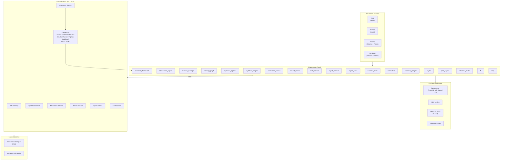
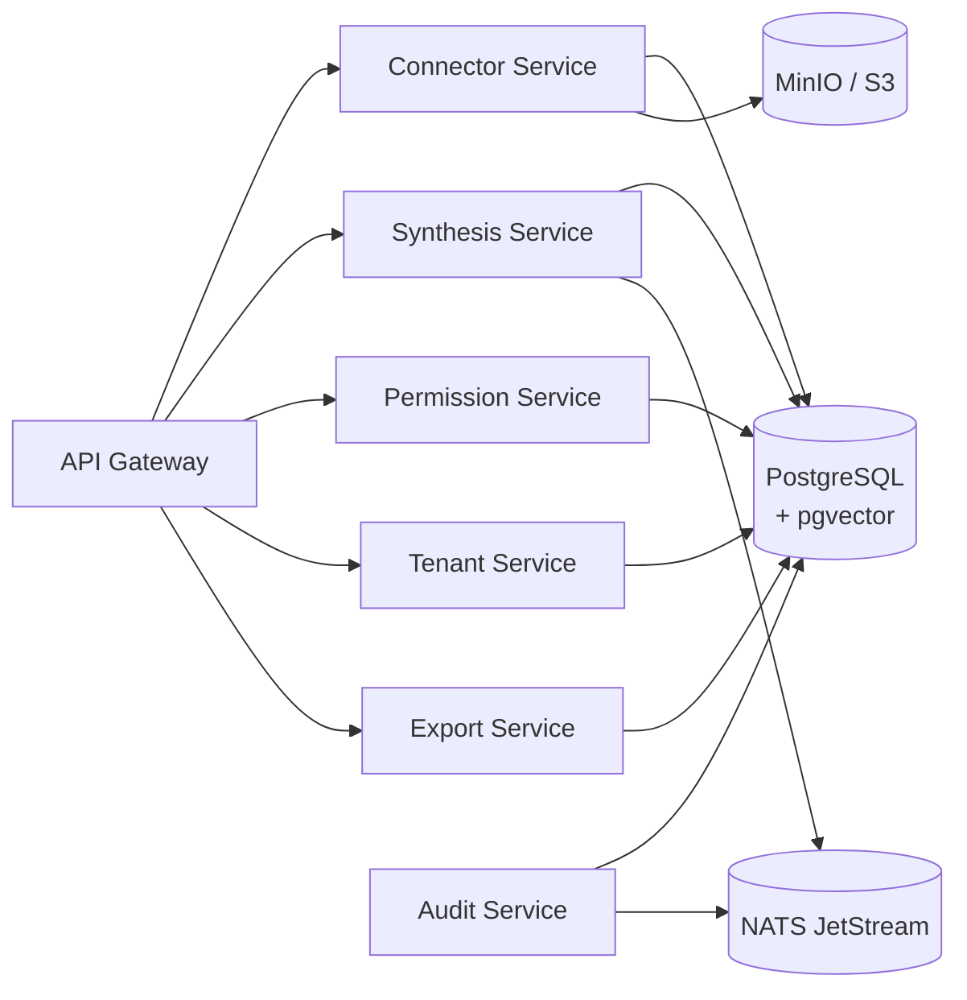
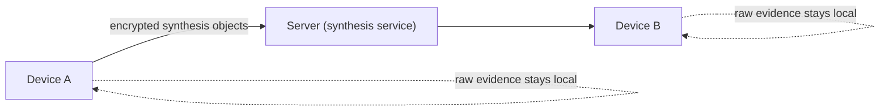
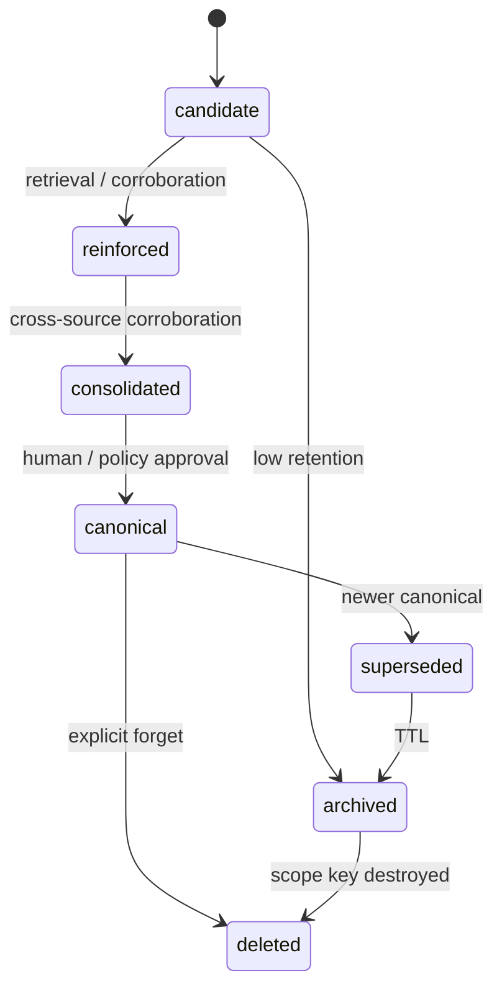

# Knowledge — Architecture

This document is the system architecture for the Knowledge
substrate. It builds on the layered six-plane substrate from
[PROPOSAL.md](./PROPOSAL.md) and turns it into a concrete
component map, data flow, permission model, decay state machine,
crypto layer, device-optimization strategy, and platform-specific
implementation notes.

For phasing and progress see [PHASES.md](./PHASES.md) and
[PROGRESS.md](./PROGRESS.md).

---

## 1. System overview

Knowledge is split into three cooperating surfaces — an on-device
surface that runs on every form factor a user owns, a server
surface that runs the connector pipeline and cross-tenant
synthesis, and an inference layer that serves both. They all
consume the same Rust shared core.



The shared Rust core is the single source of truth for memory.
Every platform shell consumes it via FFI. The server surface is a
peer of the device surface for the on-server connector workflows;
they share the same observation / semantic / reasoning / export
schema.

---

## 2. Rust shared core

The Rust core is a workspace of focused crates, compiled to four
binary shapes:

- **`framework_ios`** — `.xcframework` (static library + headers,
  built via `cargo lipo` / `xcodebuild -create-xcframework`),
  consumed via Swift through UniFFI.
- **`jni_android`** — `.so` per ABI (`arm64-v8a`,
  `armeabi-v7a`, `x86_64`), consumed via JNI.
- **`napi_macos`** — N-API addon `.node` for Electron main
  process, with a thin Swift bridge for MLX.
- **`napi_windows`** — N-API addon `.node` for Electron main
  process, with C++ bindings to DirectML / Vulkan / CUDA where
  applicable.

### 2.1 Module map

| Module | Responsibility |
|---|---|
| `evidence_store` | Encrypted, append-only evidence plane with content-aware storage routing (inline / body-table / ring buffer) and the hybrid lexical + semantic + recency retriever. |
| `observation_engine` | Extracts entities, facts, tasks, and decisions from raw evidence and feeds them through the importance classifier into the observation plane. |
| `memory_manager` | Owns the decay state machine, retention scoring, working memory, and the user / channel / domain / tenant memory objects. |
| `concept_graph` | Sparse typed concept graph with supersession, contradiction edges, and incremental subgraph updates. |
| `synthesis_pipeline` | Manages scope-window synthesis (channel / domain / tenant), grammar-constrained outputs, elected-device election, and encrypted publication. |
| `crypto` | All cryptographic primitives the substrate consumes — hybrid X25519 + ML-KEM-768 KEM, ML-DSA-65 and SPHINCS+ signatures, XChaCha20-Poly1305, BLAKE3, and the provenance bundle. |
| `sync_engine` | CRDT-based delta sync of synthesis objects, MLS group keying, and policy-gated evidence sync. |
| `permission_service` | Zanzibar-style relation graph with reachability checks. |
| `tenant_service` | Tenant lifecycle, per-tenant keys, and member provisioning. |
| `audit_service` | Append-only audit log of canonical promotions, exports, agent proposals, and policy changes. |
| `agent_contract` | Proposal-only write contract for agents — typed proposals, lifecycle, and promotion to canonical. |
| `export_plane` | Portable concept profiles, export policy, and the read-only policy simulator. |
| `connector_framework` | OAuth2 vault, incremental + webhook sync state, channel-scoped attachment, and ACL sync. |
| `connectors` | Vendor connector implementations (Google Drive, OneDrive, Notion, Jira, Confluence, Figma, HubSpot, Slack, Email). |
| `inference_router` | On-device inference routing across MLX, llama.cpp, and a fallback adapter, with device-tier gating. |
| `reasoning_engine` | Contradiction and drift detection, multi-hop traversal, query planning, workflow memory, Graph-of-Thought, and community summaries. |
| `ffi` | UniFFI surface consumed by iOS and Android. |
| `napi` | N-API addon consumed by macOS and Windows Electron shells. |

See [`docs/MODULE_EVOLUTION.md`](docs/MODULE_EVOLUTION.md) for the
per-phase evolution of each module.

### 2.2 Local store

- **SQLCipher** for the relational store (AES-256-GCM page
  encryption; key derived from a per-user master key via HKDF +
  hybrid KEM unwrap).
- **SQLite FTS5** with `unicode61 remove_diacritics 2` for
  lexical / hybrid retrieval.
- **Cold segments** — content older than the hot window is
  written to encrypted append-only segments with per-epoch
  XChaCha20-Poly1305 keys; epoch keys are rotated on a schedule
  and destroyed when the epoch is forgotten.
- **Content-aware storage routing** — bodies are routed through
  a size-threshold strategy:
  - **Inline path (≤ 512 bytes):** short text messages are stored
    inline in the evidence row itself. BLAKE3 hash is computed
    for integrity framing but no dedup index lookup is performed.
    This eliminates JOIN overhead for the common case (chat messages).
  - **Body-table path (> 512 bytes):** files, document chunks,
    transcripts, and large bodies are stored in a separate body
    table with BLAKE3 content-hash deduplication. Duplicate hashes
    share a single body row referenced by multiple observation rows.
  - **Ring-buffer path (noise class):** messages classified as
    noise by the importance tagger are stored in a fixed-size
    circular buffer (configurable, default 5 MB) that overwrites
    on FIFO. These are available for the current synthesis window
    but never persist beyond it.
- **Semantic near-dedup at the observation plane** — XLM-R
  embeddings detect semantically equivalent observations extracted
  from different messages. Deduplication of meaning happens at the
  observation layer, not the evidence layer, catching cases where
  the same fact is stated in different words across channels.

### 2.3 Cross-platform FFI

- **UniFFI** for iOS bindings (Swift). The procedural-macro flow
  produces idiomatic Swift types for the `evidence_store`,
  `memory_manager`, and `synthesis_pipeline` public APIs.
- **JNI** for Android. A thin Kotlin wrapper around the JNI
  surface exposes coroutines-friendly entry points.
- **N-API** for macOS / Windows. Electron's main process loads
  the `.node` addon and exposes an IPC surface to the React
  renderer.

### 2.4 CRDT-based sync

- Per-scope **operation logs** are CRDT-merged across devices.
- Synthesis objects use **add-wins** semantics with explicit
  supersession markers; conflicts produce `contradicts`
  edges in the concept graph rather than silent overwrites.
- Raw evidence does **not** sync by default; only synthesis
  objects, observation rows, and (with explicit policy) selected
  evidence body refs.

### 2.5 Post-quantum primitives

The `crypto` crate wraps the post-quantum and classical primitives
that the rest of the substrate consumes through a small high-level
API: content hashing, AEAD encryption / decryption, key derivation,
hybrid KEM encap / decap, and provenance signing / verification.
The rest of the core never touches raw cryptographic state.

The primitive inventory is:

- **BLAKE3** content hashing.
- **XChaCha20-Poly1305 AEAD** for per-scope, per-epoch symmetric
  encryption.
- **HKDF-SHA256** key derivation.
- **Hybrid X25519 + ML-KEM-768 KEM** with a concatenate-then-KDF
  combiner (HKDF-SHA256 over the concatenation of the X25519 DH
  output and the ML-KEM-768 shared secret). The ML-KEM-768 side
  sits behind a `KemBackend` trait so the implementation can be
  swapped for an FFI-backed `liboqs` build without touching the
  rest of the substrate.
- **ML-DSA-65 (Dilithium)** for provenance signatures on every
  synthesis output and every export bundle.
- **SPHINCS+** as a stateless backup signer, available as a
  co-signer alongside ML-DSA-65 for archival group operations.

---

## 3. On-device inference architecture

The on-device inference layer is where the substrate's heavy
synthesis runs. The architecture deliberately mirrors the KChat
slm-chat-demo runtime layout so the same `llama-server` sidecar
serves Knowledge synthesis and chat skills on the same device.

### 3.1 PrismML llama.cpp fork

Knowledge ships with the
[`kennguy3n/llama.cpp@prism`](https://github.com/kennguy3n/llama.cpp/tree/prism)
fork as its on-device SLM serving layer. The fork is the only
runtime that supports the `Q1_0_g128` ternary repack format used
in Bonsai derivatives across:

- **CUDA** (NVIDIA discrete GPUs)
- **Metal** (Apple Silicon GPUs)
- **Vulkan** (cross-vendor desktop / mobile GPUs)
- **AVX-512 VNNI** (recent Intel server / desktop CPUs)
- **AVX-VNNI** (Intel client CPUs from Alder Lake onwards)
- **AVX2** (baseline desktop CPUs, with cross-arch validation
  via Intel SDE on x86 hosts)
- **ARM NEON / dotprod** (mobile + Apple Silicon CPUs)

The dispatcher under `ggml/` selects the best kernel for the
host at runtime; the substrate does not need to know which
backend won.

### 3.2 Adapter bootstrap priority

The Inference Router bootstraps adapters in priority order; the
first one that probes successfully wins the bind:

```
MLXAdapter  →  LlamaCppAdapter  →  fallback (no SLM, encoder-only)
```

- **`MLXAdapter`** — Apple Silicon only (iOS, macOS). Loads the
  Bonsai-1.7B MLX 2-bit weight via the system MLX runtime. This
  is the preferred path on Apple Silicon because of weight-size
  and memory-bandwidth wins.
- **`LlamaCppAdapter`** — POSIX + Windows. Talks to a
  `llama-server` instance from the PrismML fork over loopback
  HTTP / SSE. The Bonsai-1.7B GGUF is the canonical artifact.
- **Fallback** — XLM-R encoder + lexicon classifiers only; SLM
  synthesis is disabled for that session.

### 3.3 Inference tasks

Every inference call routes through one of a small number of
tagged tasks; the router uses the tag to pick the prompt
template, the grammar, and the budget:

| Task | Tag | Output |
|---|---|---|
| Importance tagging | `tag.importance` | `{class, confidence}` JSON |
| Entity extraction | `extract.entities` | `[{type, span, confidence}]` JSON |
| Observation promotion | `promote.observation` | Structured observation row |
| Summary generation | `synth.summary` | Episodic / channel / domain summary |
| Concept synthesis | `synth.concept` | Concept node + relation proposals |
| Contradiction adjudication | `adjudicate.contradiction` | `{verdict, rationale, evidence_refs}` |

### 3.4 Shared sidecar pattern

A single `llama-server` instance is shared across all KChat
subsystems on the device:

- Knowledge synthesis (this repo)
- KChat chat AI surfaces (`slm-chat-demo`)
- CV-Guard SLM consultation
- slm-guardrail when SLM-promoted

Server runs with `--parallel 2` so two inference slots can
overlap, mmap'd weights, 60 s idle-unload, warm-up at boot.

### 3.5 Grammar-constrained decoding

Every structured output (observation rows, importance tags,
entity lists, synthesis bundles) is generated with GBNF
grammar-constrained decoding. The substrate never has to repair
malformed JSON from the SLM at the consumer side; the grammar
guarantees the output schema.

### 3.6 Thinking disabled

A closed `<think>\n</think>\n` pair is prepended to every
synthesizer prompt to suppress in-model chain-of-thought.
Reasoning traces — when needed — are produced by the **reasoning
plane** with explicit Graph-of-Thought scaffolding so they
remain auditable and citable.

---

## 4. Server architecture

The server surface runs the connector pipeline, the cross-tenant
synthesis service, the permission graph, and the export plane.

### 4.1 Go services

| Service | Responsibility |
|---|---|
| **API Gateway** | OAuth2 token verification, rate-limiting, fan-out to internal services, NDJSON / SSE streaming |
| **Connector Service** | Google Drive, OneDrive, Notion, Jira, Confluence, Figma, HubSpot, Slack, email connectors; OAuth2 token refresh; webhook subscription; incremental delta sync |
| **Permission Service** | Zanzibar-style relation graph: tuples, namespace configs, reachability checks, ACL sync from connectors |
| **Tenant Service** | Tenant lifecycle, per-tenant encryption keys, storage configuration, member provisioning (SCIM v2) |
| **Export Service** | Portable concept profile rendering, summary view rendering, evidence pack rendering with policy enforcement |
| **Audit Service** | Append-only audit log of canonical promotions, exports, agent proposals, policy changes |

### 4.2 Rust services

| Service | Responsibility |
|---|---|
| **Synthesis Engine** | Heavy synthesis (channel / domain / tenant windows) when more than the elected-device path is needed; runs in confidential compute or as a managed endpoint |
| **Crypto Service** | Provenance signing, hybrid KEM operations, MLS commit / welcome handling at server scope |
| **Vector Store Service** | Embedding upserts and ANN retrieval over `pgvector`; routes hybrid (BM25 + vector + recency) queries |

### 4.3 Storage

| Store | Use |
|---|---|
| **PostgreSQL** | Relational store: nodes, edges, provenance bundles, observations, scopes, relations, audit log |
| **pgvector** | Embedding index (XLM-R + optional MobileCLIP for media) co-located with PostgreSQL for transactional consistency |
| **NATS JetStream** | Async event bus: connector events, synthesis-window triggers, audit events, agent proposals |
| **MinIO / S3** | Object storage: encrypted bodies, weight files, manifest snapshots |

### 4.4 Service topology



---

## 5. Data flow

The data flow is the same shape on the device and on the server,
because they share the substrate planes from PROPOSAL.md §3.

### 5.1 On-device

```
raw input
  → evidence plane (encrypted bodies, content-hash dedup)
  → observation engine (lexicon → XLM-R → SLM-assisted)
  → memory manager (decay / promotion)
  → concept graph (selective)
  → synthesis pipeline (channel / episodic windows)
  → export plane (portable concept profile, allowed evidence pack)
```

### 5.2 On-server

```
connector sync (OAuth2 + webhook)
  → evidence plane (encrypted bodies, ACL pointer from source)
  → observation engine (server-side, same pipeline)
  → memory manager
  → concept graph
  → synthesis pipeline (domain / tenant windows; managed AI / TEE)
  → export plane
```

### 5.3 Cross-device sync



- **Synthesis objects** sync via CRDT-merged operation logs;
  every object carries provenance + supersession markers.
- **Raw evidence** stays on the device that produced it unless
  policy explicitly permits server / cross-device sync.
- **MLS group keying** is the substrate for shared channel /
  domain memory; commits and welcomes use ML-DSA-65 signatures
  with hybrid X25519 + ML-KEM-768 KEM under the hood.

---

## 6. Permission model

### 6.1 Object types

| Object | Hierarchy / role |
|---|---|
| Tenant | Top of the B2B hierarchy; owns domains, channels, users |
| Domain | Cross-channel workstream within a tenant |
| Channel | Scope where messages and files land; primary synthesis scope |
| User | A person; has devices and roles |
| Device | A user's specific endpoint; holds DEK delegations |
| Concept | A node in the semantic plane |
| Summary | An episodic / channel / domain / tenant summary |
| Workflow | A reusable reasoning trace / playbook |
| Export-Profile | A portable concept profile recipe |
| Agent | A software agent allowed to propose memory writes |

### 6.2 Relations

| Relation | Meaning |
|---|---|
| `owner` | Has full control, including delete and key destruction |
| `admin` | Can configure policy, manage members, approve proposals |
| `editor` | Can write canonical observations / concepts |
| `member` | Can read and propose, cannot promote |
| `synthesizer` | Allowed to publish synthesis objects to the scope |
| `viewer` | Read-only |
| `proposer` | Agents only; can propose, never promote |

Relations are stored in a Zanzibar-style tuple store; permission
checks are reachability queries over the relation graph.

### 6.3 Cryptographic capabilities

- Each scope has a **DEK** (Data Encryption Key).
- Granting a relation that grants read access produces a
  **delegation token** binding the user / device's public key to
  the scope DEK via hybrid KEM unwrap.
- Revoking the relation is enforced at two layers:
  - The relation tuple is removed (Zanzibar).
  - The scope DEK is rotated and previously delegated tokens are
    invalidated; for the most sensitive scopes, the DEK is
    destroyed and a new one is generated for remaining members
    via MLS commit.

### 6.4 Export boundary

By default, exports produce **portable concept profiles only** —
typed, scoped, time-bounded concepts with provenance. Raw
evidence and full-fidelity summaries are an opt-in escalation
gated by an explicit export policy and a fresh audit-trail
entry.

---

## 7. Memory decay state machine



The transitions are driven by:

- **Retrieval count** — how many times the object has answered a
  query.
- **Cross-source corroboration** — independent sources backing
  the same observation.
- **Time since last access** — used in retention scoring and
  decay sweeps.
- **Contradiction detection** — supersession is preferred over
  silent deletion; contradictions become explicit edges in the
  concept graph.
- **Explicit human action** — pinning, promotion, deprecation,
  forgetting.

Per-class decay policies (PROPOSAL.md §4.3) are enforced by the
memory manager. Cryptographic forgetting destroys the scope DEK
or the archive epoch key, depending on the scope of the delete.

---

## 8. Post-quantum crypto layer

### 8.1 Key material

| Layer | Primitive | Notes |
|---|---|---|
| Key encapsulation | **ML-KEM-768 (Kyber)** | Hybrid X25519 + ML-KEM-768 during transition |
| Provenance signatures | **ML-DSA-65 (Dilithium)** | Every synthesis output and every export bundle is signed |
| Stateless backup signatures | **SPHINCS+** | Reserved for high-assurance / archival signing |
| Symmetric AEAD | XChaCha20-Poly1305 | Per-scope and per-epoch keys |
| Hashing / framing | BLAKE3 | Content hash, MAC framing |

### 8.2 Hybrid KEM during transition

All new key exchanges run a hybrid X25519 + ML-KEM-768
construction. The combiner produces a session secret that is
classically secure as long as either primitive is unbroken. The
substrate stays forward-secure against the "harvest now, decrypt
later" threat model from day one.

### 8.3 MLS with post-quantum extensions

- Leaf key packages carry an ML-KEM-768 KEM in addition to
  X25519.
- TreeKEM uses the hybrid KEM construction for path-secret
  derivation.
- Commits and welcomes are signed with ML-DSA-65; archival
  group ops can additionally be SPHINCS+ co-signed.

### 8.4 Per-epoch keys for archive segments

Cold archive segments use **per-epoch** XChaCha20-Poly1305 keys
keyed by BLAKE3-derived nonces. Aging out an epoch is a single
DEK destroy; the segment ciphertext is left in place but is no
longer recoverable.

### 8.5 Cryptographic forgetting

- **Per-scope DEK destroy** forgets the entire scope at once.
- **Per-epoch DEK destroy** forgets a time slice of the cold
  archive.
- **Per-row DEK** (used for very-high-sensitivity rows) gives
  per-row forgetting at extra storage cost.

---

## 9. Device & platform notes

The substrate adapts to four signals (storage, memory, battery,
network) and ships platform-specific integration notes for iOS,
Android, macOS, and Windows. See
[`docs/PLATFORMS.md`](docs/PLATFORMS.md) for the full catalogue —
tiered SQLCipher storage routing, working-set caps, decay-sweep
throttling, ANR-class watchdogs, idle-window observation processing,
background-fetch policies, and the per-platform FFI / N-API shims.

---

## Cross-references

- [README.md](./README.md) — overview and quick start
- [PROPOSAL.md](./PROPOSAL.md) — product thesis and substrate
- [PHASES.md](./PHASES.md) — phased delivery plan
- [PROGRESS.md](./PROGRESS.md) — per-phase status and changelog
- [`kennguy3n/slm-chat-demo`](https://github.com/kennguy3n/slm-chat-demo) — model strategy reference
- [`kennguy3n/llama.cpp@prism`](https://github.com/kennguy3n/llama.cpp/tree/prism) — modified llama.cpp inference runtime
