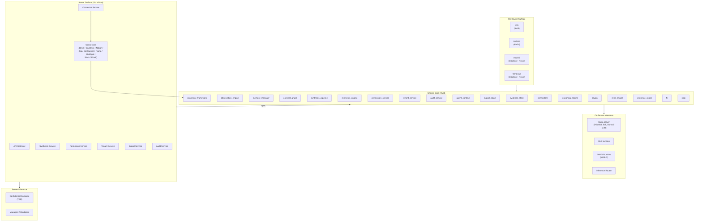
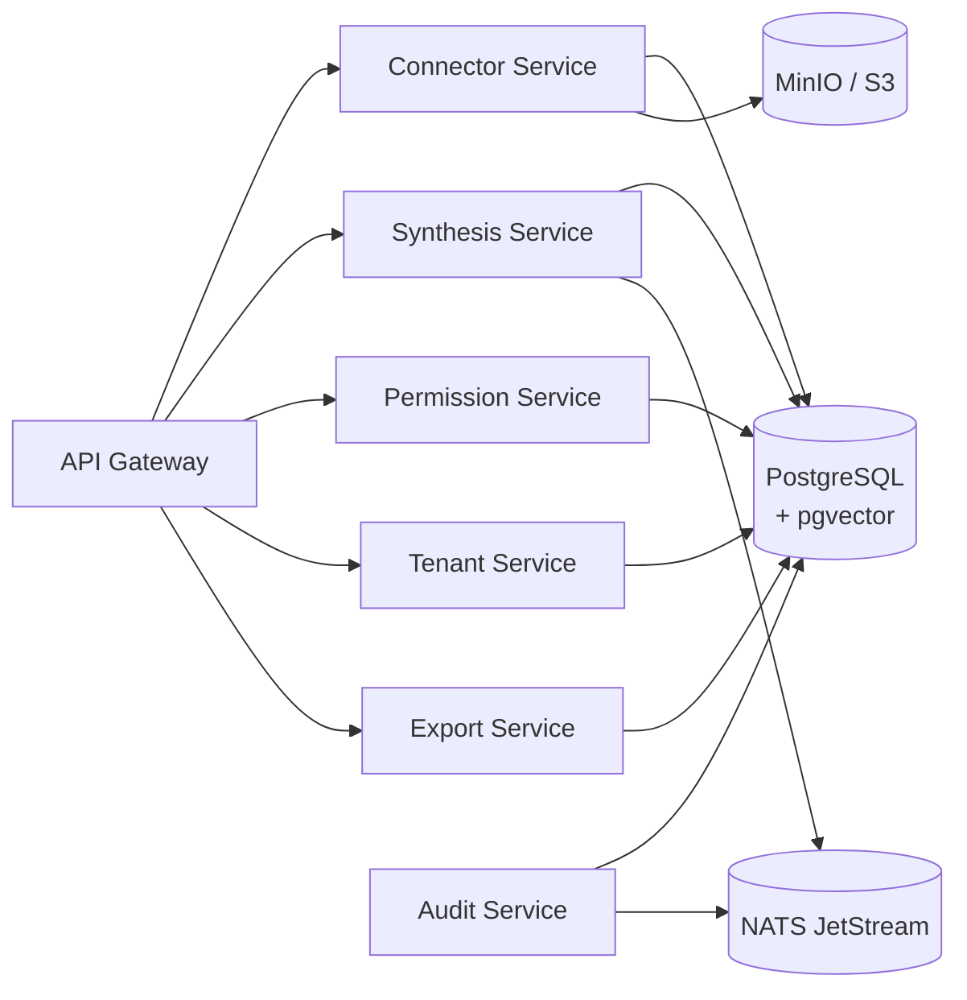
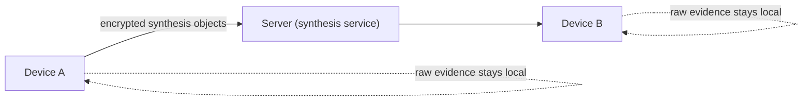
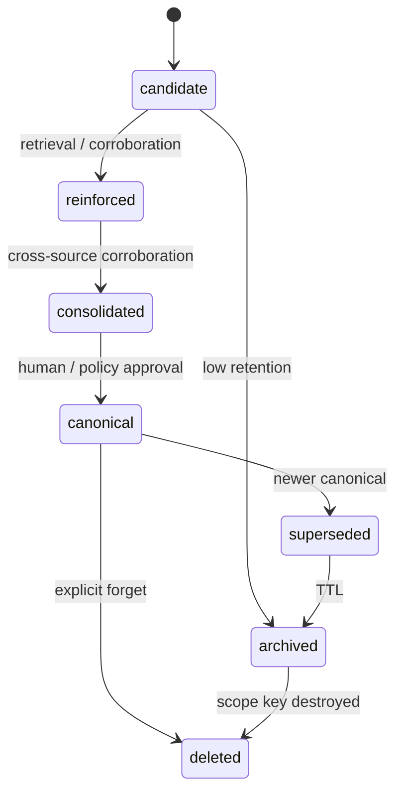

# Knowledge — Architecture

This document is the system architecture for the Knowledge
substrate. It builds on the layered six-plane substrate from
[PROPOSAL.md](./PROPOSAL.md) and turns it into a concrete
component map, data flow, permission model, decay state machine,
crypto layer, device-optimization strategy, and platform-specific
implementation notes.

For phasing and progress see [PHASES.md](./PHASES.md) and
[PROGRESS.md](./PROGRESS.md).

---

## 1. System overview

```
Knowledge System
├── On-Device Surface
│   ├── iOS (Swift native)
│   ├── Android (Kotlin native)
│   ├── macOS (Electron + React + Swift N-API)
│   └── Windows (Electron + React + C++ N-API)
├── Shared Core (Rust)
│   ├── Evidence Store (SQLCipher)
│   ├── Observation Engine
│   ├── Memory Manager (decay state machine)
│   ├── Concept Graph (sparse semantic layer + incremental updates)
│   ├── Synthesis Pipeline
│   ├── Synthesis Engine (server-side)
│   ├── Permission Service (Zanzibar-style)
│   ├── Tenant Service
│   ├── Audit Service
│   ├── Agent Contract (proposal-only writes)
│   ├── Export Plane (portable concept profiles)
│   ├── Connector Framework (OAuth2 vault, sync, webhooks, ACL sync)
│   ├── Connectors (Google Drive, OneDrive, Notion, Jira, Confluence, Figma, HubSpot, Slack, Email)
│   ├── Reasoning Engine (contradiction, drift, traversal, planner, workflow memory, GoT, community summaries)
│   ├── Crypto Layer (post-quantum: ML-KEM-768, ML-DSA-65, SPHINCS+ co-signer, hybrid X25519, attestation)
│   ├── Sync Engine (CRDT + MLS)
│   ├── Inference Router (MLX → LlamaCpp → Fallback adapters, device-tier gating)
│   ├── FFI (UniFFI for iOS / Android)
│   └── N-API Addon (macOS / Windows Electron)
├── On-Device Inference
│   ├── llama-server (PrismML fork, Bonsai-1.7B)
│   ├── MLX runtime (Apple Silicon)
│   ├── ONNX Runtime (XLM-R embeddings)
│   └── Inference Router
├── Server Surface (Go + Rust)
│   ├── API Gateway
│   ├── Connector Service
│   ├── Synthesis Service
│   ├── Permission Service (Zanzibar-style)
│   ├── Tenant Service
│   └── Export Service
└── Server Inference
    ├── Confidential Compute (TEE Worker — attest → synthesize → verify lifecycle)
    └── Managed AI Endpoint
```



The shared Rust core is the single source of truth for memory.
Every platform shell consumes it via FFI. The server surface is a
peer of the device surface for the on-server connector workflows;
they share the same observation / semantic / reasoning / export
schema.

---

## 2. Rust shared core

The Rust core is a workspace of focused crates, compiled to four
binary shapes:

- **`framework_ios`** — `.xcframework` (static library + headers,
  built via `cargo lipo` / `xcodebuild -create-xcframework`),
  consumed via Swift through UniFFI.
- **`jni_android`** — `.so` per ABI (`arm64-v8a`,
  `armeabi-v7a`, `x86_64`), consumed via JNI.
- **`napi_macos`** — N-API addon `.node` for Electron main
  process, with a thin Swift bridge for MLX.
- **`napi_windows`** — N-API addon `.node` for Electron main
  process, with C++ bindings to DirectML / Vulkan / CUDA where
  applicable.

### 2.1 Module map

| Module | Responsibility |
|---|---|
| `evidence_store` | SQLCipher-backed encrypted store; size-threshold inline/body-table routing; content-hash dedup for large bodies; ring buffer for noise; append-only ingestion. Houses the `HybridRetriever` (FTS5 lexical + recency decay; semantic-vector slot is now wired through the `EmbeddingModel` trait — `search_hybrid` embeds the query and each candidate body and uses `cosine_distance` to compute the score, falling back to `0.0` when no embedder is configured or one errors out). |
| `observation_engine` | `ObservationExtractor` trait + Phase-1 `LexiconExtractor` baseline (capitalised words / `@mentions` / `#tags` for entities, action verbs / `TODO` / `ACTION` / `TASK` for tasks, `decided` / `agreed` / `approved` for decisions, declarative sentences for facts). `ObservationPipeline` chains extraction → reuse of the evidence-plane `ImportanceClassifier` → Candidate observation creation. XLM-R + SLM-assisted stages reserved for Phase 1's later milestones. |
| `memory_manager` | Decay state machine (Candidate → Reinforced → Consolidated → Canonical → Superseded → Archived → Deleted), retention scoring, stage promotion, retrieval-trigger updates. Hosts `WorkingMemory` (bounded TTL-evicting context window), `UserMemoryObject` (read / pin / unpin / forget / list / decay sweep), and the `PrivacyStrip` + `SynthesisOutput<T>` invariant pair. |
| `concept_graph` | Sparse typed graph (nodes, edges, scopes), supersession, contradiction tracking. Phase 2: typed nodes, edges (`IsA`, `PartOf`, `DecidedBy`, `Supersedes`, `Contradicts`, `DerivedFrom`, `AssignedTo`), scopes, supersession, contradiction tracking — in-memory adjacency. |
| `synthesis_pipeline` | Channel / domain / tenant synthesis windows; published encrypted synthesis objects. Phase 2: window manager, synthesis-object types, GBNF schema types, elected-device election (tier / battery / heartbeat eligibility), encrypted publish / consume with `(scope_id, window_id, object_id)` AAD binding. |
| `crypto` | Post-quantum primitives; hybrid X25519 + ML-KEM-768 KEM (Phase 0 via RustCrypto `ml-kem`; Phase 7 via `liboqs` behind the same `KemBackend` trait); HKDF-SHA256; XChaCha20-Poly1305; BLAKE3; Phase 2 `ProvenanceBundle` PROV data model + HMAC-SHA256 `TestSigner`; ML-DSA-65 + SPHINCS+ in Phase 7 |
| `sync_engine` | CRDT-based delta sync of synthesis objects; MLS group keying; selective evidence sync where policy permits. Phase 2: add-wins observed-remove CRDT (`AddWinsSet<T>`), append-only operation log (`OpLog<T>`) with `Add` / `Remove` / `Supersede` ops, deterministic `merge_logs` producing consistent merged state. |
| `observation_engine (Phase 2)` | Channel-scoped promotion policy (`ChannelPromotionPolicy`: min importance class, min corroboration count, max noise ratio); extractor hardening — URL detection, email detection, date / time references, numeric references, question detection. |
| `memory_manager (Phase 2)` | `ChannelMemoryObject` (recap, decisions, open questions, active tasks); reuses `MemoryObject` for individual items; archive-on-decay sweep. |
| `memory_manager (Phase 3)` | `DomainMemoryObject` (cross-channel workstreams, dependencies, risks, procedures; registered channel scopes; archive-on-decay sweep) and `TenantMemoryObject` (canonical policies, product taxonomy, stable org knowledge, admitted approved-document refs); tenant memory items default to `SensitivityClass::Critical` with no passive decay — only explicit deprecation per `PROPOSAL.md` §4.3. |
| `synthesis_pipeline (Phase 3)` | `hierarchy` module: `ChannelOutput` / `DomainOutput` (constructible only from the matching `SynthesisObject` variants), `DomainSynthesisInput` (only constructible from `ChannelOutput`s registered on a `DomainMemoryObject`), `TenantSynthesisInput` (only constructible from `DomainOutput`s registered on a `TenantMemoryObject` plus `ApprovedDocument`s admitted to that tenant), `WindowScopeTier` (`Channel / Domain / Tenant`), and a `HierarchyEnforcedWindowManager` blanket impl on `SynthesisWindowManager` whose `validate_domain_input` / `validate_tenant_input` reject cross-tier admission at the type level. |
| `concept_graph (Phase 3)` | `PersistentConceptGraph`: SQLCipher-backed wrapper over the Phase-2 in-memory adjacency list; `concept_nodes` + `concept_edges` schema with plaintext lifecycle / relation tags for scope-filtered queries; per-scope AEAD encryption (`scope:{uuid}:concept:v1` HKDF context) of the JSON-encoded payloads with `(scope_id, id)` bound into the AAD. |
| `permission_service (Phase 3)` | Zanzibar-style relation tuples (`ObjectRef`, `Relation`, `SubjectRef`) for the ten object types from §6, the seven-relation namespace with default inheritance (`owner ⇒ admin ⇒ editor ⇒ member ⇒ viewer`), an in-memory `TupleStore`, and a `check_permission` reachability query that walks both direct tuples and userset rewrites. |
| `tenant_service (Phase 3)` | `Tenant` / `TenantConfig` / `TenantMember` data model, the `Active / Suspended / Deleted` lifecycle state machine with key-destruction reference on delete, role-based member provisioning, and config validation (storage caps, sub-minute synthesis windows). |
| `synthesis_engine (Phase 3)` | Rust side of the server-side synthesis service: `SynthesisEngine` trait (`synthesize_domain`, `synthesize_tenant`), `ManagedEndpointSynthesizer` deterministic stub that the future managed-AI endpoint will replace, end-to-end channel → domain → tenant integration test under `tests/hierarchy_e2e.rs`. The Go gateway in front of this engine is intentionally still pending. |
| `audit_service (Phase 3)` | Append-only `AuditLog` per §4.1; `AuditEntryBuilder`; `AuditQuery` filters (scope / action / actor / time-range); the eight `AuditActionType`s (`CanonicalPromotion`, `Export`, `AgentProposal`, `PolicyChange`, `MemberProvisioned`, `MemberRemoved`, `TenantLifecycle`, `KeyDestruction`); no mutation / deletion APIs — append-only is enforced at the type level. |
| `agent_contract (Phase 5)` | Agent write contract per `PROPOSAL.md` §7.3: `AgentProposal<T>` carrier with four typed payloads (`ObservationProposal` / `ConceptProposal` / `RelationProposal` / `SummaryProposal`), `AgentIdentity` (agent_id, name, model_name, model_version, optional skill_id + recipe_id), strict reuse of `crypto::ProvenanceBundle` and `memory_manager::SensitivityClass`, schema validation in `schema.rs` (confidence ∈ [0.0, 1.0], ≥1 evidence ref, non-nil scope, non-empty agent identity, TTL > 0 if present), the four-state lifecycle machine `Proposed → UnderReview → Promoted/Rejected` in `lifecycle.rs` with `AutoPromotionPolicy` (min_confidence, min_corroboration, max_sensitivity, require_human_for_critical), in-memory `ProposalStore`, and `promote_to_canonical` returning `CanonicalArtifact::{Observation,Concept,Relation,Summary}` ready for substrate insertion. Agents have only `proposer` rights — they can never write canonical state directly. |
| `export_plane (Phase 5)` | Export plane per `PROPOSAL.md` §3.5 / §4.1: `PortableConceptProfile`, `ApprovedConcept`, `ApprovedSummary`, `ExportView` (`ConceptsOnly` / `WithSummaries` / `WithEvidencePack`), `EvidencePack`, `ReasoningRef`, and `ExportConstraint::{MaxConcepts, MaxAge, ScopeRestriction, SensitivityCeiling}` in `profile.rs`. `ExportPolicy` + `PolicyEngine` in `policy.rs` enforce least-privilege defaults: `allow_raw_evidence` is opt-in and is *additionally* blocked whenever any concept is `Critical`; provenance is required by default; sensitivity ceiling, scope whitelist, max_concepts, and time_window are checked per concept. `ExportControlRegistry` in `controls.rs` is deny-by-default per concept / summary / workflow with time-bound and scope-bound enforcement. `PolicySimulator` in `simulator.rs` is read-only — `simulate(profile)` returns `SimulationResult { included_concepts, excluded_concepts, included_summaries, excluded_summaries, would_include_evidence, total_export_size_estimate, warnings }` without mutating any input or producing a real export. `ConceptApprovalWorkflow` in `approval.rs` bridges `concept_graph` canonical nodes to `ApprovedConcept`s — only nodes whose state is `NodeState::Canonical` and whose registry entry has `exportable: true` may be approved. |
| `audit_service (Phase 5)` | Extended with five Phase-5 `AuditActionType`s (`ExportRendered`, `ExportSimulated`, `AgentProposalSubmitted`, `AgentProposalPromoted`, `AgentProposalRejected`) and an `ExportProfile` `TargetType` variant; new `helpers` module exposes `log_export`, `log_export_simulated`, `log_proposal_submitted`, `log_proposal_promoted`, `log_proposal_rejected` so every export and every proposal lifecycle event produces an audit entry without callers needing to hand-build the metadata payload. |
| `connector_framework (Phase 4)` | Server-side connector substrate per `PROPOSAL.md` §10.2 / `ARCHITECTURE.md` §4.1: the `Connector` trait (`authenticate`, `initial_sync`, `incremental_sync`, `subscribe_webhook`, `handle_webhook_event`); `OAuth2TokenVault` with HKDF-derived `SecretToken` wrappers and a `TokenRefresher` trait that handles expiring-token refresh with configurable skew; `SyncState` (Full / Incremental modes with cursor + last-sync-time tracking) and `SyncOutcome`; `WebhookSubscription` (URL, secret, event types, status) + `WebhookSignatureVerifier` HMAC-SHA256 verifier and `WebhookEvent` parser; `ConnectorConfig` (connector type, scope binding, auth config, sync interval) + `ConnectorInstance` runtime state; `ConnectorEvent::{DocumentCreated, DocumentUpdated, DocumentDeleted, PermissionChanged}`; channel-scoped attachment via `ConnectorAttachment` + `AttachmentRegistry` (one-connector-per-source-per-scope) integrated with `permission_service` (`AttachmentService` only allows `admin` / `editor` on the scope to attach / detach); ACL sync via `SourcePermission` + `PermissionMapping` + `AclSyncEngine::sync_permissions` that idempotently upserts and revokes relation tuples in the permission service. |
| `observation_engine (Phase 4)` | Document observation pipeline per `ARCHITECTURE.md` §5.2: `DocumentRef` (source identifier), `DocumentKind::{PlainText, Markdown, Json}`, `ChunkMetadata` (citation-grade — source doc ref, chunk index, byte / char offsets), `DocumentChunker` trait + `SlidingWindowChunker` (configurable window size + overlap; correct on Unicode boundaries), and `DocumentObservationPipeline<H, E, C>` chaining chunking → importance tagging (reusing `ImportanceClassifier`) → entity / topic extraction (reusing `LexiconExtractor`) with metadata propagation onto every observation. Citation surface per `PROPOSAL.md` §10.3 in `citation.rs`: `Citation` (id, source_url, source_type, document_id, optional section_ref, chunk_range, last_verified_at), `CitationSourceType::{GoogleDrive, OneDrive, Notion, Jira, Confluence, Internal, Other(String)}`, `CitationFormat::{Markdown, Json, InlineRef}`, `CitationRenderer::render`, and `CitationRegistry` (URL-reverse-indexed in-memory store with stale-detection helper). |
| `concept_graph (Phase 6)` | Incremental updates per `PHASES.md` Phase 6: `IncrementalUpdateEngine` recomputes only touched branches when an observation is promoted or superseded; `AffectedSubgraph` BFS-walks direct neighbours plus transitive `derived_from` dependents up to a configurable max depth; `RecomputeScope` filters to the minimal set of nodes whose state actually depends on the change; `UpdatePropagation` carries the bookkeeping result of pushing the change through the affected subgraph; `ChangeEvent::{NodePromoted, NodeSuperseded, NodeContradicted, EdgeAdded, EdgeRemoved}` is the full mutation surface that the engine translates into `ConceptGraph` mutations. |
| `inference_router (Phase 0)` | On-device inference router per `ARCHITECTURE.md` §3: `InferenceAdapter` trait (`probe`, `generate(task_tag, prompt, grammar)`, `is_available`, `supports`); `InferenceTask::{TagImportance, ExtractEntities, PromoteObservation, SynthSummary, SynthConcept, AdjudicateContradiction}` with associated tag strings, prompt templates, and GBNF grammars; `InferenceRouter` bootstraps adapters in MLX → LlamaCpp → Fallback priority order, handles warm-up + 60-second idle-unload, respects `DeviceTier::{Low, Medium, High}` gating; adapters: `MlxAdapter` (Apple Silicon platform `probe`), `LlamaCppAdapter` (HTTP loopback `probe` against `llama-server`), `FallbackAdapter` (encoder-only — succeeds on classification tasks via lexicon, errors on synthesis tasks); `RouterConfig` (server_url, model_path, idle_timeout, warm_up_prompt) and `RouterError::{Unavailable, Generation, NoAdapter, Tier, ProbeFailed, Internal}`. |
| `evidence_store::classifier (Phase 0)` | `SlmClassifier`: implements the existing `ImportanceClassifier` trait by dispatching to `InferenceRouter` with the `TagImportance` task; grammar constrains output to `{"class": "critical|important|useful|noise", "confidence": 0.0-1.0}`; falls back to `LexiconClassifier` when the router returns `RouterError::Unavailable`. `CompositeClassifier`: chains lexicon → SLM (lexicon runs first as a cheap pre-filter; SLM only runs when lexicon confidence is below a threshold). |
| `evidence_store::embeddings (Phase 1)` | XLM-R embedding adapter per `PROPOSAL.md` §11: `EmbeddingModel` trait (`embed(text)`, `embed_batch(texts)`, `dimension()`); `OnnxEmbeddingAdapter` skeleton holding `(model_path, quantization: INT8/INT4, dimension: 768)` with `probe()` checking ONNX runtime availability behind a mockable `OnnxRuntime` trait; `StubEmbeddingModel` returning zero vectors of the correct dimension; `cosine_distance` utility. The Phase-1 hybrid retriever (`HybridRetriever` in `retrieval.rs`) accepts an optional `Box<dyn EmbeddingModel>` and replaces the hardcoded `0.0` semantic score with real cosine similarity when one is provided. |
| `memory_manager::episodic (Phase 1)` | Episodic memory per `PROPOSAL.md` §4.1: `EpisodicSummary` (id, scope_id, session_id, summary_text, key_observations, time_range, created_at, state, retention_score), `SessionBoundary` detection (time gap > 30 minutes, explicit user action, topic-shift signal), the `Summarizer` trait, `SlmSummarizer` (dispatches to `InferenceRouter` with the `SynthSummary` task), `StubSummarizer` (concatenated observation text — used in tests and when SLM is unavailable), `EpisodicStore` CRUD integrated with the decay state machine (episodic summaries start as `Candidate` and promote to `Reinforced` on retrieval), and `SessionDetector` over evidence-timestamp streams. |
| `ffi (Phase 0)` | UniFFI surface for iOS / Android per `PHASES.md` Phase 0: evidence (`ingest_message(scope_id, body, source)`, `query(scope_id, query_text, limit)`, `get_evidence(id)`); memory manager (`get_user_memory(scope_id)`, `pin(id)`, `unpin(id)`, `forget(id)`, `list_memories(scope_id, filter)`, `run_decay_sweep(scope_id)`); synthesis (`get_channel_memory(scope_id)`, `trigger_synthesis(scope_id)`); crypto (`generate_keypair()`, `encrypt(scope_id, plaintext)`, `decrypt(scope_id, ciphertext)`). FFI-safe wrapper types in `types.rs` (String IDs, simplified enums); FFI error mapping in `error.rs`; `uniffi.toml` configuration. |
| `napi (Phase 0)` | N-API addon skeleton for macOS / Windows Electron per `PHASES.md` Phase 0: same surface as `ffi` plus `init(config_json)` for bootstrapping the Rust core with a JSON config; N-API exception mapping in `error.rs`; serde JSON round-trip types in `types.rs`. |
| `crypto::sphincs (Phase 7)` | SPHINCS+ stateless backup signer per `PROPOSAL.md` §9.1: `SphincsPlusSigner` (FIPS 205 `slh-dsa-shake-128f`) and `SphincsPlusVerifier` implement both the substrate-wide `ProvenanceSigner` trait and the new `SignerBackend` trait (`sign_bytes` / `verify_bytes`); `SphincsPlusEncodedKeypair` and `SphincsPlusEncodedVerifyingKey` transport types reject mismatched-keypair decoding via `CryptoError::ProvenanceVerification`; `CoSigner` wraps both `MlDsa65Signer` + `SphincsPlusSigner` to produce dual signatures for archival group ops, with each signature verified independently. |
| `synthesis_engine::tee_worker (Phase 7)` | Confidential compute worker skeleton per `PROPOSAL.md` §9.2 / `ARCHITECTURE.md` §8.4: `TeeWorkerConfig` (platform: `TeePlatform`, expected_measurement, synthesis_key_pair, scope_bindings); `TeeWorker` implements the `SynthesisEngine` trait; `TeeWorkerLifecycle::{Unattested, Attesting, Attested, Synthesizing, Idle}` state machine; `attest()` generates the attestation report, binds the synthesizer key, and emits an `AttestationAuditEntry`; `synthesize_domain` / `synthesize_tenant` verify attestation freshness (rejects expired attestation), decrypt inputs inside the simulated enclave, run synthesis, encrypt output, and publish; `MockTeeRuntime` simulates TEE behaviour using `mock_attestation_report` from `crypto::attestation` for the full attest → synthesize → verify flow including expiry rejection and wrong-measurement rejection. |
| `connectors::slack (Phase 4)` | Slack connector per `PROPOSAL.md` §10.1: `SlackConnector` implementing the `Connector` trait with OAuth2 (`channels:history` + `channels:read` + `files:read` scopes), `conversations.list` + `conversations.history` for initial sync, `conversations.history` with an `oldest` Unix-timestamp cursor for incremental sync, Slack Events API subscription (URL-verification challenge handling for `message` / `file_shared` / `channel_archive` event types), and event-envelope parsing into `ConnectorEvent::{DocumentCreated, DocumentUpdated, DocumentDeleted}` with full unknown-event-type rejection. |
| `connectors::email (Phase 4)` | Email connector per `PROPOSAL.md` §10.1: `EmailConnector` with `EmailProvider::{Gmail, MicrosoftGraph}` for provider-specific logic, OAuth2 for both providers, `messages.list` (Gmail) / `/me/messages` (Graph) for initial sync with cursor-based pagination, `after`-date cursor filtering for incremental sync, Gmail Cloud Pub/Sub push notifications and Graph `/subscriptions` (`changeType: created`) for webhooks, and parsing of Gmail push notifications + Graph change notifications into `ConnectorEvent::DocumentCreated`. |
| `reasoning_engine (Phase 6)` | Reasoning plane per `PHASES.md` Phase 6 / `PROPOSAL.md` §11.1. Contradiction + drift in `contradiction.rs` / `drift.rs`: `ContradictionDetector` scans the concept graph for canonical-pair opposing claims and emits explicit `Contradicts` edges with detected_at + confidence + dual evidence_refs; `AdjudicationWorkflow` is the state machine `Detected → UnderReview → Resolved(winner, loser)` or `Resolved(both_valid_in_context)`; `DriftDetector` flags canonical claims whose evidence base has been superseded or weakened with `DriftMarker`s. Multi-hop traversal in `traversal.rs`: `GraphTraversal` does typed-edge BFS over the concept graph with `TraversalBudget` (max_hops / max_nodes_visited / max_time_ms / max_edges_per_hop), `TraversalQuery` (start_node, optional target_node, edge-type / scope filters, direction), `TraversalResult` (paths + visited + reasoning trace + completed_at), and `PathScorer` (per-relation weights + depth penalty) supporting both targeted (A → B) and exploratory (A → ?) modes. Query planner in `planner.rs`: `RetrievalMode::{Summary, Fts, SemanticVector, GraphTraversal, RawEvidence}` with `cost_rank`, `QueryClassifier` (point-lookup / relational / temporal / holistic), `PlannerHeuristics` (per-class fallback chains + default chain), and `QueryPlanner::execute` that stops at the first successful step (`PlanExecutionResult` records which modes were tried, which succeeded, and the final answer source). Workflow memory in `workflow.rs`: `WorkflowTrace` (query + plan + steps + result + duration + scope), `WorkflowPattern` (template query + common steps + success rate), `PatternMatcher` (Jaccard-token similarity), and `TraceRecorder` for step-by-step recording. |
| `connectors (Phase 4)` | Seven vendor connector implementations of the `Connector` trait from `connector_framework`, modeled as in-process fakes that parse fixture JSON over the actual vendor API contracts (no real HTTP calls — the actual HTTP client lands when the Go gateway does). `GoogleDriveConnector` (`google_drive.rs`) walks `files.list` for initial sync, paginates the Changes API with `startPageToken` cursors for incremental sync, subscribes resource channels with HMAC-secret-bound TTLs, and parses Drive push notifications (`add` / `update` / `remove` / `change` resource states) into `ConnectorEvent::{DocumentCreated, DocumentUpdated, DocumentDeleted, PermissionChanged}`. `OneDriveConnector` (`onedrive.rs`) drives Microsoft Graph `/drive/root/delta` with `@odata.deltaLink` cursor handoff, subscribes Graph subscriptions with `clientState` secrets, and parses `value[].changeType` payloads. `NotionConnector` (`notion.rs`) uses `/search` for initial sync and `/databases/{id}/query` with `last_edited_time >= cursor` filter for incremental sync; Notion has no native webhooks so `subscribe_webhook` returns a polling-only `ConnectorError` and `handle_webhook_event` rejects events. `JiraConnector` (`jira.rs`) uses JQL `/search` with `ORDER BY created` for initial sync and `updated >= cursor_timestamp` for incremental, subscribes Jira webhooks with HMAC-secret binding, and parses `webhookEvent` payloads. `ConfluenceConnector` (`confluence.rs`) walks `/content?expand=body.storage` for initial sync, filters by `lastModified` for incremental, and parses `page_created` / `page_updated` / `page_removed` events. `FigmaConnector` (`figma.rs`) reads `/files/{key}` and `/files/{key}/components` for design-system extraction, advances incremental via the file `version` field as cursor, and parses `FILE_UPDATE` / `FILE_DELETE` / `LIBRARY_PUBLISH` webhook events. `HubSpotConnector` (`hubspot.rs`) pages through `/crm/v3/objects/{type}` for contacts / companies / deals / notes, filters incremental by `lastModifiedDate`, and parses `subscriptionType` (`contact.creation` / `contact.propertyChange` / `contact.deletion` / etc.). All seven emit canonical `ConnectorEvent` values keyed by stable `SourceDocumentId`s and route OAuth2 tokens through `connector_framework`'s `OAuth2TokenVault`. The `ConnectorKind` enum in `connector_framework::config` was extended with the `Figma` and `HubSpot` variants. Connector-specific integration tests live under `crates/connectors/tests/` with fixture JSON in `crates/connectors/tests/fixtures/` exercising the full `authenticate → initial_sync → incremental_sync → subscribe_webhook → handle_webhook_event` cycle plus error paths (invalid JSON, missing fields, unknown event types). |
| `reasoning_engine (Phase 6 — GoT)` | Graph-of-Thought reasoning per `PHASES.md` Phase 6 in `graph_of_thought.rs`. `ThoughtNode` is one reasoning step (`id`, `content`, `ThoughtType::{Hypothesis, Evidence, Conclusion, Question, Refinement}`, `confidence`, `parent_ids`, `scope_id`); `ThoughtEdge::{Supports, Contradicts, Refines, Derives, Aggregates}` is the typed relation; `ThoughtGraph` is the in-memory directed graph with insertion-order iteration and a `connect_child` API that requires every parent already exist. `GoTQuery` carries the question text, `scope_id`, `max_depth`, `max_branches`, and `max_nodes` budget. `GoTStrategy::{BreadthFirst, DepthFirst, BestFirst, Iterative}` controls expansion order — `BestFirst` is the default and pulls the highest-confidence frontier node first. `Expander` is the trait used to grow the graph: `StaticExpander` is a deterministic test fake that maps parent ids to a pre-registered child set, while `GraphExpander` delegates to `traversal::GraphTraversal` for factual grounding from the concept graph. `GoTPlan` (root + sub-questions), `ScoredPath` (path + score + ends-at-conclusion flag), and `GoTResult` (best path, all paths, confidence, reasoning trace, budget_exhausted, succeeded) are the output types. `GoTExecutor::execute(query)` is the full pipeline: `plan` → `expand` (or `expand_all`) → `evaluate`. `GoTExecutor::record_trace` integrates with `WorkflowMemory` from `workflow.rs` so every completed run is persisted as a `WorkflowTrace`. `default_score` (average path confidence times a 5%-per-hop depth penalty, plus a +0.1 boost for paths ending in a conclusion) is the default scoring function. |
| `reasoning_engine (Phase 6 — Community)` | GraphRAG-style community summaries per `PHASES.md` Phase 6 in `community.rs`. `CommunityDetector` runs a connected-component scan over a scope-filtered, relation-filtered, canonical-only subgraph of the concept graph and assigns each component a deterministic `CommunityId`. `Community` carries `member_node_ids`, `scope_ids`, `label`, `level`, and `child_ids`. `CommunityHierarchy::build` recursively merges sibling leaves whose scope sets overlap to build a multi-level hierarchy; `leaves()` / `at_level()` / `level_count()` / `get(id)` are the read APIs. `CommunitySummaryGenerator::summarise` collects every canonical concept in a community, groups every member-internal edge by `RelationType` (`is_a` clusters, `part_of` hierarchies, `decided_by` chains, etc.), and renders a structured `CommunitySummary` (community_id, level, summary_text, key_concepts, key_relations grouped by relation type, generated_at, scope_ids). `CommunityQueryRouter::route` tokenises the query, scores every summary by token-overlap against `key_concepts` + `summary_text`, applies the `permission_service::check_permission` visibility filter (a caller only sees summaries whose constituent scopes they have `viewer` or higher on), sorts descending by score, and returns the top-`limit` matches — so users with no access see an empty result. |
| `concept_graph (Phase 6 — Visualization)` | Kanvas-style exploration query API per `PHASES.md` Phase 6 in `visualization.rs`. `GraphView` carries `nodes` / `edges` / `scope_filter` / `depth` / `layout_hints` / `truncated` (with a `TruncationReason::{MaxNodes, MaxDepth, Forbidden}` enum), `ViewFilter` carries `scope_ids` / `node_states` / `relation_types` / `max_depth` / `max_nodes`, `NodeVisual` carries `id` / `label` / `state` / `scope_id` / `position_hint` (`PositionHint { x, y }` parsed from `metadata.position`) / `connections_count`, and `EdgeVisual` carries `id` / `from` / `to` / `relation_type` / `scope_id`. `explore_from(graph, start_node, filter, access)` does BFS over a typed-edge frontier, `subgraph_for_scope(graph, scope_id, filter, access)` returns every visible node bound to a single scope, `neighborhood(graph, node_id, depth, filter, access)` returns the N-hop neighbourhood, and `search_nodes(graph, query_text, filter, access)` does case-insensitive label / definition substring search. Permission gating goes through the `ScopeAccess` trait (`AllowAllScopes` for tests, `AllowedScopeSet` for explicit allow-lists, plus a blanket impl over `Fn(ScopeId) -> bool` so `permission_service::check_permission` integrates cleanly). |
| `synthesis_engine (Phase 3 — Managed endpoint)` | `HttpManagedEndpointSynthesizer` in `managed_endpoint.rs` is the production-grade implementation of the existing `SynthesisEngine` trait against a managed AI endpoint. `EndpointConfig` (`url`, `api_key_ref`, `model_id`, `max_tokens`, `timeout`, optional `grammar`) is the static configuration; `InputObjectRef` is the typed reference the engine accepts (object kind + id + scope tier); `SynthesisRequest` carries the scope tier + input object refs + prompt template + grammar; `SynthesisResponse` carries `output_text` + `model_version` + `tokens_used` + `latency_ms`; `EndpointError::{Timeout, RateLimited, InvalidResponse, Transport, Auth, Serialisation}` is the typed error surface. The `HttpClient` trait is the trait-based abstraction the engine dispatches through (request serialisation, response parsing, error mapping); `MockHttpClient` ships with `MockBehaviour::{Echo, Fixed, Failing, Sequence}` for unit-test fixturing. `synthesize_domain` and `synthesize_tenant` build a grammar-constrained request, dispatch it through the `HttpClient`, validate the response, and package the output as a `DomainMemoryObject` / `TenantMemoryObject`. |
| `crypto (Phase 7 — ML-DSA-65 signer)` | `MlDsa65Signer` and `MlDsa65Verifier` in `signer_backend.rs` use the RustCrypto `ml-dsa` (FIPS 204) crate to provide post-quantum provenance signatures. They implement both the existing `crypto::ProvenanceSigner` trait (for transparent integration with the Phase-2 `ProvenanceBundle` data model) and the new `SignerBackend` trait (`sign_bytes` / `verify_bytes`) that wraps the raw FIPS-204 signing surface. `MlDsa65EncodedKeypair` and `MlDsa65EncodedVerifyingKey` are the byte-encoded transport types; decoding rejects mismatched-keypair pairs via `CryptoError::ProvenanceVerification`. `TestSigner` (HMAC-SHA256) is preserved as a test-only fallback. |
| `crypto (Phase 7 — Cryptographic forgetting + epoch rotation)` | `forgetting.rs` ships `ScopeId` / `EpochId` newtypes, `ScopeDek` and `EpochDek` (the latter parameterised by `(scope_id, epoch_id)`) with `Drop`-time `zeroize` of the underlying key bytes so destruction is provably irrecoverable, `DekRegistry` (in-memory `(scope_id, epoch)`-indexed registry that preserves tombstones so `is_scope_forgotten` / `is_epoch_forgotten` are stable after destruction), `destroy_scope_dek` / `destroy_epoch_dek` returning `Vec<KeyDestructionEvent>` for audit fan-out, the `KeyDestructionAuditor` trait, and `record_key_destructions` for piping events into `audit_service`. The same module ships the policy-driven epoch rotation surface: `EpochRotationTrigger::{TimeElapsed, SizeExceeded, PolicyForced}`, `EpochRotationPolicy` (default + configurable `max_epoch_duration` / `max_epoch_size_bytes`), `EpochInfo`, `EpochManager` (one current epoch per scope plus historical cold epochs), `current_epoch` / `list_epochs` / `force_rotate` / `record_bytes` (size trigger) / `tick` (time trigger), and the `EpochKeySource` trait with a `DeterministicEpochKeySource` for tests. |
| `crypto (Phase 7 — Hybrid enforcement)` | `hybrid_enforcement.rs` ships `HybridMode::{ClassicalOnly, HybridTransition, PostQuantumOnly}` for the three-mode policy enforcement surface, `CryptoPolicy` carrying the active mode, `KemPrimitives::{Hybrid, ClassicalOnly, PostQuantumOnly}` describing what was actually used in a key exchange, `KeyExchangeDirection::{Encap, Decap}`, `KeyExchangeOutcome::{Success, Failure(reason)}`, the `KeyExchangeAudit` record (timestamp, scope, primitives, direction, outcome) and `KeyExchangeAuditor` trait, the `enforce_hybrid_kem` validation function, and `enforce_hybrid_kem_encap` / `enforce_hybrid_kem_decap` policy-checked wrappers around the existing `crypto::hybrid_kem_encap` / `hybrid_kem_decap`. `InMemoryKeyExchangeAuditor` is the in-process auditor for tests. |
| `crypto (Phase 2 — MLS group keying)` | `mls.rs` ships a skeletal MLS keying data model focused on group state and key schedule (the full RFC 9420 wire protocol lives in [`kennguy3n/openmls`](https://github.com/kennguy3n/openmls)). `MlsGroup` carries `group_id` / `epoch` / `members` / a tree shape; `LeafKeyPackage` carries the hybrid X25519 + ML-KEM-768 leaf KEM plus an ML-DSA-65 verifying key; `MlsCommit` is signed with ML-DSA-65; `MlsWelcome` carries new-member admission state; `GroupKeySchedule` derives per-epoch group secrets from the tree; `add_member` / `remove_member` / `process_commit` are the high-level transition APIs. |
| `crypto (Phase 7 — Attestation)` | `attestation.rs` ships `TeePlatform::{IntelTdx, AmdSevSnp, NitroEnclaves, Mock}` for the supported confidential-compute substrates, `AttestationReport` (`report_id`, `platform`, `measurement: ContentHash`, `report_data`, `signature`, `created_at`), `AttestationBinding` (`binding_id`, `report_id`, `synthesizer_key_hash`, `synthesizer_pub_key`, `platform`, `created_at`) for binding a synthesizer's public key to a report, `AttestationAuditEntry` (`entry_id`, `report_id`, `binding_id`, `scope_id`, `platform`, `verified`, `failure_reason`, `created_at`) plus `AttestationAuditEntry::{success, failure}` constructors for audit-service linkage, `verify_attestation(report, expected_measurement)`, `bind_synthesizer_key(report, synthesizer_pub_key)`, and `mock_attestation_report` for unit-test flows. |
| `memory_manager (Phase 7 — Quality metrics)` | `metrics.rs` ships `RetentionPrecisionTracker` (computes `retrieved_retained / total_retained` precision over an observation window), `ContradictionDetectionRate` (computes `caught / total_pairs` against a labelled contradicting-pair set), `DecayTuningMetrics` (per-sweep promoted / archived / deleted counts plus aggregate promoted / archived / deleted ratios), `MemoryQualityReport` (snapshot of all three with `generated_at` timestamps), and `MetricsCollector` that hooks into the `decay` state machine and the retrieval paths to feed the trackers. `compute_retention_precision`, `compute_contradiction_rate`, and `decay_sweep_report` are the standalone pure-function variants of the same calculations for ad-hoc analysis. |
| `evidence_store (Phase 7 — Red-team tests)` | `tests/privacy_redteam.rs` ships 11 focused privacy / forgetting tests covering scope isolation (evidence written under scope A is not readable under scope B's key), forgotten-scope recovery (after `destroy_scope_dek` no record is recoverable from the in-memory registry), cross-scope dedup (BLAKE3 content-hash collision between scopes does not leak across the storage path), ring-buffer overwrite (noise-class messages are physically overwritten, not merely tombstoned), append-only canonical promotion (`agent_contract` lifecycle blocks direct writes), permission-service boundary (viewer cannot promote, member cannot admin), agent boundary (proposals must be reviewed; agents cannot write canonical memory directly), provenance integrity (tampered `entity_id` and tampered signature both fail verification under `TestSigner`), and key-material handling (the `Drop` impl on `ScopeDek` / `EpochDek` zeroes the key bytes before deallocation). |
| `synthesis_pipeline (Phase 7 — Red-team tests)` | `tests/privacy_redteam.rs` ships 10 focused privacy / prompt-injection tests covering AAD-bound scope / window / object-id replay rejection, wrong-key rejection, ciphertext-byte tampering detection (Poly1305 catches it), nonce-byte tampering detection, prompt-injection containment (a malicious payload remains opaque to the schema layer), AAD smuggling rejection, distinct keys producing independent ciphertexts under a shared nonce, and inner-routing mismatch with matched outer AEAD (defence-in-depth). |

### 2.2 Local store

- **SQLCipher** for the relational store (AES-256-GCM page
  encryption; key derived from a per-user master key via HKDF +
  hybrid KEM unwrap).
- **SQLite FTS5** with `unicode61 remove_diacritics 2` for
  lexical / hybrid retrieval.
- **Cold segments** — content older than the hot window is
  written to encrypted append-only segments with per-epoch
  XChaCha20-Poly1305 keys; epoch keys are rotated on a schedule
  and destroyed when the epoch is forgotten.
- **Content-aware storage routing** — bodies are routed through
  a size-threshold strategy:
  - **Inline path (≤ 512 bytes):** short text messages are stored
    inline in the evidence row itself. BLAKE3 hash is computed
    for integrity framing but no dedup index lookup is performed.
    This eliminates JOIN overhead for the common case (chat messages).
  - **Body-table path (> 512 bytes):** files, document chunks,
    transcripts, and large bodies are stored in a separate body
    table with BLAKE3 content-hash deduplication. Duplicate hashes
    share a single body row referenced by multiple observation rows.
  - **Ring-buffer path (noise class):** messages classified as
    noise by the importance tagger are stored in a fixed-size
    circular buffer (configurable, default 5 MB) that overwrites
    on FIFO. These are available for the current synthesis window
    but never persist beyond it.
- **Semantic near-dedup at the observation plane** — XLM-R
  embeddings detect semantically equivalent observations extracted
  from different messages. Deduplication of meaning happens at the
  observation layer, not the evidence layer, catching cases where
  the same fact is stated in different words across channels.

### 2.3 Cross-platform FFI

- **UniFFI** for iOS bindings (Swift). The procedural-macro flow
  produces idiomatic Swift types for the `evidence_store`,
  `memory_manager`, and `synthesis_pipeline` public APIs.
- **JNI** for Android. A thin Kotlin wrapper around the JNI
  surface exposes coroutines-friendly entry points.
- **N-API** for macOS / Windows. Electron's main process loads
  the `.node` addon and exposes an IPC surface to the React
  renderer.

### 2.4 CRDT-based sync

- Per-scope **operation logs** are CRDT-merged across devices.
- Synthesis objects use **add-wins** semantics with explicit
  supersession markers; conflicts produce `contradicts`
  edges in the concept graph rather than silent overwrites.
- Raw evidence does **not** sync by default; only synthesis
  objects, observation rows, and (with explicit policy) selected
  evidence body refs.

### 2.5 Post-quantum primitives via `liboqs`

The `crypto` crate ([`crates/crypto/`](./crates/crypto/)) wraps the
post-quantum and classical primitives that the rest of the substrate
consumes through a small high-level API:
`content_hash`, `encrypt_aead` / `decrypt_aead`, `derive_key`,
`hybrid_kem_encap` / `hybrid_kem_decap`, and (in later phases)
`sign_provenance` / `verify_provenance`. The rest of the core never
touches raw cryptographic state.

Phase 0 ships:

- **BLAKE3** content hashing (`blake3` crate).
- **XChaCha20-Poly1305 AEAD** for per-scope, per-epoch symmetric
  encryption (`chacha20poly1305` from RustCrypto).
- **HKDF-SHA256** key derivation (`hkdf` + `sha2` from RustCrypto).
- **Hybrid X25519 + ML-KEM-768 KEM** with a concatenate-then-KDF
  combiner (HKDF-SHA256 over the concatenation of the X25519 DH
  output and the ML-KEM-768 shared secret). X25519 is provided by
  `x25519-dalek`; ML-KEM-768 is provided by the RustCrypto `ml-kem`
  crate. The ML-KEM-768 side sits behind a `KemBackend` trait so
  the implementation can be swapped for an FFI-backed `liboqs`
  build in Phase 7 without touching the rest of the substrate.

ML-DSA-65, SPHINCS+, and the `liboqs` FFI backend land in Phase 7
(`PHASES.md` §Phase 7).

---

## 3. On-device inference architecture

The on-device inference layer is where the substrate's heavy
synthesis runs. The architecture deliberately mirrors the KChat
slm-chat-demo runtime layout so the same `llama-server` sidecar
serves Knowledge synthesis and chat skills on the same device.

### 3.1 PrismML llama.cpp fork

Knowledge ships with the
[`kennguy3n/llama.cpp@prism`](https://github.com/kennguy3n/llama.cpp/tree/prism)
fork as its on-device SLM serving layer. The fork is the only
runtime that supports the `Q1_0_g128` ternary repack format used
in Bonsai derivatives across:

- **CUDA** (NVIDIA discrete GPUs)
- **Metal** (Apple Silicon GPUs)
- **Vulkan** (cross-vendor desktop / mobile GPUs)
- **AVX-512 VNNI** (recent Intel server / desktop CPUs)
- **AVX-VNNI** (Intel client CPUs from Alder Lake onwards)
- **AVX2** (baseline desktop CPUs, with cross-arch validation
  via Intel SDE on x86 hosts)
- **ARM NEON / dotprod** (mobile + Apple Silicon CPUs)

The dispatcher under `ggml/` selects the best kernel for the
host at runtime; the substrate does not need to know which
backend won.

### 3.2 Adapter bootstrap priority

The Inference Router bootstraps adapters in priority order; the
first one that probes successfully wins the bind:

```
MLXAdapter  →  LlamaCppAdapter  →  fallback (no SLM, encoder-only)
```

- **`MLXAdapter`** — Apple Silicon only (iOS, macOS). Loads the
  Bonsai-1.7B MLX 2-bit weight via the system MLX runtime. This
  is the preferred path on Apple Silicon because of weight-size
  and memory-bandwidth wins.
- **`LlamaCppAdapter`** — POSIX + Windows. Talks to a
  `llama-server` instance from the PrismML fork over loopback
  HTTP / SSE. The Bonsai-1.7B GGUF is the canonical artifact.
- **Fallback** — XLM-R encoder + lexicon classifiers only; SLM
  synthesis is disabled for that session.

### 3.3 Inference tasks

Every inference call routes through one of a small number of
tagged tasks; the router uses the tag to pick the prompt
template, the grammar, and the budget:

| Task | Tag | Output |
|---|---|---|
| Importance tagging | `tag.importance` | `{class, confidence}` JSON |
| Entity extraction | `extract.entities` | `[{type, span, confidence}]` JSON |
| Observation promotion | `promote.observation` | Structured observation row |
| Summary generation | `synth.summary` | Episodic / channel / domain summary |
| Concept synthesis | `synth.concept` | Concept node + relation proposals |
| Contradiction adjudication | `adjudicate.contradiction` | `{verdict, rationale, evidence_refs}` |

### 3.4 Shared sidecar pattern

A single `llama-server` instance is shared across all KChat
subsystems on the device:

- Knowledge synthesis (this repo)
- KChat chat AI surfaces (`slm-chat-demo`)
- CV-Guard SLM consultation
- slm-guardrail when SLM-promoted

Server runs with `--parallel 2` so two inference slots can
overlap, mmap'd weights, 60 s idle-unload, warm-up at boot.

### 3.5 Grammar-constrained decoding

Every structured output (observation rows, importance tags,
entity lists, synthesis bundles) is generated with GBNF
grammar-constrained decoding. The substrate never has to repair
malformed JSON from the SLM at the consumer side; the grammar
guarantees the output schema.

### 3.6 Thinking disabled

A closed `<think>\n</think>\n` pair is prepended to every
synthesizer prompt to suppress in-model chain-of-thought.
Reasoning traces — when needed — are produced by the **reasoning
plane** with explicit Graph-of-Thought scaffolding so they
remain auditable and citable.

---

## 4. Server architecture

The server surface runs the connector pipeline, the cross-tenant
synthesis service, the permission graph, and the export plane.

### 4.1 Go services

| Service | Responsibility |
|---|---|
| **API Gateway** | OAuth2 token verification, rate-limiting, fan-out to internal services, NDJSON / SSE streaming |
| **Connector Service** | Google Drive, OneDrive, Notion, Jira, Confluence, Figma, HubSpot, Slack, email connectors; OAuth2 token refresh; webhook subscription; incremental delta sync |
| **Permission Service** | Zanzibar-style relation graph: tuples, namespace configs, reachability checks, ACL sync from connectors |
| **Tenant Service** | Tenant lifecycle, per-tenant encryption keys, storage configuration, member provisioning (SCIM v2) |
| **Export Service** | Portable concept profile rendering, summary view rendering, evidence pack rendering with policy enforcement |
| **Audit Service** | Append-only audit log of canonical promotions, exports, agent proposals, policy changes |

### 4.2 Rust services

| Service | Responsibility |
|---|---|
| **Synthesis Engine** | Heavy synthesis (channel / domain / tenant windows) when more than the elected-device path is needed; runs in confidential compute or as a managed endpoint |
| **Crypto Service** | Provenance signing, hybrid KEM operations, MLS commit / welcome handling at server scope |
| **Vector Store Service** | Embedding upserts and ANN retrieval over `pgvector`; routes hybrid (BM25 + vector + recency) queries |

### 4.3 Storage

| Store | Use |
|---|---|
| **PostgreSQL** | Relational store: nodes, edges, provenance bundles, observations, scopes, relations, audit log |
| **pgvector** | Embedding index (XLM-R + optional MobileCLIP for media) co-located with PostgreSQL for transactional consistency |
| **NATS JetStream** | Async event bus: connector events, synthesis-window triggers, audit events, agent proposals |
| **MinIO / S3** | Object storage: encrypted bodies, weight files, manifest snapshots |

### 4.4 Service topology



---

## 5. Data flow

The data flow is the same shape on the device and on the server,
because they share the substrate planes from PROPOSAL.md §3.

### 5.1 On-device

```
raw input
  → evidence plane (encrypted bodies, content-hash dedup)
  → observation engine (lexicon → XLM-R → SLM-assisted)
  → memory manager (decay / promotion)
  → concept graph (selective)
  → synthesis pipeline (channel / episodic windows)
  → export plane (portable concept profile, allowed evidence pack)
```

### 5.2 On-server

```
connector sync (OAuth2 + webhook)
  → evidence plane (encrypted bodies, ACL pointer from source)
  → observation engine (server-side, same pipeline)
  → memory manager
  → concept graph
  → synthesis pipeline (domain / tenant windows; managed AI / TEE)
  → export plane
```

### 5.3 Cross-device sync



- **Synthesis objects** sync via CRDT-merged operation logs;
  every object carries provenance + supersession markers.
- **Raw evidence** stays on the device that produced it unless
  policy explicitly permits server / cross-device sync.
- **MLS group keying** is the substrate for shared channel /
  domain memory; commits and welcomes use ML-DSA-65 signatures
  with hybrid X25519 + ML-KEM-768 KEM under the hood.

---

## 6. Permission model

### 6.1 Object types

| Object | Hierarchy / role |
|---|---|
| Tenant | Top of the B2B hierarchy; owns domains, channels, users |
| Domain | Cross-channel workstream within a tenant |
| Channel | Scope where messages and files land; primary synthesis scope |
| User | A person; has devices and roles |
| Device | A user's specific endpoint; holds DEK delegations |
| Concept | A node in the semantic plane |
| Summary | An episodic / channel / domain / tenant summary |
| Workflow | A reusable reasoning trace / playbook |
| Export-Profile | A portable concept profile recipe |
| Agent | A software agent allowed to propose memory writes |

### 6.2 Relations

| Relation | Meaning |
|---|---|
| `owner` | Has full control, including delete and key destruction |
| `admin` | Can configure policy, manage members, approve proposals |
| `editor` | Can write canonical observations / concepts |
| `member` | Can read and propose, cannot promote |
| `synthesizer` | Allowed to publish synthesis objects to the scope |
| `viewer` | Read-only |
| `proposer` | Agents only; can propose, never promote |

Relations are stored in a Zanzibar-style tuple store; permission
checks are reachability queries over the relation graph.

### 6.3 Cryptographic capabilities

- Each scope has a **DEK** (Data Encryption Key).
- Granting a relation that grants read access produces a
  **delegation token** binding the user / device's public key to
  the scope DEK via hybrid KEM unwrap.
- Revoking the relation is enforced at two layers:
  - The relation tuple is removed (Zanzibar).
  - The scope DEK is rotated and previously delegated tokens are
    invalidated; for the most sensitive scopes, the DEK is
    destroyed and a new one is generated for remaining members
    via MLS commit.

### 6.4 Export boundary

By default, exports produce **portable concept profiles only** —
typed, scoped, time-bounded concepts with provenance. Raw
evidence and full-fidelity summaries are an opt-in escalation
gated by an explicit export policy and a fresh audit-trail
entry.

---

## 7. Memory decay state machine



The transitions are driven by:

- **Retrieval count** — how many times the object has answered a
  query.
- **Cross-source corroboration** — independent sources backing
  the same observation.
- **Time since last access** — used in retention scoring and
  decay sweeps.
- **Contradiction detection** — supersession is preferred over
  silent deletion; contradictions become explicit edges in the
  concept graph.
- **Explicit human action** — pinning, promotion, deprecation,
  forgetting.

Per-class decay policies (PROPOSAL.md §4.3) are enforced by the
memory manager. Cryptographic forgetting destroys the scope DEK
or the archive epoch key, depending on the scope of the delete.

---

## 8. Post-quantum crypto layer

### 8.1 Key material

| Layer | Primitive | Notes |
|---|---|---|
| Key encapsulation | **ML-KEM-768 (Kyber)** | Hybrid X25519 + ML-KEM-768 during transition |
| Provenance signatures | **ML-DSA-65 (Dilithium)** | Every synthesis output and every export bundle is signed |
| Stateless backup signatures | **SPHINCS+** | Reserved for high-assurance / archival signing |
| Symmetric AEAD | XChaCha20-Poly1305 | Per-scope and per-epoch keys |
| Hashing / framing | BLAKE3 | Content hash, MAC framing |

### 8.2 Hybrid KEM during transition

All new key exchanges run a hybrid X25519 + ML-KEM-768
construction. The combiner produces a session secret that is
classically secure as long as either primitive is unbroken. The
substrate stays forward-secure against the "harvest now, decrypt
later" threat model from day one.

### 8.3 MLS with post-quantum extensions

- Leaf key packages carry an ML-KEM-768 KEM in addition to
  X25519.
- TreeKEM uses the hybrid KEM construction for path-secret
  derivation.
- Commits and welcomes are signed with ML-DSA-65; archival
  group ops can additionally be SPHINCS+ co-signed.

### 8.4 Per-epoch keys for archive segments

Cold archive segments use **per-epoch** XChaCha20-Poly1305 keys
keyed by BLAKE3-derived nonces. Aging out an epoch is a single
DEK destroy; the segment ciphertext is left in place but is no
longer recoverable.

### 8.5 Cryptographic forgetting

- **Per-scope DEK destroy** forgets the entire scope at once.
- **Per-epoch DEK destroy** forgets a time slice of the cold
  archive.
- **Per-row DEK** (used for very-high-sensitivity rows) gives
  per-row forgetting at extra storage cost.

---

## 9. Device optimization

The substrate's behaviour adapts to three signals: storage,
memory, and battery.

### 9.1 Storage

- **Tiered storage** — hot SQLCipher database for recent /
  pinned objects; cold encrypted segments for the long tail.
- **Content-aware storage routing** — inline storage for small
  bodies (≤ 512 B, no dedup index lookup); separate body table
  with BLAKE3 content-hash dedup for large bodies (> 512 B);
  ring buffer for noise-class messages (FIFO overwrite, no
  persistence beyond synthesis window).
- **Semantic near-dedup** — XLM-R detects semantically equivalent
  observations at the observation plane, deduplicating meaning
  rather than bytes for text content.
- **Hard caps** — configurable per device, with sane defaults
  (250 MB substrate footprint on mobile without SLM resident,
  1 GB+ on desktop with SLM resident).

### 9.2 Memory

- **mmap** for all weight files so the OS can evict cleanly
  under pressure.
- **60 s idle-unload** of the SLM after a quiet period; the
  next synthesis triggers a re-warm.
- **Hard caps** — at most one heavy model resident on mobile
  at a time; on desktop, the SLM and the embedding model can
  coexist.

### 9.3 Battery

- **< 20% battery** — heavy synthesis (channel / domain
  windows) is skipped; only sensory observations + lexicon
  importance tagging continue.
- **Defer non-critical observations** — low-importance
  candidates are queued until AC / Wi-Fi.
- **Batch sync** — sync uplink waits for AC + Wi-Fi by default;
  override per-tenant policy is allowed.

### 9.4 Network

- **Delta sync only** — full re-sync is reserved for first run
  and explicit recovery.
- **Compressed encrypted payloads** — `zstd` over the
  encrypted body before transmission.
- **Bloom prefilters** — for cross-device retrieval, a small
  per-scope bloom filter is consulted before the full delta
  pull, in line with the chat-storage-search "Bloom shard"
  pattern.

---

## 10. Platform-specific notes

### 10.1 iOS

- **UI**: Swift native (SwiftUI + UIKit).
- **Rust core** via **UniFFI** (`.xcframework`).
- **Embeddings**: Core ML (XLM-R converted with `coremltools`).
- **SLM**: MLX runtime — `MLXAdapter` is the preferred path on
  Apple Silicon; Bonsai-1.7B 2-bit MLX (~248 MB).
- **Background work** — synthesis windows scheduled via BGTask
  scheduler; respects Low Power Mode.

### 10.2 Android

- **UI**: Kotlin native (Jetpack Compose).
- **Rust core** via **JNI**.
- **Embeddings**: ONNX Runtime with the **NNAPI EP** (DSP / NPU
  fallback to CPU).
- **SLM**: `llama.cpp` via the NDK + the PrismML fork's NDK
  build artifacts.
- **Background work** — WorkManager constraints (charging,
  unmetered, idle); synthesis windows are deferrable.

### 10.3 macOS

- **UI**: Electron 31 + React renderer.
- **Native bridge**: Swift N-API addon for Rust core +
  Swift-side MLX glue.
- **SLM**: MLX preferred (`MLXAdapter`); `LlamaCppAdapter`
  fallback.
- **Embeddings**: Core ML for XLM-R via Swift bridge; ONNX
  Runtime fallback.

### 10.4 Windows

- **UI**: Electron 31 + React renderer.
- **Native bridge**: C++ N-API addon for Rust core.
- **SLM**: `LlamaCppAdapter` against `llama-server` from the
  PrismML fork. **CPU-only** profile uses AVX2 minimum, AVX-VNNI
  / AVX-512 VNNI when available; **CPU+GPU** profile adds the
  Vulkan or CUDA backend.
- **Embeddings**: ONNX Runtime with **DirectML EP** for GPU
  acceleration; CPU EP fallback.
- **AVX2 minimum** — devices below AVX2 are tier-locked to
  Low and never enter the SLM path.

---

## Cross-references

- [README.md](./README.md) — overview and quick start
- [PROPOSAL.md](./PROPOSAL.md) — product thesis and substrate
- [PHASES.md](./PHASES.md) — phased delivery plan
- [PROGRESS.md](./PROGRESS.md) — per-phase status and changelog
- [`kennguy3n/slm-chat-demo`](https://github.com/kennguy3n/slm-chat-demo) — model strategy reference
- [`kennguy3n/llama.cpp@prism`](https://github.com/kennguy3n/llama.cpp/tree/prism) — modified llama.cpp inference runtime
