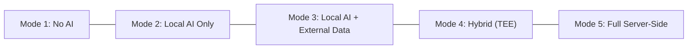
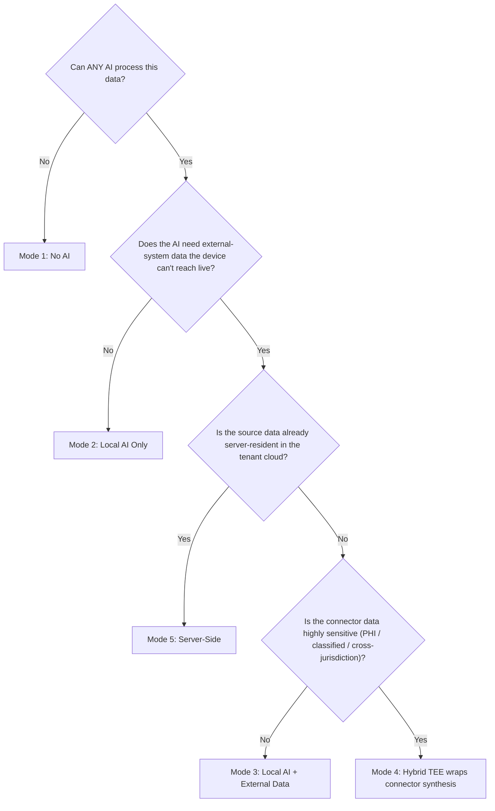

# The AI Privacy Spectrum: One Substrate, Every Trust Posture — for B2C and B2B

> **TL;DR:** AI in messaging is not a single product decision — it is a
> spectrum. A teenager in a group chat, a doctor discussing a patient,
> and a 50,000-person enterprise synthesising plans across Drive, Jira,
> and Slack all need different trust postures. Knowledge serves all of
> them on **one substrate**: chat is the entry point, but the same
> pipeline reaches into 140 connectors across 7+ regions, extracts
> structured memory in 22 languages on-device, and routes every fact
> into exactly one scope — `User`, `Channel`, or `Domain`. That single
> scope field is what lets the product hold **per-user / per-channel /
> per-community** context for B2C and **per-user / per-channel /
> per-domain** context for B2B, with privacy enforced structurally, not
> by promise.

The interesting design question is not "should we add AI?" but "how do
we let every user, every tenant, every regulatory jurisdiction pick
exactly the trust posture they need — and enforce it structurally?"
This post walks the five concrete AI processing modes Knowledge
supports, grounds each in real B2C and B2B scenarios across countries
and languages, and shows how the same scope primitives carry every
privacy guarantee from a single consumer device up to a Fortune 500
tenant.

## Two axes people conflate

Before the modes, one clarification that earlier drafts got wrong. The
substrate has **two orthogonal axes**:

1. **Where the AI model runs** — on-device only, on-device plus an
   attested enclave, or a server-side managed endpoint. The
   `InferenceRouter` (`crates/inference_router/src/router.rs`) bootstraps
   an adapter ladder in priority order — `MLX → llama.cpp → Fallback`
   (`AdapterKind::{Mlx, LlamaCpp, Fallback}`) — and `DeviceTier::{Low,
   Medium, High}` (`crates/inference_router/src/config.rs`) gates which
   adapters are even available.
2. **Where the *data* the AI reasons over comes from** — purely
   device-local (the chat on this device) or partially server-mediated
   (external systems like Drive / Jira / Notion the device cannot reach
   in real time, which arrive through a server-side connector pipeline).

Modes mix and match those axes. The on-device model can still reason
over connector-sourced data, because by the time the model sees a fact
it is a *synthesised observation row* scoped to a channel or user — not
the raw external document.

## The five modes



| Mode | Where the AI runs | Where the data comes from | What leaves the device | Who holds keys |
|---|---|---|---|---|
| **1. No AI** | Nowhere | Device-local only | Nothing (encrypted sync of synthesis objects only) | User |
| **2. Local AI only** | On-device SLM (Bonsai-1.7B) | Device-local only | Encrypted synthesis objects via CRDT | User |
| **3. Local AI + External Data** | On-device SLM | Device-local **plus** a server-side connector pipeline | Connector data already in the tenant cloud; device-local data never leaves | User (device) + tenant (connector) |
| **4. Hybrid (TEE)** | On-device **plus** attested enclave | Device-local plus optional connector data | Encrypted summaries into the TEE; encrypted synthesis back | User + enclave-bound key |
| **5. Full server-side** | Server (managed endpoint or TEE) | Server-resident only (tenant cloud) | Connector data only (already in tenant cloud) | Tenant |

These are not theoretical tiers. Each maps to the `InferenceRouter`
adapter ladder, the `TeeWorker` lifecycle
(`crates/synthesis_engine/src/tee_worker.rs`), and the connector
attachment registry (`crates/connector_framework/src/attachment.rs`).

---

## Mode 1: No AI — encrypted storage only

The router runs in fallback-only mode; `DeviceTier::Low` structurally
blocks every SLM-bearing adapter. Evidence is encrypted at rest in
SQLCipher with per-scope DEKs. Cross-device sync moves only encrypted
synthesis objects via CRDT; raw evidence never leaves the device.

- **B2C** — A teenager's friend group on KChat. No content processing,
  full lexical search, encrypted multi-device sync. The "smart" features
  are simply switched off at the substrate, not toggled off in a setting.
- **B2B** — A psychiatrist in Germany under GDPR Art. 9, or a US law
  firm under ABA Model Rule 1.6. The regulatory framework forbids AI
  processing of the content outright; Mode 1 gives them encrypted,
  searchable, cross-device messaging with zero AI exposure.

Agents do not run here at all — the `agent_contract` proposal flow is
structurally unreachable because no synthesis happens.

---

## Mode 2: Local AI only — the on-device SLM

Everything — data **and** model — stays on the device. The architecture
targets Bonsai-1.7B (a Qwen3-derived multilingual SLM) via llama.cpp
GGUF, plus XLM-R for embeddings and classification, dispatching tasks
like importance tagging, entity extraction, and summary generation with
grammar-constrained decoding. Raw evidence stays local; ~2 KB channel
summaries sync encrypted via CRDT.

Tier gating is structural, so the same source tree serves a $150 Android
and an M-series Mac: `Low` is fallback-only (lexicon classifier + XLM-R
embeddings), `Medium` runs the SLM in batched quiet-period windows,
`High` is always-on interactive synthesis.

- **B2C** — A consumer in Japan, Brazil, or Nigeria using KChat as their
  primary messenger. They want "what did we decide about the trip?" and
  automatic recaps, but nothing on any server. A fully local assistant
  that compounds knowledge over time.
- **B2B** — A wealth manager (US/UK) tracking client preferences and
  action items locally; firm compliance controls that only synthesis
  objects — never raw evidence — sync to firm servers.

---

## Mode 3: Local AI + external data sources

The on-device model now reasons over a memory object that contains
**both** chat-derived and connector-sourced observations — without ever
touching the raw Drive doc, Jira ticket, or Notion page. External data
the device cannot reach in real time arrives through a server-side
connector pipeline (OAuth2 + incremental delta sync + webhooks + ACL
projection), is extracted and scoped server-side, then the *synthesised
rows* flow to the device. Device-local chat never leaves.

- **B2C** — A creator attaches their personal Gmail and Notion to their
  **own** scope. "What did the brand deal email say about deliverables?"
  is answered from private memory no one else can see.
- **B2B** — A tenant admin attaches Jira and Confluence to a
  `#product-launch` **channel**; every engineer sees Jira observations
  beside chat in the channel's memory, clamped to the source ACLs.

---

## Mode 4: Hybrid (TEE) — confidential synthesis

The highest-assurance mode. Synthesis over sensitive external data runs
inside an attested enclave (TDX / SEV-SNP / Nitro) via the `TeeWorker`,
which the cloud operator is excluded from. Channel summaries go in
encrypted; synthesis comes back encrypted; an attestation report plus
synthesiser-key binding lets consumers cryptographically verify outputs
came from untampered code.

- **B2B** — A Singapore bank under MAS TRM, or an EU hospital network
  that needs connector synthesis but cannot let the operator read it.
  The TEE makes "the operator cannot see this" a hardware property.

The honest gap: TEE side-channel attacks are demonstrated in academic
research. TTL-based re-attestation limits the window; it does not make
the mode absolute.

---

## Mode 5: Full server-side — the enterprise connector pipeline

No on-device companion — the server processes data from connected
systems exclusively, through the *same* substrate pipeline. PostgreSQL +
pgvector, per-tenant keys, row-level security by tenant id. This is data
the tenant already accepts in their own cloud.

- **B2B** — A 50,000-person company connects its entire collaboration
  stack. "What does this org know about supply-chain disruptions in
  Southeast Asia?" is answered by traversing a concept graph built from
  observations across thousands of documents and channels — none of it
  manually tagged. Observation dedup means the same fact in an email, a
  CRM note, and a channel message is **one** corroborated observation,
  not three duplicates.

---

## The scope ladder: the same primitives for B2C and B2B

Here is the architectural heart of the product, and the answer to "how
does one substrate serve both consumers and enterprises?" Every
observation is bound to exactly one scope, typed by `ObjectType`
(`crates/permission_service/src/tuple.rs`):

```rust
pub enum ObjectType {
    Tenant,   // highest scope in the B2B hierarchy
    Domain,   // a domain inside a tenant
    Channel,  // a channel inside a domain (or a community in B2C)
    User,     // a user account
    Device,   // a device bound to a user
    // …
}
```

The product maps the two audiences onto the *same* ladder:

| Audience | per user | per channel | grouping tier | top |
|---|---|---|---|---|
| **B2C** | `User` | `Channel` (a room / DM) | **community** (`Domain`) | — (no tenant) |
| **B2B** | `User` | `Channel` (a team room) | **domain** (`Domain`, e.g. a department or client engagement) | `Tenant` (the company) |

So **B2C context is held per user, per channel, per community**, and
**B2B context per user, per channel, per domain** — with identical code.
A "community" in B2C and a "domain/department" in B2B are the same
`Domain`/`Channel` scope objects wearing different product clothes.

Connector ownership rides on this directly. `AttachmentRegistry::attach()`
takes the scope **and its object type** and is gated by
`require_editor(scope_id, object_type, …)`; the supported set is
`[Channel, User, Domain]`. The privacy boundary is one field —
`ConnectorAttachment.scope_id`, read back through
`AttachmentRegistry::scope_for()`:

```text
External system (Drive / Jira / Notion / Qonto / MercadoLibre / …)
  ↓  Connector (OAuth2 + webhook + ACL sync)
  ↓  Server-side observation extraction + synthesis
  ↓  Scope routing via ConnectorAttachment.scope_id
  ├─ Channel / Domain scope → shared memory (ACL-gated, rolls up to Tenant)
  └─ User scope            → UserMemoryObject (private, on-device synthesis)
```

A **personal (user-scoped)** connector lands its observations in the
owner's `UserMemoryObject` (`crates/memory_manager/src/user_memory.rs`)
and is never published into any shared scope. A **channel/domain-scoped**
connector feeds shared summaries that roll up Channel → Domain → Tenant,
every member seeing them under group keying. The dedup layer, decay
state machine, and PROV signing chain are identical across both — only
`scope_id` (and its `ObjectType`) differs, and that one field carries
every guarantee.

> This used to be the architecture's biggest "honest gap": the
> attachment permission check hard-coded `ObjectType::Channel`, so only
> channel-scoped connectors actually worked. That is now closed —
> `attach()` / `require_editor()` are parameterised over the object
> type, so `User`- and `Domain`-scoped attachments are first-class. The
> B2C "personal connector" and B2B "domain connector" stories are both
> real today.

---

## Multilingual, mixed-language, by default

Real conversations — especially in B2C and in global B2B — do not stay
in one language per message. Knowledge extracts structured observations
across **22 languages on-device, with per-sentence language detection**,
so a single code-switched message is segmented and each span routed to
the right lexicon. Two grounded examples:

**B2C — a Singapore buy-sell community (`Channel` inside a community
`Domain`).** A seller posts:

> "Hi! Selling my barely-used stroller, masih elok 95%, 看图 in the
> album. COD at Tampines ok? 顺丰 also can lah."

Per-sentence detection tags English, Malay (*masih elok* — "still in
good condition"), and Mandarin (*看图* — "see photos"; *顺丰* — SF
Express) within one message. The substrate extracts a single
**Item-for-sale** observation — condition 95%, pickup Tampines, courier
SF Express — searchable later by an English query ("which stroller was
near-new?") or a Mandarin one, because cross-lingual recall maps them to
the same observation. The community's other listings stay in the same
`Domain` scope; the buyer's private DMs with the seller stay in their
own `User`/`Channel` scope.

**B2B — a Geneva enterprise deal (`Channel` inside a `Domain`/engagement
under a `Tenant`).** The thread, plus a `Bexio` invoice and a `Qonto`
transaction pulled by channel-scoped connectors, reads:

> "Bestätigt: wir unterschreiben Q3. Le budget est de CHF 240k, payment
> 30 days net. I'll confirm with legal tomorrow."

German, French, and English in three sentences. The substrate extracts
one corroborated **Decision** ("sign in Q3"), one **Amount**
(CHF 240,000), and one **Task** ("confirm with legal"), de-duplicated
against the Bexio invoice line and the Qonto payment that state the same
CHF figure. "What did the Swiss client commit to?" returns the decision
and amount regardless of the asker's UI language — and none of it leaks
into a different engagement's `Domain` scope.

This is the everyday case, not a demo trick: per-sentence detection +
22-language extraction + cross-lingual recall mean mixed-language teams
and communities get the same memory quality as monolingual ones.

---

## 140 connectors across 7+ regions, one pipeline

Mode 3 and Mode 5 are only as useful as the sources they reach. The
catalog is now **140 stable connectors across 7+ regions** — the
original 70 (global SaaS + Vietnam / SEA / GCC) plus 70 regional
providers for the **UK** (Monzo, Revolut, GoCardless, HMRC MTD, …),
**Germany** (DATEV, lexoffice, Personio, …), **France** (Qonto,
Pennylane, Brevo, …), **Switzerland** (PostFinance, TWINT, Bexio, …),
**Australia** (MYOB, Afterpay, Employment Hero, …), **Latin America**
(MercadoLibre, Nubank, PagSeguro, …), and an **expanded SEA** batch
(ShopeePay, GrabPay, GCash, …). Every one implements the same `Connector`
contract, so a regional invoice or payment lands in the substrate the
same way a Slack message does — extracted, scoped, deduplicated, and
ACL-projected. See the [connector ecosystem](19-connector-ecosystem.md)
and the [maturity table](../docs/product/roadmap.md#connector-maturity).

---

## How agents stay grounded — and constrained

The common thread across all five modes: **agents never see the full raw
corpus.** Progressive distillation means raw messages (~200 B each) roll
into channel summaries (~2 KB), then domain memory, then tenant memory.
External connector docs link in at the channel summary tier. An agent
answering a question runs an escalating cascade — lexical (FTS5) →
semantic (XLM-R) → graph traversal → SLM synthesis — stopping at the
cheapest tier that answers.

Writes are **proposal-only**: the `agent_contract` crate's `Proposal`
type (`crates/agent_contract/src/lifecycle.rs`) means an agent can
propose an observation, concept, relation, or summary, but promotion to
canonical memory requires a human action or policy match. Every proposal
carries a signed PROV bundle (ML-DSA-65), evidence refs, confidence,
sensitivity class, agent identity, and model version. So agents are
well-grounded (they work from corroborated, deduplicated memory) **and**
constrained (they can never silently rewrite canonical memory).

Export is gated the same way for humans and agents:
`PolicyEngine::evaluate()` (`crates/export_plane/src/policy.rs`) checks
every export against an `ExportPolicy`, and `ExportPolicy::default()`
sets `allow_raw_evidence: false` with `sensitivity_ceiling:
SensitivityClass::Useful` — which blocks both `Important` and `Critical`
and refuses raw evidence outright. Profiles can only tighten this.

---

## What regulators in different jurisdictions care about

| Jurisdiction | Regulation | Key requirement | Mode(s) that satisfy |
|---|---|---|---|
| **EU** | GDPR (Art. 9, Schrems II) | Data minimisation, no uncontrolled transfer, erasure | 1, 2, 4 (TEE in EU region) |
| **US** | HIPAA, SEC 17a-4, CCPA | PHI protection, retention, consumer rights | 1 (PHI), 2 (financial), 3 (channel-scoped), 5 (with BAA) |
| **Japan** | APPI | Cross-border limits, AI-processing consent | 2, 3 (JP-region data), 4 |
| **Singapore** | PDPA + MAS TRM | No operator access to customer data | 4 (TEE synthesis) |
| **Brazil** | LGPD | Minimisation, right to erasure | 2, 3 (personal-scope only), crypto-forgetting |
| **Australia** | Privacy Act + APP | Reasonable security, cross-border limits | 2, 3 (AU-resident pipeline), 4 |

Cryptographic forgetting (`forget()` → DEK destruction → `DELETE` +
FTS5 `REBUILD` in one transaction) is the substrate's answer to
right-to-erasure everywhere: the key is gone, the ciphertext is noise.

---

## Choosing the right mode



The modes compose. One tenant can run Mode 2 for employee DMs, Mode 3
for team channels with channel- and personal-scoped connectors, Mode 4
for executive channels with TEE synthesis, and Mode 5 for a
connector-sourced knowledge base — all on the same substrate, same scope
model, same crypto primitives, same audit trail.

---

## What we haven't solved yet

Honest gaps, in order of severity:

1. **Host shell key handling.** The master key is passed to the
   substrate via FFI; the host shell (Swift/Kotlin/Electron) must store
   it securely. `SECURITY.md` marks host shells out of scope. This is the
   biggest real-world attack surface.
2. **Observation quality.** The whole value chain depends on the
   observation engine extracting entities, decisions, and tasks
   correctly. The lexicon-first extractor is strong but not perfect; the
   extraction-quality eval and cross-lingual recall benchmark exist to
   keep it honest, and both gate CI.
3. **Production server-side connector service.** The connector framework
   is wired and unit-tested at the substrate boundary across all 140
   providers, but the production HTTP-fronted connector service and
   webhook ingest layer are still hardening against live OAuth2
   endpoints.
4. **TEE side-channels.** Attestation proves code integrity, not
   side-channel resistance; re-attestation limits but does not eliminate
   exposure.

---

## Further reading

- [Why On-Device Memory](01-why-on-device-memory.md) — the case against
  server-side RAG for privacy-conscious apps.
- [The Multilingual Extraction Engine](02-multilingual-extraction-engine.md)
  — structured observations across 22 languages.
- [Memory That Forgets](03-memory-that-forgets.md) — decay and
  cryptographic forgetting.
- [Connector Architecture](06-connector-architecture.md) and
  [140 Connectors](19-connector-ecosystem.md) — the contract and the
  catalog this vision rides on.
- [Multi-Tenant at Scale](09-multi-tenant-at-scale.md) — the permission
  model behind the scope ladder.
