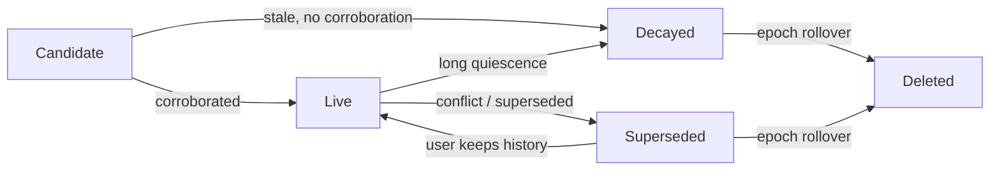

# Adaptive Memory Storage for On-Device AI: How We Keep Knowledge Fresh Without Blowing Up Your Phone

On-device AI is having a moment. The pitch: your model runs
locally, your data never leaves your device, sub-second
responses without paying for inference. The reality, once you
start building, is uglier. A useful AI assistant needs *memory*
— facts, decisions, deadlines, the slow accretion of context
that turns a chatbot into something that actually knows you.
Memory has to live somewhere. And phones, even nice ones, are
not laptops.

This post is about how we designed the memory layer for an
on-device AI substrate so it stays small, stays useful, and
forgets the right things at the right time. The short version:
naive approaches break, and the fix is to treat memory as a
*hierarchy of layers with different rules*, not a single
undifferentiated store.

---

## The Problem

Imagine a workplace channel on a Tuesday morning. Someone posts:

> "Heads up team — launch is now March 15. Priya owns the rollout
> plan, budget is approved at $50k. I'll send the deck after lunch."

Three minutes later, twenty other messages have flowed past:
"thanks!", "🎉", "great", a poll about lunch, two GIFs, somebody
asking the wifi password. By end of week the same launch date is
repeated in a Slack thread, a Jira ticket, a recap email, and a
calendar invite.

A thoughtful AI assistant should be able to answer:

- *"What's the launch date?"* → March 15.
- *"Who owns the rollout?"* → Priya.
- *"What's the budget?"* → $50k.

…even three months later, even when the original message has
scrolled past oblivion, even when you ask in a different channel.
And it should do this *without* eating 8 GB of phone storage and
without grinding the device to a halt every time you open the app.

The naive approaches fail in predictable ways:

| Approach | Failure mode |
|---|---|
| Store everything verbatim, search at query time | Blows past phone storage in weeks; search latency grows linearly with data |
| Embed every message into a vector index | RAM cost is brutal; embeddings dwarf the source text for short messages |
| Send everything to a server, query remotely | Defeats the privacy story; offline-broken; bandwidth-hungry |
| LRU-cache the last N messages | Loses long-tail facts (the launch date) the moment N is exceeded |

The interesting design question isn't *whether* to compress and
forget — you have to. It's *what* to compress, *when* to forget,
and *how* to do it without losing the things that matter.

---

## Insight 1: Not All Content Deserves the Same Storage Strategy

If you eyeball a week of chat data, the size distribution is
extremely skewed. The vast majority of messages are short text:
"sounds good", "on my way", "yes please". A long tail consists
of files, screenshots, voice notes, and the occasional pasted
document.

Treating these the same is wasteful in both directions. A naive
content-hash deduplication scheme (hash every body, look it up
in a dedup table, store once if duplicate) is fantastic for
shared documents — the same PDF circulating across five channels
costs you one body row instead of five. But for a 30-byte chat
message, the dedup index entry is bigger than the message itself,
and the JOIN at read time costs more than just inlining the bytes.

So we route bodies through a **size threshold**:

```mermaid
flowchart TD
    A[Incoming body] --> B{Importance class}
    B -->|Noise: greetings, emoji, "thanks"| C[Ring buffer<br/>FIFO, ~5 MB cap<br/>auto-overwrites]
    B -->|Signal| D{Body size}
    D -->|≤ 512 bytes| E[Inline path<br/>stored directly in<br/>evidence row]
    D -->|> 512 bytes| F[Body-table path<br/>BLAKE3 content hash<br/>dedup across channels]
    E --> G[Observation extraction]
    F --> G
    C --> H[Available for current<br/>synthesis window only]
    H --> G
```

Three distinct paths, each tuned for its workload:

- **Inline (≤ 512 B)** — the bytes go into the evidence row.
  No dedup table lookup. No JOIN at read time. We still compute
  a BLAKE3 hash for integrity framing (so we can detect bit rot
  in cold storage), but we don't index it.
- **Body table (> 512 B)** — the bytes go into a separate body
  table keyed by BLAKE3 hash. Duplicate hashes share one row,
  referenced by many evidence rows. This is where dedup actually
  pays off: the same forwarded PDF, the same pasted code block,
  the same image attachment.
- **Ring buffer (noise class)** — messages tagged as noise by
  the importance classifier ("thanks!", "+1", "🎉", "good
  morning!") never get a permanent home. They go into a
  fixed-size circular buffer that overwrites itself FIFO. They
  *are* available to the current synthesis window — you can
  still answer "what was the vibe of the channel today" —
  but they don't persist.

The ring buffer is the underrated piece. In real chat data,
something like 30–40% of messages are pure social noise. Giving
them a permanent home is a tax you pay forever for no benefit.
Giving them a *temporary* home for a few hours is the right
tradeoff: they can still influence current synthesis without
bloating long-term storage.

---

## Insight 2: Deduplicate Meaning, Not Bytes

For files, byte-level deduplication is a huge win. The same PDF
forwarded to ten channels is one body row.

For text, byte-level deduplication is almost useless. Three
different people will say the same fact in three different
strings. None of the strings are byte-identical, but they
encode the same fact:

> 1. "Launch is March 15."
> 2. "FYI we slipped the launch to 3/15."
> 3. "Mar 15 is the new launch date — confirmed with Priya."

A content hash sees three different bodies. A human sees one fact.
We want the database to behave like the human.

The fix is to push deduplication *up the stack* — not at the
evidence layer (the raw bytes), but at the **observation layer**
(the extracted facts). When the substrate ingests a message, a
small classifier promotes interesting messages to a more
expensive extraction stage that uses an XLM-R encoder + a small
language model to produce structured observations like:

```json
{ "type": "decision", "subject": "launch_date", "value": "2026-03-15", "owner": "Priya", "confidence": 0.92 }
```

Each observation gets an embedding. Before we write it, we check
nearest-neighbour similarity in the observation index. If a
near-duplicate already exists, we *merge* — incrementing a
"corroboration count", updating confidence, linking provenance —
rather than writing a second row.

The result: three messages stating the same fact in three different
ways collapse into one observation with three pieces of evidence
backing it. The LLM doesn't get confused by triplicated context.
Storage stays bounded. And contradiction detection (someone says
the launch is now April 1) becomes a graph operation on top of
this collapsed structure, not a fuzzy search across raw text.

---

## Insight 3: Memory That Forgets

The fashionable thing to say is "memory should be persistent."
The honest thing to say is that persistence-by-default makes
memory unusable. Most things don't deserve to live forever, and
a memory that can't forget is mostly noise.

Every observation enters a **decay state machine**:



Each observation also carries a **class** that determines its
half-life. A few examples:

| Class | Half-life | Example |
|---|---|---|
| Social noise | minutes | "good morning!" |
| Ephemeral status | hours | "I'm in a meeting" |
| Operational | days | "I'll grab lunch at 1" |
| Decision / commitment | months | "Budget approved at $50k" |
| Identity / preference | years | "She prefers dark mode" |

A "good morning!" doesn't get a free seat in your phone for the
next decade. A confirmed budget does.

The deletion mechanism is **cryptographic forgetting**: each
epoch has its own encryption key, and deleting an epoch means
destroying the key. The encrypted bytes might still exist on
disk for a while (cold segments, backups), but without the key
they're noise. This makes deletion provable — you don't have to
trust that the database honored your DELETE statement, you can
verify the key is gone.

---

## Insight 4: The SLM Never Sees the Full Corpus

Even with aggressive forgetting and dedup, the corpus grows. A
year of chat history is a lot of text. The small language model
running on your phone has a context window measured in thousands
of tokens, not millions.

So we don't ask it to read the whole corpus. We use an
**escalating retrieval cascade**:

1. **Lexical** — FTS5 + trigram fuzzy matching over the inline
   bodies and observation snippets. Cheap, often sufficient. If
   you ask "what's the launch date" and the channel summary says
   "Launch is March 15", we're done in milliseconds.
2. **Semantic** — XLM-R embedding search over observations.
   Catches the cases where the question is phrased differently
   from the source. Still cheap; runs on the on-device embedding
   model.
3. **Graph traversal** — walk the concept graph. If the question
   is "who's responsible for the launch", we follow the
   `launch_date` node to its `owner` edge, no SLM call required.
4. **SLM synthesis** — only if the lower tiers can't produce a
   confident answer do we wake up the SLM, hand it a *small,
   pre-filtered set* of relevant observations and channel
   summaries, and ask it to synthesize.

The SLM never sees ten thousand messages. It sees ten or twenty
observations the lower layers determined were relevant. This is
what keeps RAM bounded as memory grows.

---

## Insight 5: Synthesize Up, Never Down

The memory hierarchy looks like this:

```mermaid
flowchart TD
    R[Raw messages<br/>~200 B each<br/>thousands per channel] --> CS[Channel summary<br/>~2 KB per channel<br/>updated each synthesis window]
    CS --> DS[Domain memory<br/>~5 KB per domain<br/>e.g. "launch", "hiring"]
    DS --> TS[Tenant / user memory<br/>~10 KB per scope<br/>top-level facts and preferences]
```

Each layer is dramatically smaller than the one below it. A
channel that ingested 500 raw messages produces a ~2 KB summary
that captures the through-line: *"Launch was rescheduled to
March 15. Priya owns rollout. Budget confirmed at $50k. Open
question: which markets ship first."* The SLM produces this
summary asynchronously during quiet periods, then queries hit
the summary instead of re-reading 500 messages.

The contract is **synthesis flows up the hierarchy, never down**.
Higher layers never ingest higher layers as input. That keeps
the data-flow graph acyclic, prevents "telephone-game"
degradation where summaries summarize summaries, and lets us
delete or rebuild any single layer without poisoning the others.

---

## Putting It Together

Let's trace a single message through the whole system. Someone
posts in `#product-launch`:

> "Confirmed with finance — launch budget is $50k, locked for Q1." (~110 bytes)

Here's what happens:

| Stage | Action | Approximate size |
|---|---|---|
| 1. Ingest | Per-scope encryption, BLAKE3 framing | 110 B body + ~40 B header |
| 2. Classify | Importance tagger: signal (not noise) | (no storage) |
| 3. Storage routing | ≤ 512 B → inline path, written into evidence row | 110 B inline |
| 4. Observation extraction | XLM-R + SLM produce: `{type: budget_decision, value: $50k, scope: launch, period: Q1}` | ~150 B observation row |
| 5. Semantic dedup check | Embedding NN search finds related "$50k budget" observation; merge with corroboration++ | (no new row written) |
| 6. Concept graph update | Add edge `launch → has_budget → $50k` (or strengthen existing edge) | ~40 B edge |
| 7. Decay class assigned | "decision / commitment" — half-life of ~6 months | (metadata only) |
| 8. Channel summary update | Next synthesis window: channel summary updated to mention confirmed budget | ~+30 B in summary |
| 9. Retrieval | User asks "what's the launch budget?" → lexical hit on summary, no SLM call | <50 ms |

Total persistent footprint for this message: ~110 B inline + ~150 B
observation + ~40 B edge + a small contribution to the channel
summary. The 110 B body is the only new bytes that scale linearly
with message volume; the rest amortizes over time as observations
merge and summaries stay roughly fixed-size.

Compare to the naive "store everything, embed everything" path:
~3 KB on this single message (body in a body table, dedup index
entry, full XLM-R embedding, FTS row, un-merged observation row)
and no compounding benefit at synthesis time.

---

## The Numbers

The whole substrate runs inside hard caps:

- **250 MB** total footprint on mobile (without the SLM resident)
- **1 GB+** on desktop (with the SLM resident in mmap'd weights)
- **5 MB** ring buffer for noise-class messages, FIFO overwrite
- **mmap** for all model weights so the OS can evict pages cleanly
  under memory pressure
- **60 s idle-unload** for the SLM after a quiet period; the next
  synthesis call triggers a re-warm
- **1 heavy model resident at a time** on mobile; on desktop the
  SLM and the embedding model can coexist
- **Battery-aware**: below 20% the synthesis pipeline skips heavy
  work and falls back to lexicon-only ingest
- **Tier-aware**: low-end devices never enter the SLM path; the
  substrate stays queryable on lexicon + classifier alone

Hard caps mean the system has to be honest about what it can't
keep. The decay state machine, the ring buffer, and cryptographic
forgetting are how we make "we can't keep everything" stop being
a bug and start being a feature.

The thing we keep coming back to: *useful* memory is not
*complete* memory. It's the right facts, at the right grain, with
the right provenance, in the right hierarchy — small enough to
fit on the device the user owns, fresh enough that the assistant
doesn't feel stuck in last quarter, and honest enough about what
it has forgotten that you can trust what it tells you.

That's a different mental model than "store everything and
search later." It's also the only one we've found that actually
works on a phone.
