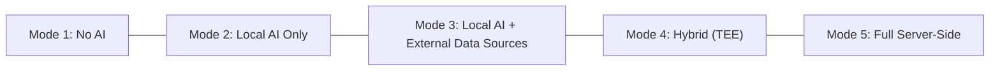
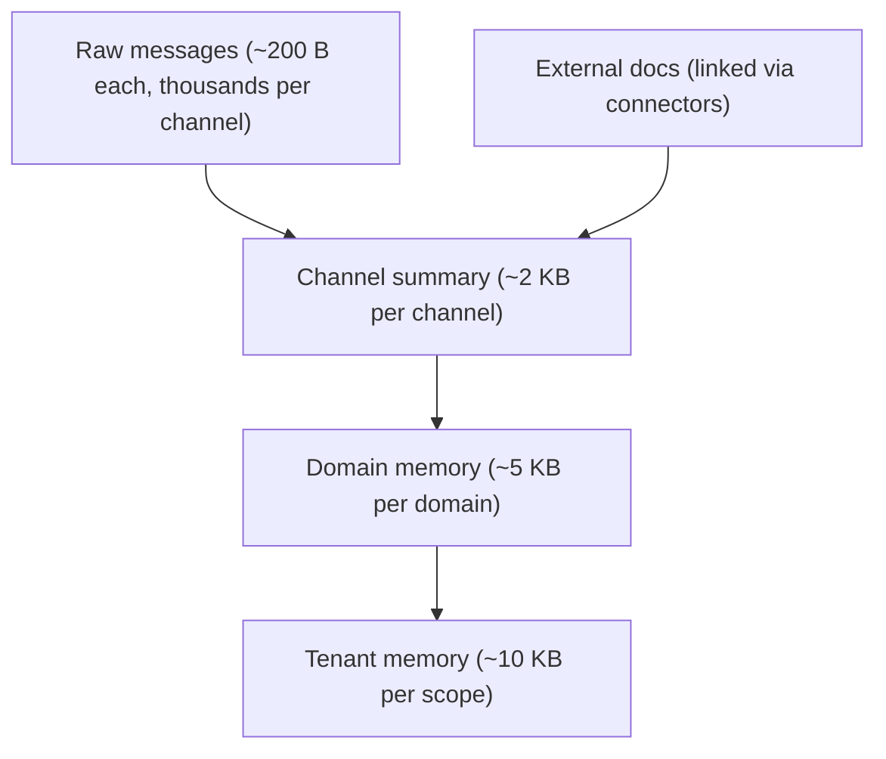
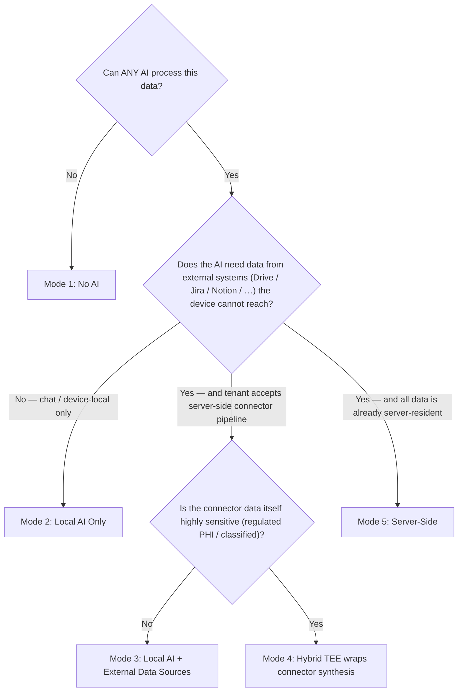

# The AI Privacy Spectrum: How KChat Serves Every Trust Posture from Zero AI to Full Hybrid Processing

AI in messaging is not a single product decision — it is a spectrum. A teenager in a group chat has different privacy expectations than a doctor discussing a patient, and both differ from an enterprise team synthesising quarterly plans across Google Drive, Jira, and Slack. The interesting design question is not "should we add AI?" but "how do we let every user, every tenant, every regulatory jurisdiction pick exactly the trust posture they need — and enforce it structurally, not by promise?"

This post walks through five concrete AI processing modes that KChat supports through the Knowledge substrate, grounds each in real business scenarios across industries and countries, explains how AI agents operate with well-grounded context at every tier, and maps the threat model against the three actors most products ignore: the KChat operator itself, the infrastructure operator (cloud provider), and external attackers.

A critical clarification before we start. The substrate offers two orthogonal axes, and earlier drafts conflated them:

1. **Where the AI model runs** — on-device only, on-device plus a confidential enclave, or server-side managed endpoint.
2. **Where the *data* the AI reasons over comes from** — purely device-local (chat messages on this device) or partially server-mediated (external systems like Drive / Jira / Notion that the device cannot reach in real time and so reach the substrate through a server-side connector pipeline).

Mode 3 below sits on a specific combination of those axes: AI stays on-device, but external **data** is reached through a server-side connector pipeline. The substrate then routes the synthesised observations into the correct scope — channel knowledge if a tenant admin attached the connector to a channel, user knowledge if the user attached it personally — and enforces that routing through `ConnectorAttachment.scope_id` and `AttachmentRegistry::scope_for()` in `crates/connector_framework/src/attachment.rs`.

---

## The Five Modes

The Knowledge substrate ships three deployment modes (`docs/DESIGN.md` §8) that combine into five distinct AI processing postures on the user-facing surface:



| Mode | Where the AI runs | Where the data comes from | What leaves the device | Who holds keys |
|---|---|---|---|---|
| **1. No AI** | Nowhere | Device-local only | Nothing (encrypted sync of synthesis objects only) | User |
| **2. Local AI only** | On-device SLM (Bonsai-1.7B) | Device-local only | Encrypted synthesis objects via CRDT | User |
| **3. Local AI + External Data Sources** | On-device SLM | Device-local **plus** server-side connector pipeline for external systems (Drive / Notion / Jira / …) | Connector-sourced data flows server-side (data the tenant already has in their cloud); device-local data never leaves | User (device data) + tenant (connector data) |
| **4. Hybrid (TEE)** | On-device **plus** attested enclave | Device-local plus optional connector data | Encrypted channel summaries into TEE; encrypted synthesis back | User + enclave-bound key |
| **5. Full server-side** | Server (managed endpoint or TEE) | Server-resident only (tenant cloud) | Connector-sourced data only (already in tenant cloud) | Tenant |

These are not theoretical tiers. Each maps to the `InferenceRouter`'s adapter ladder (`crates/inference_router/src/router.rs`), the `TeeWorker` lifecycle (`crates/synthesis_engine/src/tee_worker.rs`), and the connector attachment registry (`crates/connector_framework/src/attachment.rs`). The router bootstraps adapters in priority order: `MLXAdapter → LlamaCppAdapter → FallbackAdapter`. Device tier gating (`DeviceTier::Low` / `Medium` / `High`) determines which adapters are available; the rest is structural.

---

## Mode 1: No AI — Encrypted Storage Only

### What it is

The substrate runs with the `InferenceRouter` in fallback-only mode. The `FallbackAdapter` handles basic lexicon classification (regex/keyword heuristics) but no SLM synthesis. The `DeviceTier::Low` configuration structurally blocks every SLM-bearing adapter — `crates/inference_router/tests/router_integration_tests.rs::low_tier_blocks_slm_adapters` pins that contract. Evidence is encrypted at rest in SQLCipher with per-scope DEKs. Cross-device sync moves only encrypted synthesis objects via CRDT; raw evidence never leaves the originating device.

### Who needs this

**Healthcare in the EU (Germany, France).** A psychiatrist using KChat for patient case notes under GDPR Art. 9 (special category data) and national medical confidentiality law. The data cannot be processed by any AI — not even on-device — because the regulatory framework requires explicit, informed, per-processing-purpose consent that the patient has not given for AI processing. The substrate stores notes encrypted, syncs across the doctor's devices, and provides lexical search. No model ever touches the content.

**Legal privilege in the US.** Attorney-client communications at a law firm using KChat. Work product doctrine and ethical rules (ABA Model Rule 1.6) prohibit disclosure to third parties, which some interpretations extend to AI processing by third-party models. Mode 1 gives the firm encrypted, searchable, cross-device messaging with zero AI exposure.

**Government classified channels (Five Eyes, NATO).** Classified discussions on KChat where policy forbids any automated content processing. The substrate provides the communication layer; AI is structurally disabled, not just toggled off in a preference screen.

### Threat model

| Actor | Protection |
|---|---|
| **External attacker** | SQLCipher with `kdf_iter = 256_000` and `cipher_page_size = 4096` set explicitly (cipher mode and HMAC hash inherit SQLCipher 4 defaults: AES-256-CBC + HMAC-SHA512); hybrid X25519 + ML-KEM-768 KEM for key exchange |
| **KChat operator** | Never possesses master key; raw evidence never syncs to server; no AI endpoint to exfiltrate through |
| **Infrastructure operator** | No server-side processing; encrypted bytes at rest on user device; cloud provider sees only encrypted CRDT sync blobs |

### How agents work here

They don't. The `agent_contract` crate's proposal-only write contract (`crates/agent_contract/src/lifecycle.rs`) is structurally inaccessible — no synthesis runs, no proposals are generated. The substrate is a pure storage and retrieval layer. Lexical FTS5 search still works for point lookups.

---

## Mode 2: Local AI Only — On-Device SLM

### What it is

The full on-device inference stack is designed to run Bonsai-1.7B (1.7B parameter Qwen3-derived multilingual SLM) via MLX on Apple Silicon or llama.cpp GGUF on Android/Windows/Linux, plus XLM-R for embeddings and classification. The `InferenceRouter` dispatches six task types: importance tagging, entity extraction, observation promotion, summary generation, concept synthesis, and contradiction adjudication — all with GBNF grammar-constrained decoding.

Production status today: only the llama.cpp HTTP adapter ships wired into the router. The MLX adapter and the lexicon-only fallback are scaffolded as follow-on integration points (see `README.md` §Status). The architecture and contracts described in this section are the steady state, not what every platform binary ships in the current build.

Everything — data **and** model — stays on the device. Raw evidence stays local. Synthesis objects (channel summaries ~2 KB each) sync encrypted via CRDT. The server never sees raw messages or the AI's intermediate outputs.

### Device tier gating

The same source tree serves a $150 Android and an M-series Mac because tier gating is structural:

- `DeviceTier::Low` — fallback-only. Lexicon classifier handles importance tagging; no SLM. XLM-R INT4 (~55 MB) still runs for embeddings.
- `DeviceTier::Medium` — gated SLM. The SLM runs in batched windows during quiet periods; not always-on.
- `DeviceTier::High` — always-on SLM, low-latency interactive synthesis.

A pure-Mode-2 deployment on a `Low` device simply skips on-device summaries and relies on lexical search plus basic classification. It does not silently spill to a managed endpoint — that would be a different mode.

### Who needs this

**Personal B2C users globally.** A consumer in Japan, Brazil, or Nigeria using KChat as their primary messenger. They want smart features — "what did we decide about the trip?", automatic channel recaps, surfaced action items — but they don't want their messages processed on any server. Mode 2 gives them a fully local AI assistant that compounds knowledge over time.

**Journalists and activists.** A journalist in Turkey or Myanmar communicating with sources over KChat. The device is the trust boundary. Even if the network is compromised, the AI processing happens locally. The progressive distillation (raw → channel summary → domain summary) means even the synthesised outputs that sync across devices contain no raw source quotes — only distilled facts.

**Financial advisors (US/UK).** A wealth manager using KChat with clients. SEC/FCA rules require records retention but also restrict data sharing. Mode 2 lets the advisor's AI assistant track client preferences, meeting outcomes, and action items locally while the firm's compliance policy controls what syncs to the firm's servers (synthesis objects only, not raw evidence).

### Threat model

| Actor | Protection |
|---|---|
| **External attacker** | Same as Mode 1, plus the SLM runs in-process — no network surface for inference calls |
| **KChat operator** | Synthesis objects that sync are encrypted with user-held scope DEKs; operator sees ciphertext only. CRDT merge happens on encrypted blobs. |
| **Infrastructure operator** | Same as Mode 1. Zero server-side AI processing. |

### How agents work here

Agents operate through the `agent_contract` proposal-only write contract. The on-device SLM generates candidate observations and concepts, but they enter the substrate as *proposals* — never as canonical memory. Promotion requires either explicit user action (pinning, approval) or a local policy match (high confidence + cross-source corroboration + low sensitivity).

The key insight: the agent sees only the synthesised memory hierarchy, not raw evidence. When it answers "what's the launch date?", it consults the channel summary (~2 KB) and the concept graph, not the 500 raw messages that produced them. This bounds the context window, keeps RAM bounded, and means the agent's grounding is always the distilled, corroborated version of reality — not a noisy raw feed.

The escalating retrieval cascade controls cost: lexical FTS5 first (milliseconds), then XLM-R semantic search, then graph traversal, then SLM synthesis. The SLM is the most expensive step and runs only when cheaper retrieval modes fail.

---

## Mode 3: Local AI + External Data Sources

This is the mode earlier drafts of this post got wrong. The correction matters enough to spell it out twice:

> **The AI model still runs locally on the device. What is "external" is the *data source*, not the AI endpoint.**

A device cannot read a tenant's Google Drive, a project's Jira board, or a team's Notion workspace in real time — those systems gate access behind OAuth2, push deltas through webhooks, and live in clouds the device doesn't have credentials for. The server-side connector pipeline does the fetch / aggregate / observe / synthesise work on those external systems, and the resulting observations flow into the substrate scoped to wherever the connector is attached. The on-device AI then reasons over that enriched local memory — exactly the same way it reasons over chat-derived memory in Mode 2.

### What it is

Both the knowledge substrate and the AI model sit on-device. The novel piece is the connector pipeline: nine connectors — Google Drive, OneDrive / SharePoint, Notion, Jira, Confluence, Figma, HubSpot, Slack, Email — implement the same contract (`docs/DESIGN.md` §10.2): OAuth2 with refresh-token storage, incremental sync, webhook push, channel-scoped attachment, ACL sync from the source system.

When a connector emits a delta (new doc, ticket update, page edit), the server runs the substrate's standard ingest pipeline on it: importance classification, storage routing, observation extraction, semantic dedup, decay class assignment, channel/domain summary update. The output is structured observations and synthesised memory objects, encrypted to a specific substrate scope, that flow into the substrate alongside chat-derived knowledge. The on-device AI then operates on the enriched scope memory — it queries the channel / user memory object that now contains connector-sourced observations, without ever seeing the raw Drive document or Jira payload.

### Connector ownership — the key distinction

A single connector — same source code, same observation pipeline, same dedup logic — produces fundamentally different privacy outcomes depending on *who attached it and to what scope*. The attachment registry binds every connector instance to exactly one substrate scope (`ConnectorAttachment.scope_id` in `crates/connector_framework/src/attachment.rs`), and the observation pipeline reads that binding via `AttachmentRegistry::scope_for()` to inherit the correct scope on every emitted observation. There are two patterns:

#### (a) Channel-scoped connector (shared knowledge)

A tenant admin or editor attaches a connector to a channel scope — e.g. Jira to `#product-launch`. The `AttachmentRegistry::attach()` call gates this on the permission graph: `require_admin_or_editor()` rejects the attempt unless the caller holds `Relation::Admin` or `Relation::Editor` on the scope, modelled as a `Channel` object in the Zanzibar-style permission graph.

Once attached, every Jira-derived observation inherits the channel scope. The synthesised memory feeds the channel summary, rolls up into the domain summary, and is visible to every channel member under MLS group keying. When any team member's on-device AI assistant asks "what's the status of the launch tickets?", it consults the channel memory object — which now contains Jira observations alongside chat observations. The knowledge is *channel knowledge*: shared by design, gated by channel membership, ACL-mirrored from Jira so revoking a user from a Jira project also clamps what the substrate will surface to them about it.

#### (b) User-scoped connector (private knowledge)

A user attaches a connector to their *personal* scope — e.g. their personal Gmail. The attachment binds the connector to a user-owned `ScopeId`. Connector-derived observations inherit that scope and feed into the user's `UserMemoryObject` (`crates/memory_manager/src/user_memory.rs`). Synthesis runs on-device against that personal memory object. Nothing is published into any shared scope. Other users — including channel peers — never see those observations, because the scope binding never references their tenant or channel.

The same code paths, the same dedup, the same decay state machine. The privacy boundary moves entirely with the scope id.

```
External system (Drive / Jira / Notion / Slack / Email / Figma / HubSpot / OneDrive / Confluence)
  ↓
Connector (OAuth2 + webhook)
  ↓
Server-side observation extraction + synthesis (per docs/DESIGN.md §10.3)
  ↓
Scope routing via ConnectorAttachment.scope_id (AttachmentRegistry::scope_for)
  ├─ Channel scope  → Channel Memory Object  → Domain → Tenant  (shared under MLS group keying)
  └─ User scope     → User Memory Object                         (private, on-device synthesis)
```

The previous blog adaptive-memory-storage-for-on-device-ai.md (§"Connectors Are Just Another Evidence Source") put this in another way: "the substrate is the cognitive layer; connectors decide *what* gets attached and *who* can see it." Mode 3 is what falls out of that separation when external data is in play.

### Who needs this

**Mid-market SaaS companies (US, EU, APAC).** A 500-person product company using KChat with channel-scoped connectors to Google Drive, Jira, Notion, and Slack on `#engineering`, `#product`, `#sales`. The engineering channel's Jira connector means every engineer's on-device AI knows about ticket status updates, sprint commits, and blockers — synthesised, deduplicated against chat, with the AI processing staying local on each engineer's device. The shared knowledge stays shared *within the channel*; it never leaks across channel boundaries because the attachment binding scopes it.

**Retail chains (Japan, Southeast Asia).** A retailer with 200 stores using KChat for store-to-HQ communication. Each store's channel has an inventory-system connector attached by the store manager (channel-scope). Regional channels aggregate store summaries (domain-scope). Each store manager's phone runs local AI over their channel memory — which now includes inventory observations alongside chat observations.

**Real estate agencies (Australia, UK).** Agents attach a HubSpot connector to client-specific channels (channel-scope) so the agency team can see deal status. Individual agents *also* attach personal Email connectors to their own user scope — that personal email memory never publishes into the agency channels and never feeds the agency's domain memory. Same connector code, same observation pipeline, completely different privacy boundary.

**Individual knowledge workers.** A freelance consultant attaches a personal Notion connector and a personal Gmail connector to their user scope. The substrate builds a private memory: meeting notes from Notion, action items from email threads, all synthesised on-device. Nothing is shared with anyone — the user-scoped attachment guarantees it structurally.

### Threat model

| Actor | Protection |
|---|---|
| **External attacker** | OAuth2 tokens stored in the tenant key vault, never in cleartext config; observations and synthesised memory encrypted with per-scope DEKs end-to-end; webhook signatures verified before ingest |
| **KChat operator** | Server-side connector pipeline sees connector-sourced data in plaintext during extraction and synthesis — but this is data the tenant has already chosen to put in their cloud (Drive, Jira, Notion …). Device-local data (chat messages) never reaches the connector pipeline. **Crucially:** personal-connector data flows only into user scope. The operator sees it during server-side processing, but the user's on-device synthesis layer, their personal memory object, and any device-local reasoning over it remain off-server. A channel-connector's data is visible to all channel members under MLS group keying (by design — they are sharing it); a personal connector's data is visible only to the owner's device. |
| **Infrastructure operator** | The connector data lands in the same cloud the tenant already trusts for their other workloads (their Drive, their Jira). Device data never reaches the server. For tenants who need stronger guarantees over the connector synthesis itself, Mode 4 (TEE) wraps it. |

### The honest gap

Mode 3's server-side connector pipeline processes external data in plaintext (or per-tenant encrypted at rest), because that is what the source systems expose. For external data that is itself extremely sensitive (regulated PHI / PII in a customer's Drive), Mode 4 can wrap the connector synthesis in an attested enclave. Mode 3 is the right default for the common case where the tenant already trusts their own cloud with this data; it is not the right mode if the threat model demands that *no* server-side process ever see plaintext.

---

## Mode 4: Hybrid AI with Confidential Compute (TEE)

### What it is

The confidential-compute hybrid mode. On-device AI handles channel-level synthesis. Cross-channel synthesis that cannot use the elected-device path (because the group is too large, devices are heterogeneous, or the workload is too heavy) runs inside an attested Trusted Execution Environment — Intel TDX, AMD SEV-SNP, or AWS Nitro Enclaves. The `TeeWorker` exposes two public entry points — `attest()` and `synthesize_domain()` — and enforces a strict lifecycle around them. The named functions below are internal lifecycle steps inside those entry points, not public API; they are described here because each one is the audit-anchor for a specific guarantee:

1. **Attest before processing.** `attest()` drives the internal `attest_with_scope()` step, which produces a hardware-backed quote; `verify_attestation()` checks the enclave image hash against the `expected_measurement` from the deployment manifest. Platform mismatch or measurement mismatch → hard failure, audit entry, `Lifecycle::Unattested`.
2. **Bind synthesiser key.** The internal `bind_synthesizer_key()` step ties the attestation report to a specific synthesiser public key. Consumers verify that synthesis outputs came from the attested enclave, not from an operator-controlled process.
3. **Scope binding.** Before each `synthesize_domain()` call enters the synthesising state, the internal `assert_scope_allowed()` predicate refuses any scope not in the worker's configured `scope_bindings`. An operator cannot repurpose a worker to access a different customer's data, even by calling the public entry point with a foreign scope id.
4. **TTL-based re-attestation.** Attestation expires after `attestation_ttl` (default 1 hour). The worker must re-attest periodically.

Decryption happens only inside the enclave. The worker publishes encrypted synthesis objects back into the scope. The operator cannot read plaintext even with full host access. When Mode 4 is layered on top of Mode 3, the connector synthesis step itself can run inside the enclave — useful when the external data source is regulated and the tenant is unwilling to trust a plaintext server-side pipeline.

### Who needs this

**Healthcare networks (US, EU).** A hospital network with 50 facilities using KChat. Patient case discussions happen in per-case channels with E2EE. Cross-facility synthesis ("what's the regional trend in post-op complication rates?") needs to aggregate across channels that span multiple facilities. No single device can do this. A plaintext server cannot see the data. The TEE worker decrypts inside the enclave, synthesises, and publishes encrypted results. The hospital's compliance team verifies attestation reports.

**Banking and capital markets (Singapore, Switzerland, UK).** A bank's trading desk using KChat for deal flow. MAS (Singapore), FINMA (Switzerland), or FCA (UK) regulations require that customer data not be accessible to the platform operator. TEE synthesis lets the bank's KChat deployment aggregate deal intelligence across desks without the operator (or the cloud provider's hypervisor) accessing plaintext.

**Defence contractors (US, EU).** A defence firm using KChat for cross-team coordination on classified-adjacent (CUI/FOUO) programmes. NIST SP 800-171 requires protection from the hosting environment. TEE workers running on AWS Nitro Enclaves (which explicitly exclude AWS operator access from the enclave memory) satisfy this requirement at the synthesis layer.

**Cross-border legal (EU/US).** A multinational law firm using KChat across EU and US offices. GDPR's Schrems II ruling restricts EU personal data transfers to the US. TEE workers running in EU-region enclaves process EU-sourced channel summaries without the data leaving the EU jurisdiction or being accessible to a US-based operator.

### Threat model

| Actor | Protection |
|---|---|
| **External attacker** | Hardware-isolated enclave memory; all inputs/outputs encrypted in transit and at rest; attestation proves code integrity |
| **KChat operator** | **This is the primary threat Mode 4 addresses.** The operator has full host access but cannot read enclave memory (hardware enforced). Attestation report + synthesiser key binding let consumers cryptographically verify outputs came from untampered code. Scope bindings prevent lateral movement. |
| **Infrastructure operator** | TEE platforms (TDX, SEV-SNP, Nitro) are designed to exclude the cloud provider from the trust boundary. On Nitro: "no AWS operator or system has the ability to access data in processing within an enclave." On SEV-SNP: the hypervisor is explicitly untrusted. Side-channel attacks remain a theoretical risk (see below). |

### The honest gap

TEE side-channel attacks have been demonstrated in academic research against SGX. TDX and SEV-SNP have newer mitigations but are not side-channel-proof. The substrate's TTL-based re-attestation limits the window, but a state-level adversary with physical access to the host could potentially extract secrets via power analysis or cache timing. This is the highest-assurance mode the substrate offers, but it is not absolute.

---

## Mode 5: Full Server-Side — Enterprise Connector Pipeline

### What it is

The on-server surface processes data from connected systems exclusively — Google Drive, OneDrive, Notion, Jira, Confluence, Figma, HubSpot, Slack, Email — through the same substrate pipeline as on-device. The server authenticates via OAuth2, pulls documents through incremental delta sync + webhooks, runs the full observation → semantic → reasoning → export pipeline, and synthesises domain/tenant memory via a managed endpoint or TEE. This is data the tenant already accepts in their cloud; the server processes it because it came from server-accessible systems.

PostgreSQL with pgvector + MinIO/S3 for blob storage. Per-tenant encryption keys; row-level security by tenant id; physical isolation optional. The nine connectors implement the same shared contract used by Mode 3, just without an on-device companion.

### Who needs this

**Enterprise knowledge management (global Fortune 500).** A 50,000-person company using KChat with connectors to their entire collaboration stack. The server ingests their Drive docs, Confluence pages, Jira tickets, and Slack threads. The substrate builds a continuously-updated tenant memory: "What does this org know about supply chain disruptions in Southeast Asia?" — answered by traversing a concept graph built from observations extracted across 500 connected documents and 2,000 Slack channels. No human manually tagged any of it.

**Professional services (Big Four, management consulting).** A consulting firm using KChat for client engagements. Each engagement is a domain. Connectors ingest the client's SharePoint, the firm's Confluence knowledge base, and the engagement's Jira board. Domain synthesis produces a continuously-updated engagement memory: decisions, open risks, action items, stakeholder map — derived from all sources, deduplicated at the observation layer, and scoped to the engagement's access control list.

**Sales organisations (US, EMEA).** A sales team using KChat with HubSpot and Email connectors. The server-side pipeline extracts deal facts from CRM records, email threads, and channel discussions. Domain synthesis produces per-deal memory: "What's the status of the Acme deal? Who's the economic buyer? What objections have been raised?" The observation dedup means the same fact stated in an email, a CRM note, and a channel message is one corroborated observation, not three confusing duplicates.

### Threat model

| Actor | Protection |
|---|---|
| **External attacker** | Per-tenant encryption keys, Zanzibar-style relation graph for fine-grained access control, ACL sync from source systems |
| **KChat operator** | Per-tenant keys mean the operator cannot decrypt cross-tenant data. Within a tenant, the operator is a service provider with encrypted-at-rest storage. For tenants requiring stronger guarantees, the synthesis endpoint can run in a TEE (Mode 4's protections compose with Mode 5's data source). |
| **Infrastructure operator** | Per-tenant encryption. Physical isolation optional (dedicated PostgreSQL instances per tenant). The infrastructure operator sees ciphertext at rest and encrypted connections in transit. |

---

## Connector Ownership Deep Dive

This is the single most important architectural detail Modes 3, 4, and 5 share, and it deserves its own section. Connector ownership determines whose knowledge a given external data source becomes.

### Pattern A: Channel connector

A tenant admin or editor attaches a connector to a channel scope. The call is `AttachmentRegistry::attach()` and it is gated by `require_admin_or_editor()` in `crates/connector_framework/src/attachment.rs`:

```rust
// from crates/connector_framework/src/attachment.rs
fn require_admin_or_editor(
    scope_id: ScopeId,
    store: &TupleStore,
    namespaces: &NamespaceRegistry,
    subject: SubjectRef,
) -> Result<()> {
    let object = ObjectRef::new(ObjectType::Channel, scope_id.as_uuid());
    let allowed = check_permission(store, namespaces, object, Relation::Admin, subject)
        || check_permission(store, namespaces, object, Relation::Editor, subject);
    if allowed { Ok(()) } else { Err(ConnectorError::PermissionDenied) }
}
```

Observations derived from the connector inherit the channel scope. They feed channel summaries, roll up into domain summaries, and ultimately into tenant summaries. Every channel member sees them under MLS group keying. ACL changes upstream propagate downward: revoking a member from the channel clamps what the substrate will surface to them about connector-sourced facts. Example: an admin attaches Jira to `#product-launch`; every engineer on the team sees Jira observations alongside chat observations in their channel memory.

### Pattern B: Personal (user-scoped) connector

A user attaches a connector to their own personal scope. The same `attach()` code path runs, but the scope id is the user's personal scope rather than a channel scope. Observations inherit the user scope and feed only into the user's `UserMemoryObject` (`crates/memory_manager/src/user_memory.rs`). Synthesis runs on-device against that personal memory. Nothing is published into any shared scope.

Example: a user attaches their personal Gmail connector. Email-derived observations land in their personal memory. Their on-device AI answers "what did Maria ask me about the contract last week?" from this private memory. No teammate, no channel member, nobody else's substrate ever sees those observations — because the scope binding never references their tenant or channel.

### Same code path, different privacy boundary

```
External system (Drive / Notion / Jira / Confluence / Figma / HubSpot / Slack / Email / OneDrive)
  ↓
Connector (OAuth2 + webhook + ACL sync)        [docs/DESIGN.md §10.2]
  ↓
Server-side observation extraction + synthesis [docs/DESIGN.md §10.3]
  ↓
Scope routing via ConnectorAttachment.scope_id
  ├─ Channel scope → Channel Memory Object → Domain Memory Object → Tenant Memory Object
  │                      (shared under MLS group keying, channel ACL gated)
  └─ User scope    → UserMemoryObject
                       (private, never published, on-device synthesis)
```

The dedup layer is the same. The decay state machine is the same. The PROV signing key chain is the same. What differs is one field on the attachment record — `scope_id` — and that one field is what carries every privacy guarantee in the architecture.

---

## How Knowledge Gives Agents Grounded Context at Every Mode

The common thread across all five modes: **agents never see the full raw corpus**. The progressive distillation hierarchy means:



An agent answering a question runs through an escalating retrieval cascade:

1. **Lexical** (FTS5) — milliseconds, often sufficient
2. **Semantic** (XLM-R embeddings) — catches paraphrase
3. **Graph traversal** (concept graph) — multi-hop reasoning
4. **SLM synthesis** — only if cheaper modes fail

The agent contract is proposal-only: `propose_observation`, `propose_concept`, `propose_relation`, `propose_summary`. Promotion to canonical requires human action or policy match. Every proposal carries a signed PROV bundle (ML-DSA-65), evidence refs, confidence score, sensitivity class, agent identity, and model version.

In Mode 3 specifically, the on-device agent now reasons over a memory object that contains both chat-derived and connector-sourced observations — without ever touching the raw Drive document, Jira ticket, or Notion page. By the time the agent sees a fact, it has been extracted, scoped, deduplicated, and corroborated against any chat-sourced version of the same claim. The agent is well-grounded *and* constrained: it cannot exfiltrate raw external content because it never had access to it, only to the synthesised observation rows scoped to the channel or user.

This means agents are well-grounded (they work from corroborated, deduplicated, synthesised memory), and they're constrained (they can never alter canonical memory without a traceable, auditable promotion step). The same contract applies whether the agent runs on-device (Mode 2 / 3) or server-side (Mode 5).

---

## The Threat Actor Matrix

Most products discuss external attackers. The interesting threat actors for a messaging platform with AI are the ones with legitimate access:

### 1. External Attackers

| Attack | Mitigation |
|---|---|
| Database theft (stolen device / backup) | SQLCipher with 256k KDF iterations + 256-bit master key |
| Network interception | Hybrid X25519 + ML-KEM-768 KEM (post-quantum forward secrecy) |
| Harvest-now-decrypt-later (quantum) | ML-KEM-768 from day one; quantum attacker cannot recover session secrets |
| Prompt injection against AI | Grammar-constrained decoding (GBNF) prevents free-form output; agents are proposal-only (cannot write canonical memory) |
| Connector token theft (Mode 3 / 5) | OAuth2 refresh tokens stored in tenant key vault; webhook signatures verified; ACL sync clamps reachability to source-system permissions |

### 2. KChat Operator (Uney)

This is the actor most products don't discuss honestly. The KChat operator runs the server infrastructure, ships the client code, and manages the deployment pipeline. Here is how Knowledge constrains the operator across the five modes:

| Attack | Mitigation |
|---|---|
| Read raw user messages (chat / device-local data) | Raw evidence stays on-device in Modes 1–4; server never possesses user master keys |
| Read connector-sourced data (Mode 3 / 5) | The operator sees connector data during server-side extraction and synthesis — but this is data already in the tenant's own cloud (their Drive, their Jira). For tenants who need this not to be true, Mode 4 runs connector synthesis inside an attested enclave. |
| Cross-contaminate personal-connector data into shared scope (Mode 3) | `ConnectorAttachment.scope_id` binds every observation to exactly one scope. `AttachmentRegistry::scope_for()` is the only path the observation pipeline reads. A personal-connector attachment is bound to the user's scope, and there is no code path that re-scopes its observations into a channel or domain. |
| Read synthesis outputs | Synthesis objects are encrypted with per-scope DEKs the operator doesn't hold |
| Tamper with AI outputs | Every synthesis output carries a signed PROV bundle (ML-DSA-65); consumers verify |
| Repurpose TEE worker for another scope (Mode 4) | The public `synthesize_domain()` entry point runs the internal `assert_scope_allowed` predicate, which refuses unbound scopes; the audit trail records every attempt |
| Forge attestation (Mode 4) | Attestation is hardware-backed; `verify_attestation` checks against pinned `expected_measurement` |
| Bypass scope bindings via direct synthesiser construction | Documented as a footgun; production must go through `TeeWorker` policy wrapper |
| Export user data | `PolicyEngine::evaluate()` (`crates/export_plane/src/policy.rs`) gates every export against an `ExportPolicy`. `ExportPolicy::default()` sets `allow_raw_evidence: false` and `sensitivity_ceiling: SensitivityClass::Useful`, which blocks **both `Important` and `Critical`** by default and refuses raw evidence outright; profile constraints can only tighten this, never relax it |

### 3. Infrastructure Operator (AWS / GCP / Azure)

| Attack | Mitigation |
|---|---|
| Read data at rest | Per-scope AEAD encryption; per-tenant keys; SQLCipher on device |
| Read connector data during server-side processing (Mode 3 / 5) | Acknowledged: this is the same cloud the tenant already trusts for the source systems themselves (their Drive / their Jira). The trust boundary is unchanged. For tenants who need a strictly stronger boundary, Mode 4 confines synthesis to an attested enclave the cloud operator is excluded from. |
| Read enclave memory (Mode 4) | TEE platforms (Nitro/TDX/SEV-SNP) explicitly exclude the cloud operator |
| Retain filesystem snapshots after `forget()` | Acknowledged gap. Cryptographic forgetting destroys the DEK; the substrate cannot control host-OS snapshot behaviour. This is documented in `SECURITY.md`. |
| Traffic analysis on CRDT sync | Sync blobs are encrypted; metadata (timing, size) is visible — this is an inherent limitation of any sync protocol |

---

## What Regulators in Different Jurisdictions Care About

| Jurisdiction | Regulation | Key requirement | Mode(s) that satisfy |
|---|---|---|---|
| **EU** | GDPR (Art. 9, Schrems II) | Data minimisation, no uncontrolled cross-border transfer, right to be forgotten | Mode 1 (no AI), Mode 2 (local only), Mode 4 (TEE in EU region) |
| **US** | HIPAA, SEC 17a-4, CCPA | PHI protection, records retention, consumer data rights | Mode 1 (healthcare PHI), Mode 2 (financial), Mode 3 (enterprise with channel-scoped connectors), Mode 5 (with BAA) |
| **Japan** | APPI | Cross-border transfer restrictions, consent for AI processing | Mode 2 (local AI), Mode 3 (connector data in JP region only), Mode 4 (TEE in JP region) |
| **Singapore** | PDPA + MAS TRM | Financial data protection, no operator access to customer data | Mode 4 (TEE synthesis for banking) |
| **Brazil** | LGPD | Data minimisation, right to erasure | Mode 2 (local), Mode 3 with personal-scope connectors only, cryptographic forgetting for erasure |
| **India** | DPDP Act 2023 | Data localisation for certain categories, consent-based processing | Mode 2 (on-device), Mode 5 (server in IN region) |
| **Australia** | Privacy Act + APP | Reasonable security, cross-border disclosure restrictions | Mode 2 (local), Mode 3 (channel-scope connectors with AU-resident server pipeline), Mode 4 (TEE in AU) |

Cryptographic forgetting (`forget()` → DEK destruction → `DELETE` + `REBUILD` on FTS5 in a single transaction) is the substrate's answer to right-to-erasure across all jurisdictions. It is provable: the key is gone, the ciphertext is noise.

---

## Choosing the Right Mode

The decision tree for a deployment:



The modes compose. A single tenant can run Mode 2 for employee DM channels, Mode 3 for team channels with channel-scope connectors and personal-scope connectors for individuals, Mode 4 for executive channels with TEE synthesis over sensitive external data, and Mode 5 for their connector-sourced knowledge base — all on the same substrate, same memory model, same cryptographic primitives, same audit trail.

---

## What We Haven't Solved Yet

Honest gaps, in order of severity:

1. **Host shell key handling.** The master key is passed to the substrate via FFI. The host shell (Swift/Kotlin/Electron) must store it securely. `SECURITY.md` explicitly marks host shells as out of scope. This is the single biggest real-world attack surface.

2. **Observation quality.** The entire value chain depends on the observation engine correctly extracting entities, facts, tasks, and decisions. The lexicon-first extractor is regex/keyword-based. Bad extraction → bad summaries → bad agent answers. No systematic evaluation framework exists yet.

3. **Production server-side connector pipeline.** The connector framework crate (`crates/connector_framework`) is wired end-to-end in-process, but the production HTTP-fronted connector service and webhook ingest layer are scaffolded skeletons. Mode 3 and Mode 5 are architecturally defined and unit-tested at the substrate boundary, but not running against live OAuth2 endpoints yet.

4. **TEE side-channels.** TEE attestation proves code integrity, not side-channel resistance. Academic attacks against SGX/TDX have been demonstrated. The substrate's TTL-based re-attestation limits exposure but does not eliminate it.

5. **Pre-v6 legacy keys.** Existing deployments with v5 key schedules need a forward-migration plan before the v6 hybrid PQ KEM rotation is enforced. The migration tool is in design.

---

## Summary

The substrate's thesis is that privacy and AI capability are not a tradeoff — they are a design choice. The same Rust core, the same memory model, the same cryptographic primitives serve all five modes. The progressive distillation hierarchy (raw → channel summary → domain → tenant) solves the context-window problem, the storage problem, and the privacy problem simultaneously. The connector attachment registry (`ConnectorAttachment.scope_id` + `AttachmentRegistry::scope_for()`) carries the entire "whose knowledge is this?" question on a single field — and pushes that decision out to the person attaching the connector rather than into the AI plumbing.

External AI never sees raw user messages. The on-device AI processes them locally. When external data sources are needed (Mode 3), the server-side connector pipeline does the data-fetching work but the AI still runs on the device, reasoning over scope-correct synthesised observations — channel knowledge if a channel admin attached the connector, user knowledge if the individual attached it themselves. Agents operate on synthesised, deduplicated, corroborated memory — not raw feeds. Every write is a proposal; every promotion is audited; every output carries a signed provenance bundle. And when data must be forgotten, it is forgotten by key destruction — provably, irreversibly, in a single transaction.

The result is a platform where a teenager in a group chat, a doctor discussing a patient, a bank's trading desk, and a Fortune 500's knowledge management team all use the same system — each at the trust posture their context demands.
