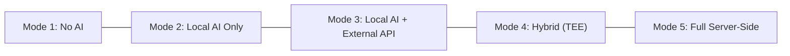
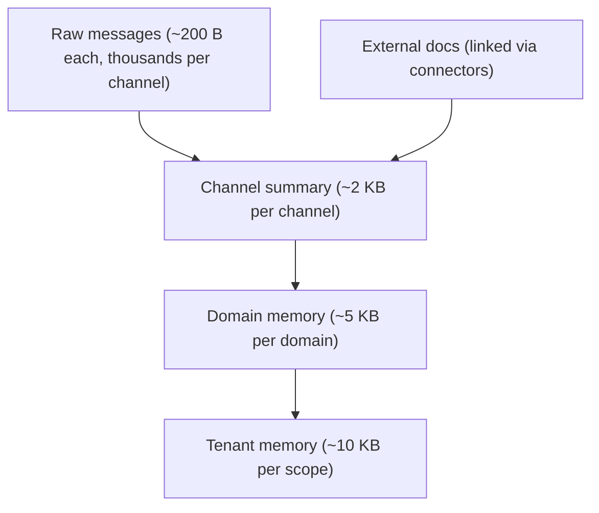
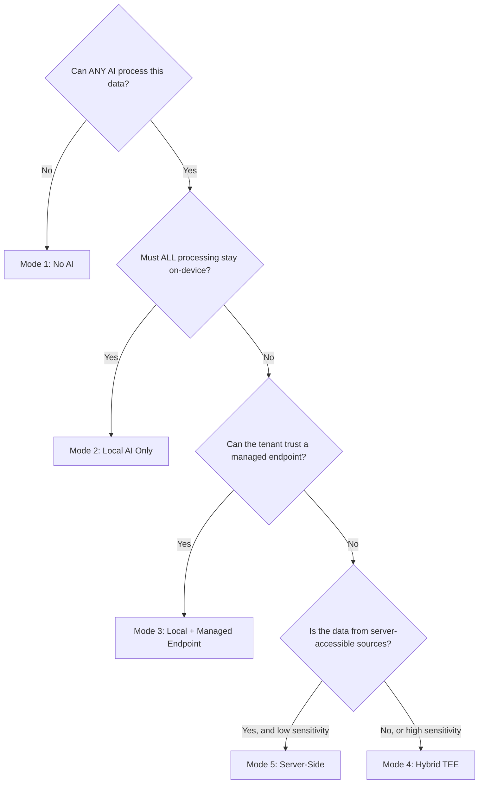

# The AI Privacy Spectrum: How KChat Serves Every Trust Posture from Zero AI to Full Hybrid Processing

AI in messaging is not a single product decision — it is a spectrum. A teenager in a group chat has different privacy expectations than a doctor discussing a patient, and both differ from an enterprise team synthesising quarterly plans across Google Drive, Jira, and Slack. The interesting design question is not "should we add AI?" but "how do we let every user, every tenant, every regulatory jurisdiction pick exactly the trust posture they need — and enforce it structurally, not by promise?"

This post walks through five concrete AI processing modes that KChat supports through the Knowledge substrate, grounds each in real business scenarios across industries and countries, explains how AI agents operate with well-grounded context at every tier, and maps the threat model against the three actors most products ignore: the KChat operator itself, the infrastructure operator (cloud provider), and external attackers.

---

## The Five Modes

The Knowledge substrate ships three deployment modes (`docs/DESIGN.md` §8) that combine into five distinct AI processing postures on the user-facing surface:

| Mode | Where AI runs | What leaves the device | Who holds keys |
|---|---|---|---|
| **1. No AI** | Nowhere | Nothing (encrypted sync of synthesis objects only) | User |
| **2. Local AI only** | On-device SLM (Bonsai-1.7B) | Encrypted synthesis objects via CRDT | User |
| **3. Local AI + external API** | On-device classification + managed AI endpoint | Payload previews (first N bytes, redacted) | User + tenant |
| **4. Hybrid (TEE)** | On-device + attested enclave | Encrypted channel summaries into TEE; encrypted synthesis back | User + enclave-bound key |
| **5. Full server-side** | Server (managed endpoint or TEE) | Connector-sourced data (already in tenant cloud) | Tenant |

These are not theoretical tiers. Each maps to the `InferenceRouter`'s adapter ladder (`crates/inference_router/src/router.rs`), the `TeeWorker` lifecycle (`crates/synthesis_engine/src/tee_worker.rs`), and the `HttpManagedEndpointSynthesizer` (`crates/synthesis_engine/src/managed_endpoint.rs`). The router bootstraps adapters in priority order: `MLXAdapter → LlamaCppAdapter → FallbackAdapter`. Device tier gating (`DeviceTier::Low` / `Medium` / `High`) determines which adapters are available; the rest is structural.

---

## Mode 1: No AI — Encrypted Storage Only

### What it is

The substrate runs with the `InferenceRouter` in fallback-only mode. The `FallbackAdapter` handles basic lexicon classification (regex/keyword heuristics) but no SLM synthesis. Evidence is encrypted at rest in SQLCipher with per-scope DEKs. Cross-device sync moves only encrypted synthesis objects via CRDT; raw evidence never leaves the originating device.

### Who needs this

**Healthcare in the EU (Germany, France).** A psychiatrist using KChat for patient case notes under GDPR Art. 9 (special category data) and national medical confidentiality law. The data cannot be processed by any AI — not even on-device — because the regulatory framework requires explicit, informed, per-processing-purpose consent that the patient has not given for AI processing. The substrate stores notes encrypted, syncs across the doctor's devices, and provides lexical search. No model ever touches the content.

**Legal privilege in the US.** Attorney-client communications at a law firm using KChat. Work product doctrine and ethical rules (ABA Model Rule 1.6) prohibit disclosure to third parties, which some interpretations extend to AI processing by third-party models. Mode 1 gives the firm encrypted, searchable, cross-device messaging with zero AI exposure.

**Government classified channels (Five Eyes, NATO).** Classified discussions on KChat where policy forbids any automated content processing. The substrate provides the communication layer; AI is structurally disabled, not just toggled off in a preference screen.

### Threat model

| Actor | Protection |
|---|---|
| **External attacker** | SQLCipher (AES-256-CBC + HMAC-SHA512, 256k KDF iterations), hybrid X25519 + ML-KEM-768 KEM for key exchange |
| **KChat operator** | Never possesses master key; raw evidence never syncs to server; no AI endpoint to exfiltrate through |
| **Infrastructure operator** | No server-side processing; encrypted bytes at rest on user device; cloud provider sees only encrypted CRDT sync blobs |

### How agents work here

They don't. The `agent_contract` crate's proposal-only write contract (`crates/agent_contract/src/lifecycle.rs`) is structurally inaccessible — no synthesis runs, no proposals are generated. The substrate is a pure storage and retrieval layer. Lexical FTS5 search still works for point lookups.

---

## Mode 2: Local AI Only — On-Device SLM

### What it is

The full on-device inference stack runs: Bonsai-1.7B (1.7B parameter Qwen3-derived multilingual SLM) via MLX on Apple Silicon or llama.cpp GGUF on Android/Windows/Linux, plus XLM-R for embeddings and classification. The `InferenceRouter` dispatches six task types: importance tagging, entity extraction, observation promotion, summary generation, concept synthesis, and contradiction adjudication — all with GBNF grammar-constrained decoding.

Raw evidence stays local. Synthesis objects (channel summaries ~2 KB each) sync encrypted via CRDT. The server never sees raw messages or the AI's intermediate outputs.

### Who needs this

**Personal B2C users globally.** A consumer in Japan, Brazil, or Nigeria using KChat as their primary messenger. They want smart features — "what did we decide about the trip?", automatic channel recaps, surfaced action items — but they don't want their messages processed on any server. Mode 2 gives them a fully local AI assistant that compounds knowledge over time. The on-device SLM runs importance tagging on every message, extracts observations, builds channel summaries asynchronously during quiet periods, and answers queries against the synthesised memory — all without any network call.

**Journalists and activists.** A journalist in Turkey or Myanmar communicating with sources over KChat. The device is the trust boundary. Even if the network is compromised, the AI processing happens locally. The progressive distillation (raw → channel summary → domain summary) means even the synthesised outputs that sync across devices contain no raw source quotes — only distilled facts.

**Financial advisors (US/UK).** A wealth manager using KChat with clients. SEC/FCA rules require records retention but also restrict data sharing. Mode 2 lets the advisor's AI assistant track client preferences, meeting outcomes, and action items locally while the firm's compliance policy controls what syncs to the firm's servers (synthesis objects only, not raw evidence).

**Education in emerging markets.** A teacher in Indonesia or India on a $150 Android phone (2-3 GB RAM). The device tier is `Low` — the SLM is disabled, but XLM-R INT4 (~55 MB) still runs for embeddings and the lexicon classifier handles importance tagging. Channel synthesis falls back to server-side (which means it's deferred unless the school's tenant configures a managed endpoint). The substrate degrades gracefully: the teacher still gets lexical search and basic classification, just not on-device summaries.

### Threat model

| Actor | Protection |
|---|---|
| **External attacker** | Same as Mode 1, plus the SLM runs in-process — no network surface for inference calls |
| **KChat operator** | Synthesis objects that sync are encrypted with user-held scope DEKs; operator sees ciphertext only. CRDT merge happens on encrypted blobs. |
| **Infrastructure operator** | Same as Mode 1. Zero server-side AI processing. |

### How agents work here

Agents operate through the `agent_contract` proposal-only write contract. The on-device SLM generates candidate observations and concepts, but they enter the substrate as *proposals* — never as canonical memory. Promotion requires either explicit user action (pinning, approval) or a local policy match (high confidence + cross-source corroboration + low sensitivity).

The key insight: the agent sees only the synthesised memory hierarchy, not raw evidence. When it answers "what's the launch date?", it consults the channel summary (~2 KB) and the concept graph, not the 500 raw messages that produced them. This bounds the context window, keeps RAM bounded, and means the agent's grounding is always the distilled, corroborated version of reality — not a noisy raw feed.

The escalating retrieval cascade controls cost: lexical FTS5 first (milliseconds), then XLM-R semantic search, then graph traversal, then SLM synthesis. The SLM is the most expensive step and runs only when cheaper retrieval modes fail.

---

## Mode 3: Local AI + External API — Managed Endpoint

### What it is

On-device classification and observation extraction run locally (same as Mode 2). Heavy synthesis — domain-level and tenant-level aggregation — is delegated to a managed AI endpoint (the tenant's own or vendor-hosted). The `HttpManagedEndpointSynthesizer` sends structured `SynthesisRequest`s containing `InputObjectRef` payloads: each includes a `payload_preview` (first N bytes, redacted of PII), a `scope_id`, and a `tier` tag — not the full evidence body. The API key is stored as a *reference* (`api_key_ref` — an env-var name or secret-store key), never as cleartext in the synthesiser config.

Grammar-constrained decoding runs on both sides: the on-device SLM for channel synthesis, the managed endpoint for domain/tenant synthesis. The hierarchy enforcement is type-system-enforced: `synthesize_domain` accepts only `DomainSynthesisInput` (channel summaries), not raw evidence rows.

### Who needs this

**Mid-market SaaS companies (US, EU, APAC).** A 500-person product company using KChat with connectors to Google Drive, Jira, Notion, and Slack. Channel-level AI runs on each employee's device: recaps, action items, entity extraction. But cross-channel domain synthesis ("what does the engineering org know about the Atlas migration?") needs to aggregate across 50 channels — too much for any single device. The managed endpoint runs domain synthesis server-side, consuming only channel summaries, and publishes encrypted domain memory objects back to the scope.

**Retail chains (Japan, Southeast Asia).** A retailer with 200 stores using KChat for store-to-HQ communication. Each store manager's phone runs local AI for their channel. Regional synthesis (aggregate across 20 stores in a region) runs via the managed endpoint. The endpoint never sees individual store messages — only channel summaries like "Store Shibuya: stock issue resolved, delivery expected Thursday."

**Real estate agencies (Australia, UK).** Agents using KChat with clients and with HubSpot/Email connectors. Local AI handles client conversation memory. The managed endpoint runs cross-client synthesis for the agency's domain memory: "which properties have price reductions this week?" derived from channel summaries, not raw client conversations.

### Threat model

| Actor | Protection |
|---|---|
| **External attacker** | HTTPS + token-cap on the managed endpoint; payload previews (not full bodies) limit exposure; grammar-constrained output prevents exfiltration via prompt injection |
| **KChat operator** | The operator routes requests to the managed endpoint but sees only ciphertext in transit (TLS) and at rest. Hierarchy enforcement means raw messages never reach the endpoint — only pre-synthesised summaries. |
| **Infrastructure operator** | The managed endpoint provider sees payload previews and synthesis prompts — this is the explicit trust boundary. Mitigation: tenant can point the endpoint at their own infrastructure (`customer-managed AI endpoint`), keeping the cloud provider identical to the one they already trust for their other data. |

### The honest gap

Mode 3 requires trusting the managed endpoint provider with payload previews. The previews are truncated and the substrate performs PII redaction (the `payload_preview` field docs note "the real adapter will redact PII"), but this is a real trust extension. For tenants who cannot accept this, Mode 4 exists.

---

## Mode 4: Hybrid AI with Confidential Compute (TEE)

### What it is

The confidential-compute hybrid mode. On-device AI handles channel-level synthesis. Cross-channel synthesis that cannot use the elected-device path (because the group is too large, devices are heterogeneous, or the workload is too heavy) runs inside an attested Trusted Execution Environment — Intel TDX, AMD SEV-SNP, or AWS Nitro Enclaves. The `TeeWorker` enforces a strict lifecycle:

1. **Attest before processing.** `attest_with_scope()` produces a hardware-backed quote; `verify_attestation()` checks the enclave image hash against the `expected_measurement` from the deployment manifest. Platform mismatch or measurement mismatch → hard failure, audit entry, `Lifecycle::Unattested`.
2. **Bind synthesiser key.** `bind_synthesizer_key()` ties the attestation report to a specific synthesiser public key. Consumers verify that synthesis outputs came from the attested enclave, not from an operator-controlled process.
3. **Scope binding.** `assert_scope_allowed()` refuses to process any scope not in the worker's configured `scope_bindings`. An operator cannot repurpose a worker to access a different customer's data.
4. **TTL-based re-attestation.** Attestation expires after `attestation_ttl` (default 1 hour). The worker must re-attest periodically.

Decryption happens only inside the enclave. The worker publishes encrypted synthesis objects back into the scope. The operator cannot read plaintext even with full host access.

### Who needs this

**Healthcare networks (US, EU).** A hospital network with 50 facilities using KChat. Patient case discussions happen in per-case channels with E2EE. Cross-facility synthesis ("what's the regional trend in post-op complication rates?") needs to aggregate across channels that span multiple facilities. No single device can do this. A plaintext server cannot see the data. The TEE worker decrypts inside the enclave, synthesises, and publishes encrypted results. The hospital's compliance team verifies attestation reports.

**Banking and capital markets (Singapore, Switzerland, UK).** A bank's trading desk using KChat for deal flow. MAS (Singapore), FINMA (Switzerland), or FCA (UK) regulations require that customer data not be accessible to the platform operator. TEE synthesis lets the bank's KChat deployment aggregate deal intelligence across desks without the operator (or the cloud provider's hypervisor) accessing plaintext.

**Defence contractors (US, EU).** A defence firm using KChat for cross-team coordination on classified-adjacent (CUI/FOUO) programmes. NIST SP 800-171 requires protection from the hosting environment. TEE workers running on AWS Nitro Enclaves (which explicitly exclude AWS operator access from the enclave memory) satisfy this requirement at the synthesis layer.

**Cross-border legal (EU/US).** A multinational law firm using KChat across EU and US offices. GDPR's Schrems II ruling restricts EU personal data transfers to the US. TEE workers running in EU-region enclaves process EU-sourced channel summaries without the data leaving the EU jurisdiction or being accessible to a US-based operator.

### Threat model

| Actor | Protection |
|---|---|
| **External attacker** | Hardware-isolated enclave memory; all inputs/outputs encrypted in transit and at rest; attestation proves code integrity |
| **KChat operator** | **This is the primary threat Mode 4 addresses.** The operator has full host access but cannot read enclave memory (hardware enforced). Attestation report + synthesiser key binding let consumers cryptographically verify outputs came from untampered code. Scope bindings prevent lateral movement. |
| **Infrastructure operator** | TEE platforms (TDX, SEV-SNP, Nitro) are designed to exclude the cloud provider from the trust boundary. On Nitro: "no AWS operator or system has the ability to access data in processing within an enclave." On SEV-SNP: the hypervisor is explicitly untrusted. Side-channel attacks remain a theoretical risk (see below). |

### The honest gap

TEE side-channel attacks have been demonstrated in academic research against SGX. TDX and SEV-SNP have newer mitigations but are not side-channel-proof. The substrate's TTL-based re-attestation limits the window, but a state-level adversary with physical access to the host could potentially extract secrets via power analysis or cache timing. This is the highest-assurance mode the substrate offers, but it is not absolute.

---

## Mode 5: Full Server-Side — Enterprise Connector Pipeline

### What it is

The on-server surface processes data from connected systems — Google Drive, OneDrive, Notion, Jira, Confluence, Figma, HubSpot, Slack, Email — through the same substrate pipeline as on-device. The server authenticates via OAuth2, pulls documents through incremental delta sync + webhooks, runs the full observation → semantic → reasoning → export pipeline, and synthesises domain/tenant memory via a managed endpoint or TEE. This is data the tenant already accepts in their cloud; the server processes it because it came from server-accessible systems.

Per-tenant encryption keys; row-level security by tenant id; physical isolation optional. The nine connectors implement a shared contract: OAuth2 auth, incremental sync, webhook push, channel-scoped attachment, and ACL sync from the source system.

### Who needs this

**Enterprise knowledge management (global Fortune 500).** A 50,000-person company using KChat with connectors to their entire collaboration stack. The server ingests their Drive docs, Confluence pages, Jira tickets, and Slack threads. The substrate builds a continuously-updated tenant memory: "What does this org know about supply chain disruptions in Southeast Asia?" — answered by traversing a concept graph built from observations extracted across 500 connected documents and 2,000 Slack channels. No human manually tagged any of it.

**Professional services (Big Four, management consulting).** A consulting firm using KChat for client engagements. Each engagement is a domain. Connectors ingest the client's SharePoint, the firm's Confluence knowledge base, and the engagement's Jira board. Domain synthesis produces a continuously-updated engagement memory: decisions, open risks, action items, stakeholder map — derived from all sources, deduplicated at the observation layer, and scoped to the engagement's access control list.

**Sales organisations (US, EMEA).** A sales team using KChat with HubSpot and Email connectors. The server-side pipeline extracts deal facts from CRM records, email threads, and channel discussions. Domain synthesis produces per-deal memory: "What's the status of the Acme deal? Who's the economic buyer? What objections have been raised?" The observation dedup means the same fact stated in an email, a CRM note, and a channel message is one corroborated observation, not three confusing duplicates.

### Threat model

| Actor | Protection |
|---|---|
| **External attacker** | Per-tenant encryption keys, Zanzibar-style relation graph for fine-grained access control, ACL sync from source systems |
| **KChat operator** | Per-tenant keys mean the operator cannot decrypt cross-tenant data. Within a tenant, the operator is a service provider with encrypted-at-rest storage. For tenants requiring stronger guarantees, the synthesis endpoint can run in a TEE (Mode 4's protections compose with Mode 5's data source). |
| **Infrastructure operator** | Per-tenant encryption. Physical isolation optional (dedicated PostgreSQL instances per tenant). The infrastructure operator sees ciphertext at rest and encrypted connections in transit. |

---

## How Knowledge Gives Agents Grounded Context at Every Mode

The common thread across all five modes: **agents never see the full raw corpus**. The progressive distillation hierarchy means:

An agent answering a question runs through an escalating retrieval cascade:

1. **Lexical** (FTS5) — milliseconds, often sufficient
2. **Semantic** (XLM-R embeddings) — catches paraphrase
3. **Graph traversal** (concept graph) — multi-hop reasoning
4. **SLM synthesis** — only if cheaper modes fail

The agent contract is proposal-only: `propose_observation`, `propose_concept`, `propose_relation`, `propose_summary`. Promotion to canonical requires human action or policy match. Every proposal carries a signed PROV bundle (ML-DSA-65), evidence refs, confidence score, sensitivity class, agent identity, and model version.

This means agents are well-grounded (they work from corroborated, deduplicated, synthesised memory), and they're constrained (they can never alter canonical memory without a traceable, auditable promotion step). The same contract applies whether the agent runs on-device (Mode 2) or server-side (Mode 5).

---

## The Threat Actor Matrix

Most products discuss external attackers. The interesting threat actors for a messaging platform with AI are the ones with legitimate access:

### 1. External Attackers

| Attack | Mitigation |
|---|---|
| Database theft (stolen device / backup) | SQLCipher with 256k KDF iterations + 256-bit master key |
| Network interception | Hybrid X25519 + ML-KEM-768 KEM (post-quantum forward secrecy) |
| Harvest-now-decrypt-later (quantum) | ML-KEM-768 from day one; quantum attacker cannot recover session secrets |
| Prompt injection against AI | Grammar-constrained decoding (GBNF) prevents free-form output; agents are proposal-only (cannot write canonical memory) |

### 2. KChat Operator (Uney)

This is the actor most products don't discuss honestly. The KChat operator runs the server infrastructure, ships the client code, and manages the deployment pipeline. Here is how Knowledge constrains the operator:

| Attack | Mitigation |
|---|---|
| Read raw user messages | Raw evidence stays on-device (Modes 1-4); server never possesses user master keys |
| Read synthesis outputs | Synthesis objects are encrypted with per-scope DEKs the operator doesn't hold |
| Tamper with AI outputs | Every synthesis output carries a signed PROV bundle (ML-DSA-65); consumers verify |
| Repurpose TEE worker for another scope | `assert_scope_allowed` refuses unbound scopes; audit trail records every attempt |
| Forge attestation | Attestation is hardware-backed; `verify_attestation` checks against pinned `expected_measurement` |
| Access data via the managed endpoint | Endpoint sees only payload previews (truncated, PII-redacted); secret refs (not raw keys) prevent operator key access |
| Bypass scope bindings via direct synthesiser construction | Documented as a footgun; production must go through `TeeWorker` policy wrapper |
| Export user data | Deny-by-default export plane; `ExportControlRegistry.allows_concept()` returns `false` for unregistered concepts; sensitivity ceiling blocks critical data by default |

### 3. Infrastructure Operator (AWS / GCP / Azure)

| Attack | Mitigation |
|---|---|
| Read data at rest | Per-scope AEAD encryption; per-tenant keys; SQLCipher on device |
| Read enclave memory | TEE platforms (Nitro/TDX/SEV-SNP) explicitly exclude the cloud operator |
| Retain filesystem snapshots after `forget()` | Acknowledged gap. Cryptographic forgetting destroys the DEK; the substrate cannot control host-OS snapshot behaviour. This is documented in `SECURITY.md`. |
| Traffic analysis on CRDT sync | Sync blobs are encrypted; metadata (timing, size) is visible — this is an inherent limitation of any sync protocol |

---

## What Regulators in Different Jurisdictions Care About

| Jurisdiction | Regulation | Key requirement | Mode(s) that satisfy |
|---|---|---|---|
| **EU** | GDPR (Art. 9, Schrems II) | Data minimisation, no uncontrolled cross-border transfer, right to be forgotten | Mode 1 (no AI), Mode 2 (local only), Mode 4 (TEE in EU region) |
| **US** | HIPAA, SEC 17a-4, CCPA | PHI protection, records retention, consumer data rights | Mode 1 (healthcare), Mode 2 (financial), Mode 3 (enterprise), Mode 5 (with BAA) |
| **Japan** | APPI | Cross-border transfer restrictions, consent for AI processing | Mode 2 (local AI), Mode 4 (TEE in JP region) |
| **Singapore** | PDPA + MAS TRM | Financial data protection, no operator access to customer data | Mode 4 (TEE synthesis for banking) |
| **Brazil** | LGPD | Data minimisation, right to erasure | Mode 2 (local), cryptographic forgetting for erasure |
| **India** | DPDP Act 2023 | Data localisation for certain categories, consent-based processing | Mode 2 (on-device), Mode 5 (server in IN region) |
| **Australia** | Privacy Act + APP | Reasonable security, cross-border disclosure restrictions | Mode 2 (local), Mode 3 (managed endpoint in AU) |

Cryptographic forgetting (`forget()` → DEK destruction → `DELETE` + `REBUILD` on FTS5 in a single transaction) is the substrate's answer to right-to-erasure across all jurisdictions. It is provable: the key is gone, the ciphertext is noise.

---

## Choosing the Right Mode

The decision tree for a deployment:

The modes compose. A single tenant can run Mode 2 for employee DM channels, Mode 3 for team channels with managed endpoint synthesis, Mode 4 for executive channels with TEE synthesis, and Mode 5 for their connector-sourced knowledge base — all on the same substrate, same memory model, same cryptographic primitives, same audit trail.

---

## What We Haven't Solved Yet

Honest gaps, in order of severity:

1. **Host shell key handling.** The master key is passed to the substrate via FFI. The host shell (Swift/Kotlin/Electron) must store it securely. `SECURITY.md` explicitly marks host shells as out of scope. This is the single biggest real-world attack surface.

2. **Observation quality.** The entire value chain depends on the observation engine correctly extracting entities, facts, tasks, and decisions. The lexicon-first extractor is regex/keyword-based. Bad extraction → bad summaries → bad agent answers. No systematic evaluation framework exists yet.

3. **Production server.** The server-side synthesis service is a Rust skeleton; the Go gateway lives outside the repo. Mode 5 is architecturally defined but not running in production.

4. **TEE side-channels.** TEE attestation proves code integrity, not side-channel resistance. Academic attacks against SGX/TDX have been demonstrated. The substrate's TTL-based re-attestation limits exposure but does not eliminate it.

---

## Summary

The substrate's thesis is that privacy and AI capability are not a tradeoff — they are a design choice. The same Rust core, the same memory model, the same cryptographic primitives serve all five modes. The progressive distillation hierarchy (raw → channel summary → domain → tenant) is the architectural insight that makes it work: it solves the context-window problem, the storage problem, and the privacy problem simultaneously.

External AI never sees raw user messages. Internal AI (on-device SLM) processes them locally. Agents operate on synthesised, deduplicated, corroborated memory — not raw feeds. Every write is a proposal; every promotion is audited; every output carries a signed provenance bundle. And when data must be forgotten, it is forgotten by key destruction — provably, irreversibly, in a single transaction.

The result is a platform where a teenager in a group chat, a doctor discussing a patient, a bank's trading desk, and a Fortune 500's knowledge management team all use the same system — each at the trust posture their context demands.
