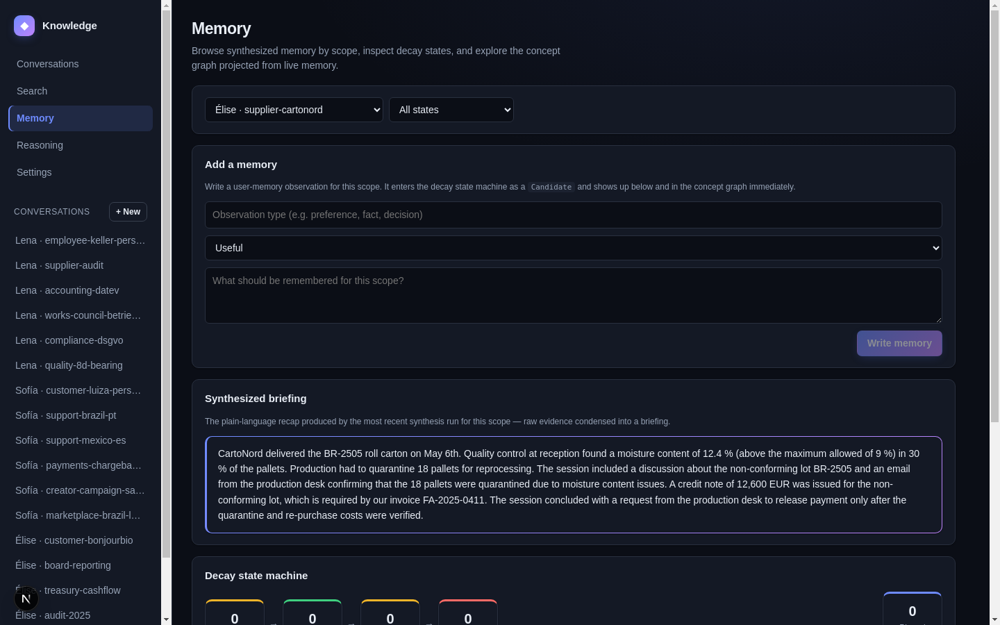
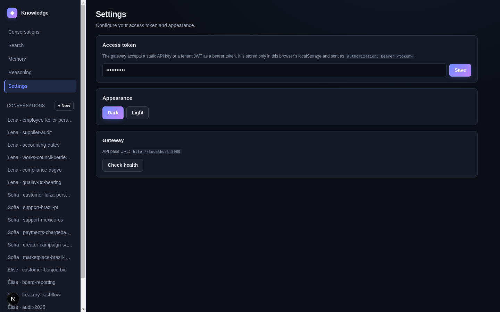
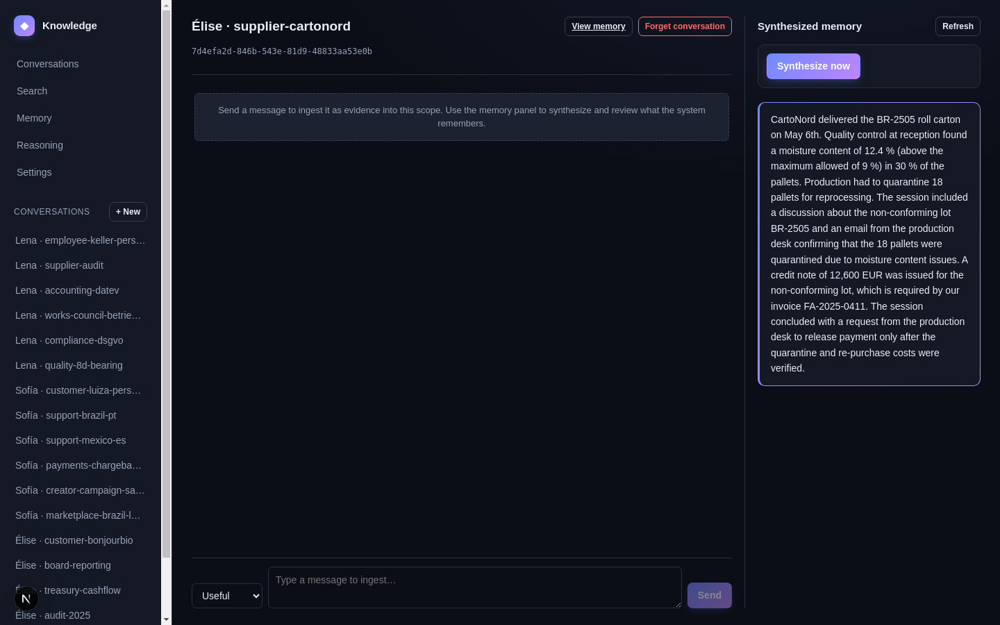
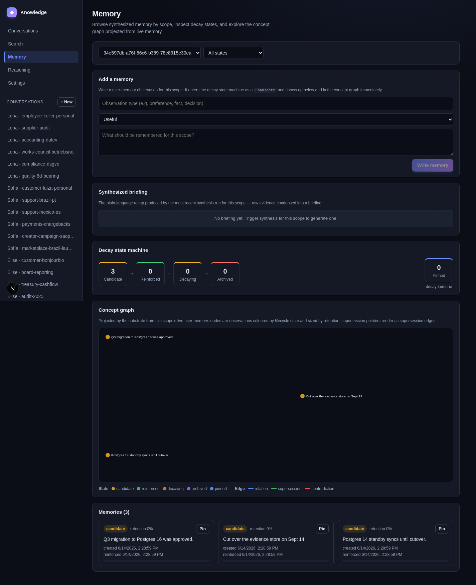
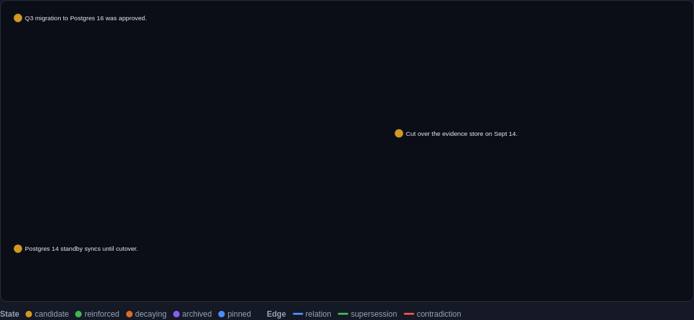
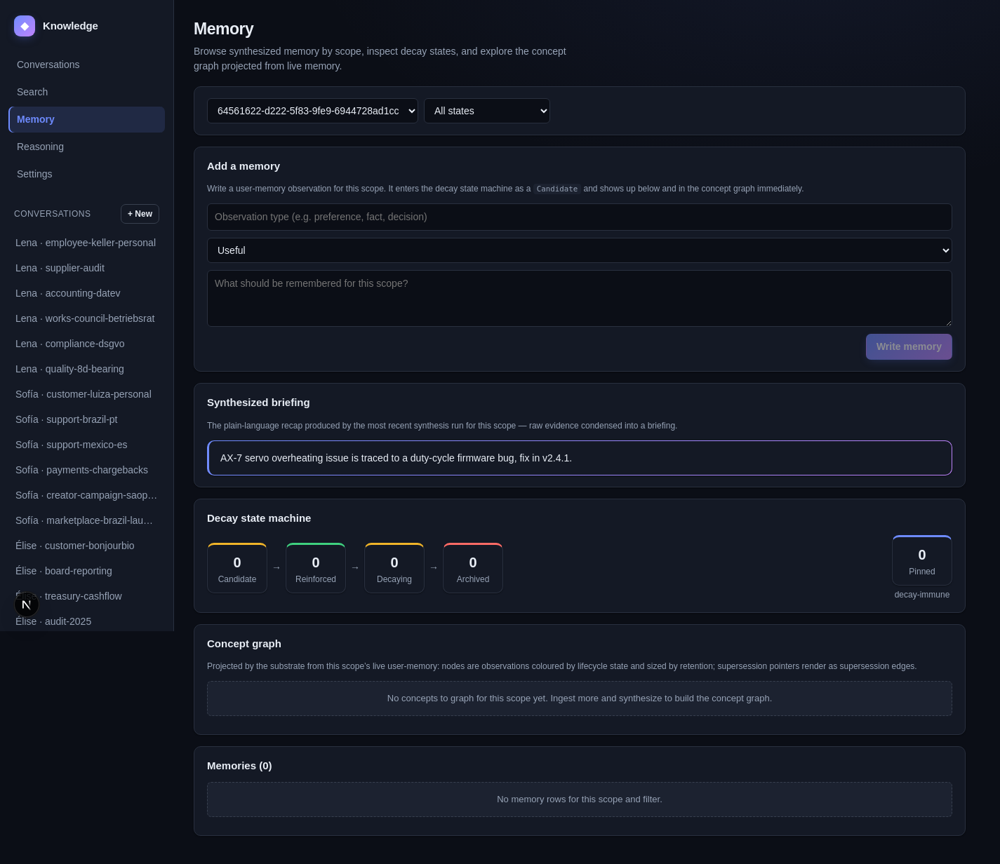

# The UI, and What It Honestly Reveals

> **TL;DR:** Before capturing a single screenshot we audited the
> reference UI against polished products (Linear, Vercel, Notion),
> found it competent but monotone, and did a root-cause design pass: a
> non-monotone palette, a real accent system, depth, and proper
> interactive/empty states. The audit surfaced two things a screenshot
> can't hide — one real bug (fixed) and one honest product gap: the
> Memory page rendered empty because user-memory had no public write
> path. **That gap is now closed.** The write path is live end-to-end,
> and the decay state machine, concept graph and per-item memory list
> render real data — shown below.

A blog series that shows the product is also a forcing function for
looking at the product honestly. Two requirements drove this post:
*fix anything broken before capturing artifacts*, and *make the UI
pleasing, not a single monotone*. Both turned up real work.

## The audit: competent but monotone

The reference UI was structurally fine — clear layout, sensible
information architecture — but visually flat. Every surface was a
near-identical blue-grey, hierarchy came only from font size, buttons
had no states, and there was no depth. Those are the "amateur tells"
that separate a dev tool from a product: not bugs, but the absence of a
deliberate visual system.

The fix was at the **design-token** level, not a per-component reskin.
The whole theme is defined once in
[`apps/knowledge-ui/src/app/globals.css`](../../apps/knowledge-ui/src/app/globals.css):

```css
:root, [data-theme='dark'] {
  /* Layered neutrals carry a faint indigo cast so the surface stack
     reads as intentional depth rather than monotone. */
  --bg: #0b0e16; --bg-elev: #141925; --bg-elev-2: #1c2230;
  --accent: #6e8bff; --accent-2: #c084fc;        /* dual accent */
  --ok: #3fd07f; --warn: #f0b429; --bad: #ff6b66; --info: #34d3e0;
  --grad-brand: linear-gradient(135deg, #6e8bff 0%, #c084fc 100%);
  --shadow-md: 0 6px 20px -6px rgba(0,0,0,0.55);
  --shadow-accent: 0 4px 14px -4px rgba(90,120,245,0.5);
}
```

From those tokens: the brand mark and primary buttons became a
blue→violet gradient; the active nav item gained an accent tint and an
inset bar; cards and search results gained shadow and a hover lift;
inputs gained an accent focus ring; and the synthesis recap got a
gradient-bordered card so the model's output reads as a distinct
artifact. The result is the same UI, now with a coherent, non-monotone
visual language:


The decay state machine is a good example of using **semantic** colour
to carry meaning instead of decoration — Candidate (amber), Reinforced
(green), Decaying (amber), Archived (red), Pinned (blue):



Light mode and the settings surface got the same token treatment:



## The bug the audit caught

The chat view has a right-hand "Synthesized memory" panel with a
**Synthesize now** button. Auditing it revealed a real defect: after
triggering synthesis, the panel still said *"No memory yet for this
scope."* The user would run synthesis and see nothing.

Root cause: the panel fetched only `listMemories()` — the *user-memory*
surface — while the briefing that synthesis actually produces is the
*channel recap*, exposed at `GET /api/v1/memories/channel`. The Memory
page read the channel recap; the chat panel didn't. So the two screens
disagreed about whether a scope had any memory.

The fix is to make the chat panel reflect both surfaces, fetched
together, so a freshly synthesised briefing appears where the user
triggered it:

```tsx
// ChatView.tsx — fetch the channel recap alongside user memories
const [recapRow, rows] = await Promise.all([
  channelMemory(scopeId, signal),
  listMemories(scopeId, { limit: 50 }, signal),
]);
setRecap(recapRow);
setMemories(rows);
```

Now the panel shows the real briefing the moment it exists:



This is the kind of bug that only an honest audit catches — everything
"worked," the API returned 200s, and the screen was simply reading the
wrong source. It is fixed at the root (the panel now models the two
distinct memory surfaces) rather than papered over.

## The gap that used to be impossible to hide — now closed

The earlier edition of this post ended on an honest admission. The
Memory page has three sections below the briefing — **Decay state
machine**, **Concept graph**, and **Memories** — and across every
persona they rendered empty: `0 Candidate / 0 Reinforced / …`, *"No
concepts to graph,"* *"Memories (0)."* That was not a rendering bug; it
was an honest reflection of the product state at the time: the
**user-memory** subsystem had **no public write path through the
gateway**. The capability existed in the substrate; it simply wasn't
reachable. We chose to **show the honest empty state, not fake data** —
and to name the gap as the next piece of work.

That work is done. There is now a public write path —
`POST /api/v1/memories` — wired end-to-end (gateway → Go client →
substrate → the `add_user_memory` FFI), fail-closed and user-tier only,
and a read route, `GET /api/v1/memories/concept-graph`, that projects
the per-scope concept graph from live user-memory. The same Memory page,
against a scope with three written observations, now renders real data:



The decay state machine shows **3 Candidate** observations, and the
concept graph projects a node per observation, coloured by lifecycle
state and sized by retention — no longer *"No concepts to graph"* but
the real Postgres-migration knowledge a team wrote into the scope:



The **Add a memory** form on the same page writes through that path:
an observation typed in becomes a `Candidate` in the decay machine and a
node in the graph immediately. The decay lifecycle
([Memory That Forgets](../03-memory-that-forgets.md)) finally has data to
operate on — and, as [post 3](03-synthesis-quality.md) shows, knowledge
that *recurs* across messages is promoted to **Reinforced** rather than
duplicated. The synthesis briefing for a cross-message roll-up is the
other half of the picture, and it too renders live:



Channel memory (the synthesis briefing) and user-memory (the decay
machine, concept graph and per-item list) are still **distinct
surfaces** — a point the original chat-panel bug above turned on — but
both are now populated end-to-end, so the Memory page tells the whole
truth instead of half of it.

## What "audit before artifacts" actually bought

The instruction to verify the UI and logs before capturing screenshots
wasn't ceremony. Across the two editions of this post it produced:

- a **design system** that makes the product look like a product;
- a **fixed bug** where synthesis results were invisible in the chat
  panel;
- a **product gap documented honestly** rather than hidden behind seed
  data — and then **closed** with a real write path rather than papered
  over with fixtures.

The browser console is clean across every screen, the captured
screenshots are real, and the one thing the UI couldn't do — show
user-memory — it now does, because the capability behind it was built,
not faked. That is the version of "polish" worth shipping.
