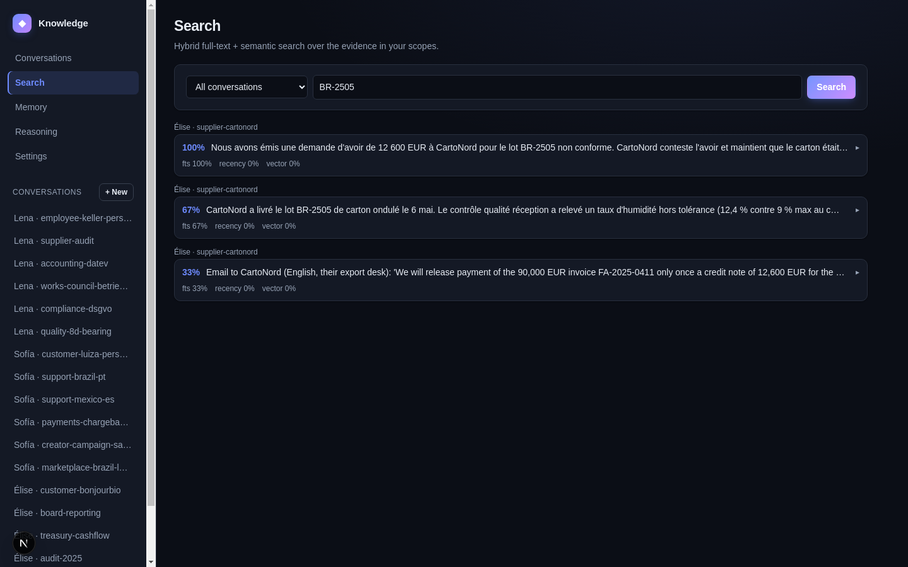

# Retrieval & the Memory Graph

> **TL;DR:** Memory has to be *fast to recall*, *willing to forget*, and
> *connected*. This post builds three things: the `HybridRetriever`
> (lexical + semantic + recency, with the FTS5 prefilter that makes the
> full query faster than semantic-only), the `memory_manager` decay state
> machine (forgetting as a feature), and the `concept_graph` (typed links
> with supersession). The design target is a latency budget no cloud-RAG
> round trip can meet: instant recall on a phone.

## What you are building

- **`HybridRetriever`** (in `evidence_store`) — three retrieval lanes
  fused into one `query()` call.
- **`memory_manager`** — the decay state machine, retention scoring,
  working memory, and the user/channel/domain/tenant memory objects.
- **`concept_graph`** — a sparse typed graph (e.g. `IsA` edges) with
  supersession and contradiction edges, updated incrementally.

## Build it: retrieval as ordered lanes

The trick is *ordering*, not cleverness in any single lane:

1. **Lexical (FTS5) — runs first.** SQLite full-text search over the
   evidence bodies, scoped to the querying scope, with
   `unicode61 remove_diacritics 2` so accented and CJK text tokenise
   correctly. This lane does the bulk candidate selection.
2. **Semantic (optional) — reranks the survivors.** A pluggable
   embedding model scores the *small* candidate set by vector
   similarity. If no model is wired in, this lane contributes nothing and
   the substrate falls back to lexical + recency — so the fast path works
   out of the box.
3. **Recency rerank.** A recency signal reorders so newer, still-relevant
   memory surfaces first.

Because the cheap lexical lane prunes the corpus before the expensive
semantic lane ever runs, the **full hybrid query is faster than running
the semantic lane alone** — the prefilter does the expensive lane a
favour. Each `QueryResult` exposes its `fts_score`, semantic, and
recency components so callers (and the reasoning plane) can explain a
ranking — visible directly in the reference UI's search results:

## Build it: forgetting as a state machine

A memory that only grows becomes a liability — for relevance, for
storage, and for privacy. `memory_manager` models decay explicitly:
observations carry a retention score and move through lifecycle states
(e.g. Active → Candidate → archived/TTL) on a background **decay sweep**.
Low-value memory ages out; high-value memory is retained; and a scope
can be cryptographically forgotten outright (post 2). Forgetting is a
designed behaviour, not an afterthought.

## Build it: the concept graph

The graph links observations into concepts with typed edges and
**supersession** — a newer decision supersedes an older one rather than
silently coexisting — plus contradiction edges that the reasoning plane
(post 7) later walks. Updates are incremental subgraph writes, bounded so
a single ingest can't trigger a full-graph recompute.

## The evidence — the latency budget

From the benchmark suite ([`benchmarks.md`](../../docs/technical/benchmarks.md))
and the on-device matrix ([`benchmarks-device.md`](../../docs/technical/benchmarks-device.md)):

| Operation | Reference VM | Device row (Linux ref) |
|---|---|---|
| Hybrid retrieval (10K scope) | 9.70 ms | 8.34 ms |
| FTS-only | 188.8 µs | 180.9 µs |
| FTS phrase query (100K / 25K) | 13.56 ms / — | 2.19 ms p50 |
| Decay sweep (100K rows) | 5.26 ms (~19 M rows/s) | 1.28 ms / 25K rows |
| Peak RSS (device run) | — | ~23.3 MiB |

The headline: the full memory graph and retriever fit in **~23 MiB of
peak RSS** and answer in single-digit milliseconds on the reference
device run — which is exactly the budget a phone can spare while running
the rest of the user's apps. (Honest caveat carried from
[post 8 of the main series](../08-performance-at-device-scale.md): real
phone/Apple-Silicon rows are still `[pending real-device measurement]`;
the design is sound and the server numbers are strong, and we measure
devices rather than assume them.)

## The business decision: the power-user latency trap

**Scenario.** Your best users are your oldest users — three years of
daily conversations, 500,000 messages on one phone. If retrieval slows
as the store grows, your product gets *worse* for the users who love it
most.

- **Server-side RAG (Pinecone-backed, or Copilot/Glean-style).** Scales
  by adding cloud compute, but every "what did we decide last quarter?"
  is a network round trip — latency floored by the RTT, cost rising with
  the corpus, and the whole history sitting in a vendor index.
- **On-device hybrid retrieval (this).** The FTS5 index is built for
  exactly this scale; the semantic rerank only ever touches the handful
  of candidates that survive the prefilter; decay keeps the working set
  lean. No round trip, no per-query cloud bill, no central index of the
  user's life.

The business takeaway: on-device retrieval turns the power-user from a
cost-and-latency liability into the user who gets the *best* experience,
because the architecture gets faster relative to the cloud as the corpus
grows.

## How a competitor would build this

A vector-DB-centric product embeds everything and runs ANN (e.g. HNSW)
in the cloud. That's the simplest path to semantic recall at scale and
the right tool if you just need a managed index. It is *similarity
search*, though — not a memory graph with decay, supersession, and
explainable rankings, and not private or offline. The on-device hybrid
graph does more, on the device, for ~$0/query.

## What's next

Retrieval finds the right evidence; synthesis turns it into a briefing.
But synthesis needs a model, and the model has to run on hardware ranging
from a 2 GB phone to a workstation. Next: the inference router.

---
*Part 4 of "How to Build Knowledge." [Previous: Observation & Extraction](03-observation-and-extraction.md) | [Next: Inference Routing on Device](05-inference-routing.md) | [Series index](README.md)*
