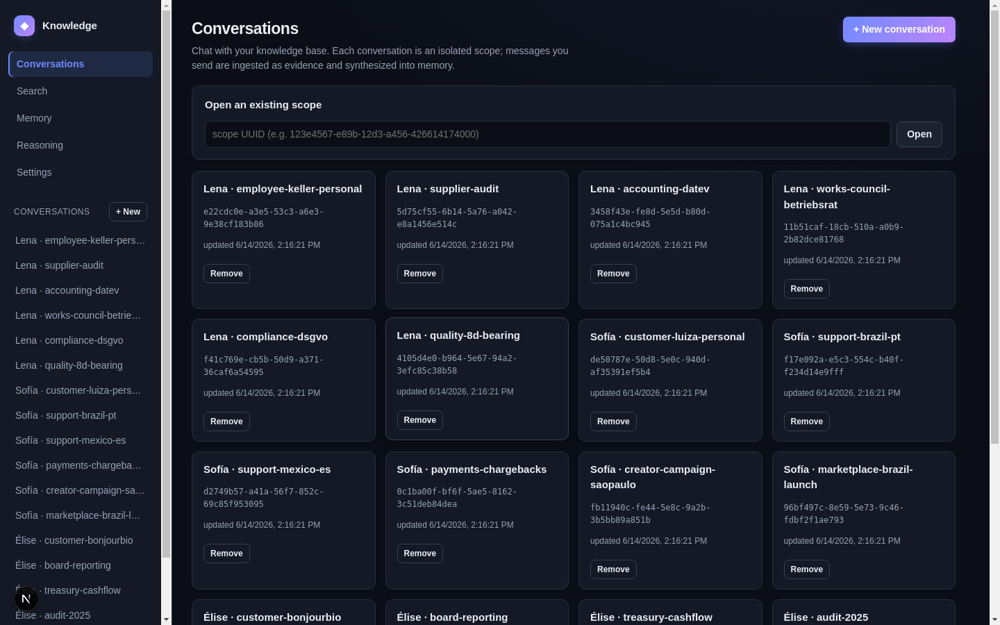

# Packaging & Shipping

> **TL;DR:** A Rust workspace isn't a product until a developer can embed
> it in four hours and a user can open it in one command. This post wraps
> the core in `ffi`/UniFFI (mobile) and `napi` (desktop), ships a
> reference UI you can actually fork, a one-command installer with a
> bundled model, and the **portable device benchmark** that proves the
> on-device promise on real hardware rather than a server VM.

## What you are building

- **`ffi`** — a UniFFI surface consumed by iOS (Swift) and Android
  (Kotlin via JNI), exposing `evidence_store`, `memory_manager`,
  `synthesis_pipeline`, and the reasoning calls.
- **`napi`** — an N-API addon (`.node`) loaded by the Electron main
  process on macOS/Windows.
- **Reference UI** (`apps/knowledge-ui/`) — a Next.js end-user UI you can
  ship or fork, with the conversations grid, search, memory page, and the
  reasoning panel.
- **Installer** (`scripts/install.sh`, `scripts/install.ps1`) + a bundled
  SLM and a first-run wizard.
- **`device_bench`** — the one-command portable benchmark.



## Build it: one core, four binary shapes

The discipline is that **all four shells consume the same Rust core** —
no platform fork of the memory logic. The core compiles to:

- `framework_ios` — `.xcframework`, consumed via Swift/UniFFI.
- `jni_android` — `.so` per ABI, consumed via JNI.
- `napi_macos` / `napi_windows` — N-API `.node` addons for Electron.

A host never touches raw cryptographic state: it hands in plaintext and a
scope, and the substrate handles encryption, routing, indexing. One
build-time invariant worth copying from this repo's CI: the mobile `ffi`
artifact is scanned to assert it **does not link `tracing_subscriber`**,
so a logging dependency can't silently bloat or leak from the mobile
binary. Turn conventions into build-time gates.

## Build it: prove it on a device, not a server

The Criterion suite ([`benchmarks.md`](../../docs/technical/benchmarks.md))
is rigorous but assumes a runner and a ~30-minute sweep — it doesn't
travel onto a phone. So you also build `device_bench`: a self-contained
binary that drives the **same real substrate code paths** (real encrypted
SQLCipher writes, real FTS5 queries, real hybrid fan-in) and prints **one
machine-readable JSON document** in one command:

```bash
cargo run -p benchmarks --release --bin device_bench   # JSON on stdout
```

The reference Linux row, measured this way
([`benchmarks-device.md`](../../docs/technical/benchmarks-device.md)):
**1,685 msgs/s ingest, 2.19 ms FTS phrase p50, 8.34 ms hybrid retrieval,
1.28 ms decay sweep over 25K rows, ~23.3 MiB peak RSS.** Every non-Linux
row (iPhone, Android, Apple-Silicon, Windows, constrained 2–4 GB device)
is explicitly marked `[pending real-device measurement]` — a template to
fill by running the identical command, never back-filled from the server
VM. That honesty is the product: "on-device" is a claim you let the buyer
reproduce.

## The business decision: zero-to-running, no ops

**Scenario.** A 5–50 person SME has no DevOps team. They will adopt a
knowledge product only if it's running before lunch and stays running
without a platform engineer.

- **Enterprise platforms (Glean, Copilot).** Powerful, but assume an IT
  org to integrate identity, connectors, and governance — overkill and
  over-budget for a 20-person shop.
- **Knowledge.** One-command install with a **bundled model** (no
  separate model-hosting decision), a first-run wizard, the browser-based
  admin dashboard ([post 20 of the main series](../20-admin-without-ops.md)),
  and the reference UI to ship as-is. The
  [zero-to-running post](../22-zero-to-running.md) walks the whole flow.
  No ops team, ~$0 marginal cost, data stays on the SME's own machines.

The packaging *is* the go-to-market for the down-market segment: the
easier it is to run with zero ops, the larger the set of customers who
can say yes without an IT project.

## How a competitor would build this

A SaaS product's "packaging" is a signup form — nothing to install,
which is genuinely lower friction for the buyer who's fine with cloud.
The cost is that there's nothing to *run in your own region* and nothing
to *fork*. Shipping installable bindings + a reference UI + a bundled
model is more engineering, but it's what lets the same product serve a
solo developer embedding the FFI, an SME running the installer, and a
bank self-hosting the server — without forking the architecture.

## What's next

Everything is built. The final post compresses the whole rebuild into a
one-page checklist, the cost model, and a head-to-head decision matrix
against the products you'd otherwise buy.

---
*Part 11 of "How to Build Knowledge." [Previous: The Server & Multi-Tenancy](10-server-and-multitenancy.md) | [Next: The Decision Playbook](12-decision-playbook.md) | [Series index](README.md)*
