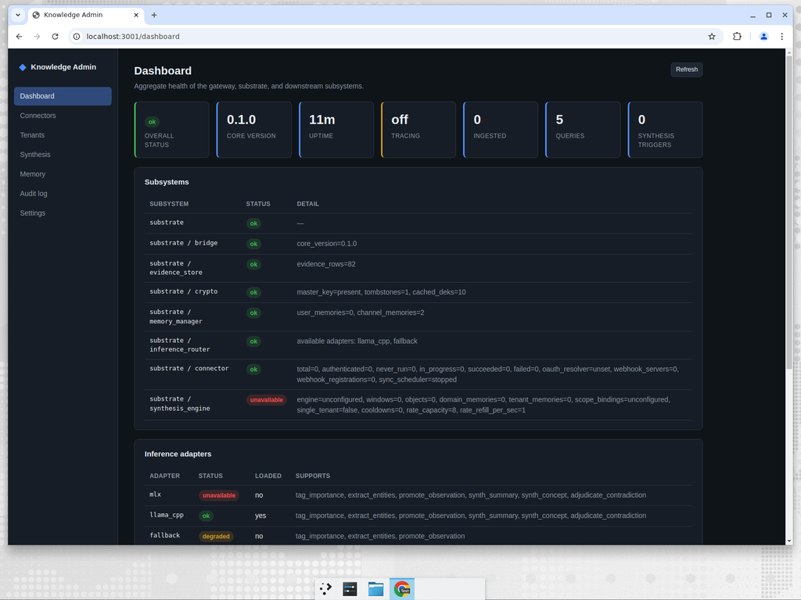
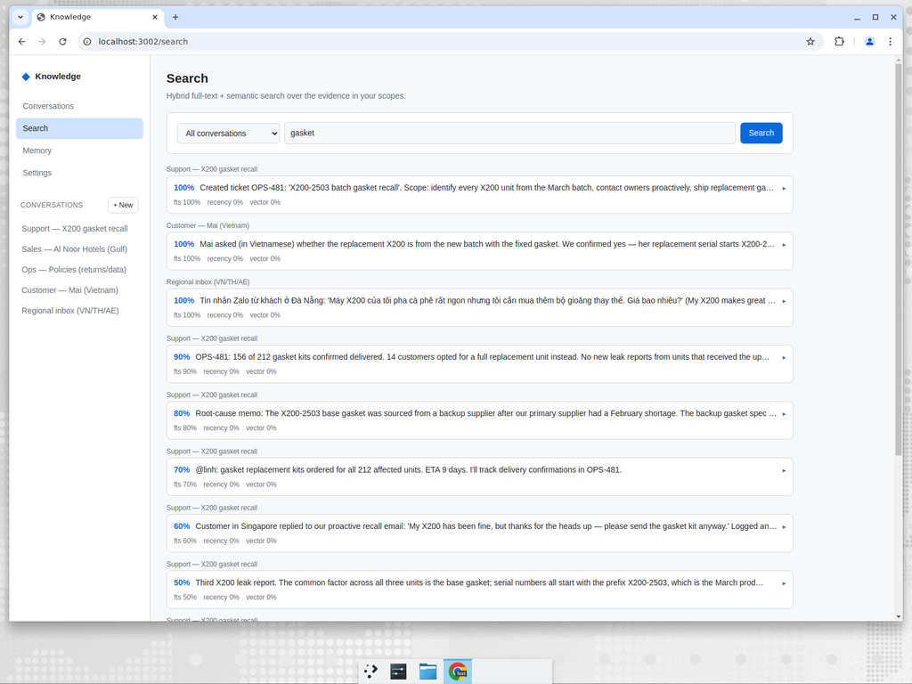
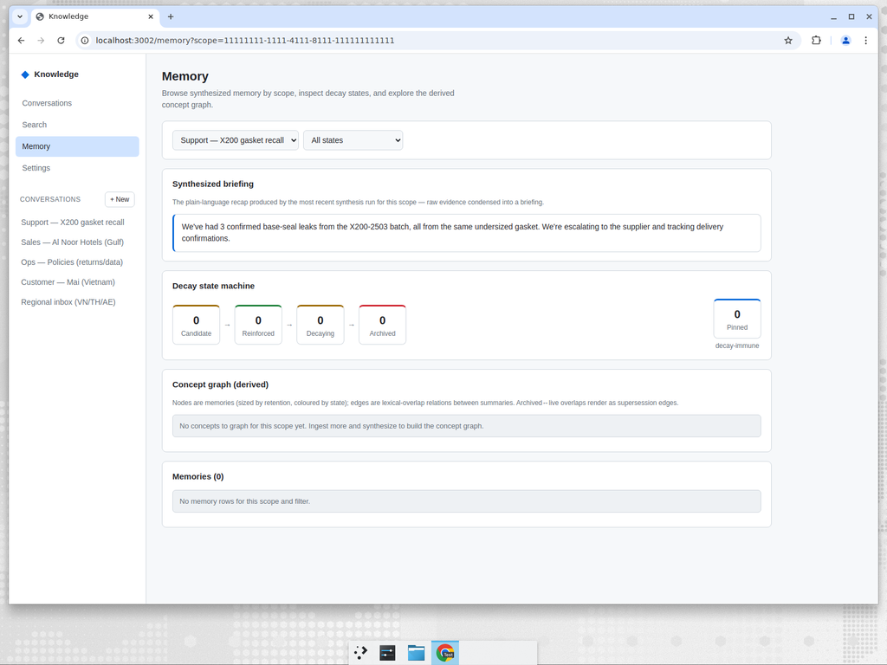
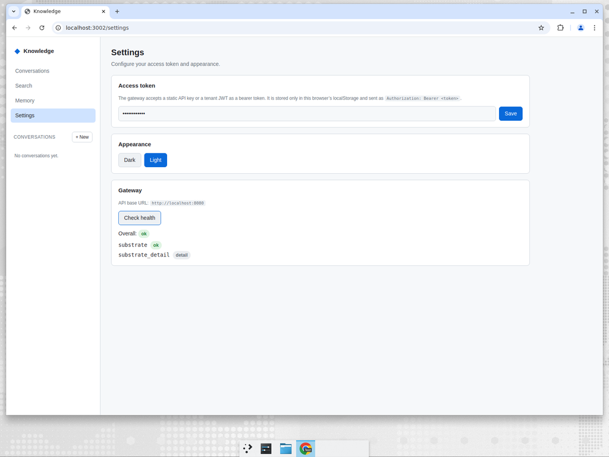

# Knowledge for a small business — a hands-on demonstration

This folder contains a complete, runnable demonstration of the Knowledge
system built for a **non-technical audience**. It uses a realistic small
business, a substantial dataset, and a single script that proves — with
pass/fail checks — that the system does what it promises.

If you read nothing else, read the five-minute story below and look at the
four screenshots. Everything here was produced by running the system, not
mocked up.

---

## 1. What problem does Knowledge solve?

A small or medium business runs on scattered information. Customer questions
arrive by email, WhatsApp, Zalo, and LINE. The team talks in Slack. Deals live
in a CRM. Policies sit in shared documents. Engineering tickets are in a
tracker. Six months later, **nobody can answer a simple question** — "what do
we actually know about the X200 leak?" — without opening five tools and asking
three people.

Knowledge fixes this by doing four things:

1. **Pull every source into one private store** so it can be searched together.
2. **Answer plain-English questions** with ranked results drawn from *all*
   sources at once — in any language.
3. **Condense the raw material into a short briefing** ("here's what's going
   on") using a small language model that runs **on your own hardware** — your
   data never leaves the building.
4. **Keep each customer, team, or topic in its own locked compartment**, and
   let you **permanently erase** any one of them on request (a real
   "right to be forgotten", not just a hidden flag).

Crucially, this all runs **on-device / on your own server**. There is no
third-party cloud reading your customers' messages.

---

## 2. The business: "Lotus & Bean"

> A 25-person specialty coffee-equipment retailer and servicer selling across
> **Vietnam, Thailand, Singapore, the UAE, the UK, Germany, Switzerland,
> France, Latin America, and Australia**.

This quarter they have a real situation: a batch of their **X200 home espresso
machine** is leaking, and they're running a proactive recall — while also
chasing a 40-unit commercial deal with a hotel group in Dubai, closing
European B2B deals, and answering customers in eight languages.

The demo loads **121 real-style business records** across **21 source types**
(support email, Slack, CRM, Google Workspace & SharePoint docs, Zoom
transcripts, an Atlassian tracker, manual notes, regional messaging apps, and
API data from regional connectors — Bexio, TWINT, Deutsche Post, Qonto,
Pennylane, GoCardless, MercadoLibre, Rappi, Nubank, MYOB, Afterpay, Zendesk,
HubSpot) into **11 separate compartments**:

| Compartment ("scope") | What it holds |
| --- | --- |
| **Support — X200** | All support activity for the leaking espresso machine. |
| **Sales — Gulf hotels** | The B2B pursuit of Al Noor Hotels (Dubai), a 40-unit order. |
| **Ops — policies** | Company policies: returns, warranty, data retention. |
| **Customer — Mai (VN)** | One Vietnamese retail customer — used to show isolation and erasure. |
| **Regional inbox** | Inbound messages in **Vietnamese, Thai, and Arabic**. |
| **Sales — Europe hotels** | A German/Swiss B2B deal — **German**-language CRM, email, Slack, Bexio & TWINT data. |
| **Support — UK retail** | UK retail support (English-UK) with GoCardless Direct Debit refunds. |
| **Sales — France enterprise** | A **French**-language enterprise deal with Qonto & Pennylane references. |
| **Regional inbox — LATAM** | Latin-American messages in **Spanish & Portuguese** (MercadoLibre, Rappi, Nubank). |
| **Regional inbox — AU** | Australian customer messages (MYOB, Afterpay). |
| **Ops — compliance (EU)** | **GDPR / DSGVO / RGPD** compliance policies in German, French, and English. |

Each compartment is encrypted under its **own key**, so they are genuinely
isolated from one another.

---

## 3. Set it up (easy mode)

A business operator gets the whole stack running with **one command** (this is
the installer added for SMEs):

```bash
curl -fsSL https://raw.githubusercontent.com/kennguy3n/knowledge/main/scripts/install.sh | bash
```

The installer generates strong passwords, asks whether you want on-device
synthesis, starts everything with Docker, waits for it to go healthy, and then
prints where to go:

```
Knowledge is running.
  Admin: http://localhost:3001
  API:   http://localhost:8080
```

(The end-user web interface — the reference UI — runs at
`http://localhost:3002`.)

Then run the business demonstration against the running system:

```bash
cd demos/sme-knowledge-demo
export KNOWLEDGE_GATEWAY_URL=http://localhost:8080
export KNOWLEDGE_API_KEY=<the key you set at install>   # omit on a frictionless localhost start
python3 run_demo.py
```

`run_demo.py` uses **only the Python standard library** — no packages to
install — so a non-developer can open it and read top-to-bottom what the
business is asking the system to do. It writes two files:

- `results/sme_demo_report.md` — a business-readable walkthrough of the run.
- `results/sme_demo_results.json` — a machine-readable record of every step.

If any business check fails, the script exits non-zero. **That is the test.**

---

## 4. What the system actually did

The latest run passed **all business checks** across **8+ languages** and
**7+ regions**
(see [`results/sme_demo_report.md`](results/sme_demo_report.md)). Here are the
highlights, with screenshots from the live system.

### 4.1 Everything is healthy and loaded

The admin dashboard shows the system is up, the on-device language model
(`llama_cpp`) is loaded, and the store already holds the ingested business
records (`evidence_rows`) and synthesized briefings (`channel_memories`).



### 4.2 One question, answered from every source at once

Searching **"gasket"** across all compartments returns a single ranked list
that pulls together the support ticket, the root-cause memo, the recall
progress update, **and** customer messages — including ones written in
**Vietnamese and Zalo** — without anyone telling the system where to look.



The demo asks 21 plain-English business questions and checks the answers,
for example:

- *"What is the root cause of the X200 leaks?"* → the gasket recall ticket.
- *"How many units are affected?"* → "all **212** affected units".
- *"What price did we commit to Al Noor?"* → "**AED 11,800** per unit for 40 units".
- *"How fast must we honour a data-deletion request?"* → "within **30 days**"
  (from the policy doc, citing Vietnam's PDPD and the UAE PDPL).

It also confirms **search works across languages** (finding Thai and Arabic
customer messages by a product code) and that **compartments are isolated**
(a support-only term returns *zero* hits inside the sales compartment).

### 4.3 Raw evidence condensed into a briefing

This is the part most tools can't do. The system reads every record in the
support compartment and writes a short, plain-language **briefing** — the kind
of thing you'd want a new team member to read on their first morning. It is
produced entirely **on-device** by the small language model.



> *"We've had 3 confirmed base-seal leaks from the X200-2503 batch, all from
> the same undersized gasket. We're escalating to the supplier and tracking
> delivery confirmations."*

Nobody wrote that summary. The system distilled it from a dozen separate
support records.

### 4.4 "Forget this customer" actually means forget

Customer Mai filed a data-deletion request. The demo erases her entire
compartment. Because each compartment is encrypted under its own key,
destroying that key makes the data **unrecoverable — not merely hidden**. The
demo verifies this: searching her scope returns 2 records before, and **0
after**.

### 4.5 The system is wired up end-to-end

The end-user UI talks to the gateway, which talks to the encrypted store and
the on-device model. A built-in health check confirms the whole chain:



---

## 5. Why a business should care

| Business need | What Knowledge gives you |
| --- | --- |
| "Where is everything?" | One searchable store across all your tools. |
| "Answer me in plain English." | Ranked answers drawn from every source at once. |
| "We sell across borders." | Search and extraction in Vietnamese, Thai, Arabic, and more. |
| "Keep clients separate." | Per-compartment encryption — no cross-contamination. |
| "We have privacy obligations." | On-device processing + genuine cryptographic erasure. |
| "We're not a tech company." | One-command install; a readable, dependency-free demo. |

---

## 6. Files in this demo

| File | What it is |
| --- | --- |
| `dataset/lotus-and-bean.json` | The 121-record business dataset across 11 compartments. |
| `run_demo.py` | The end-to-end business test (ingest → search → synthesize → erase). |
| `results/sme_demo_report.md` | Business-readable report from the latest run. |
| `results/sme_demo_results.json` | Machine-readable results from the latest run. |
| `screenshots/` | The four screenshots embedded above, captured from the live system. |

Everything here was produced by running the actual system against the dataset
in this folder.
