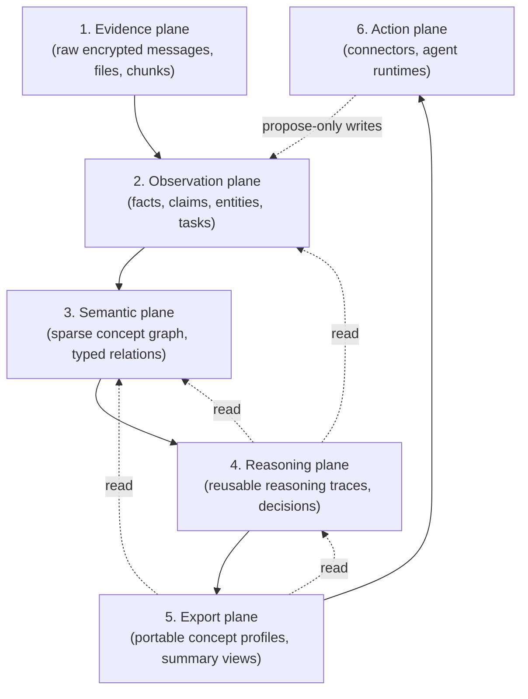
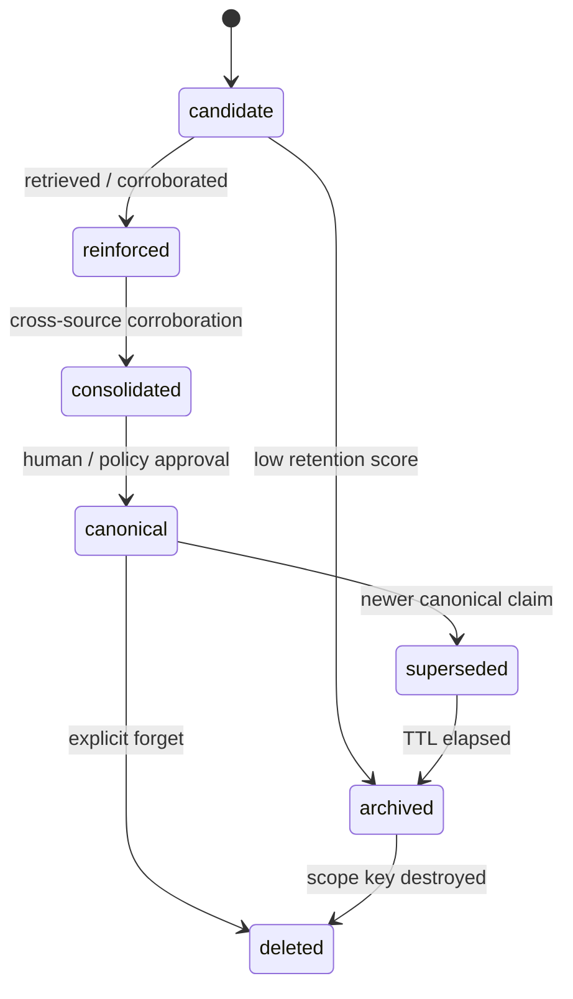
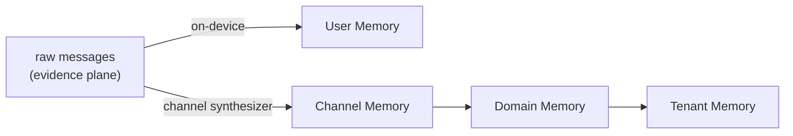
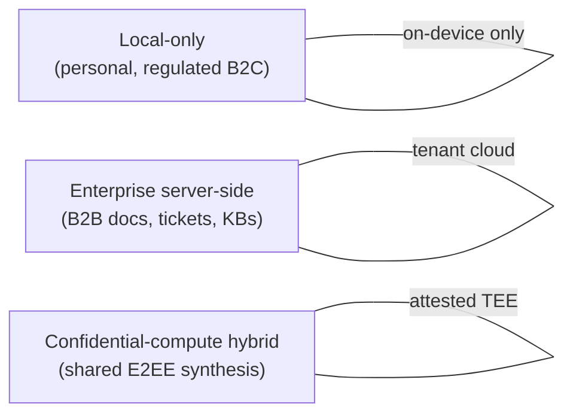
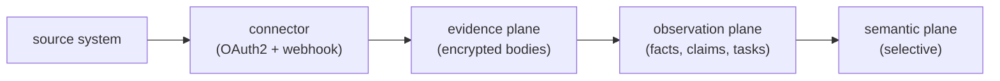

# Knowledge — Design

This is the design document for the Knowledge substrate. It
captures the product thesis, the strategic principles, the
layered substrate, the memory model, the on-device model
strategy, the scope hierarchy, the permission model, the
deployment modes, the post-quantum cryptography, and the
integration surface.

Knowledge is a privacy-first continual knowledge and context
substrate. It serves a consumer surface (B2C) and an enterprise
surface (B2B) over the same memory model. See
[README.md](../README.md) for an overview,
[ARCHITECTURE.md](../ARCHITECTURE.md) for the implementation
architecture that realises this document,
[API_REFERENCE.md](API_REFERENCE.md) for the Go gateway REST
surface, and [QUICKSTART.md](QUICKSTART.md) for deployment
instructions.

---

## 1. Product thesis

Knowledge is not a chat-with-your-files product, and it is not a
vector database with a UI bolted on top. It is a **shared
cognitive substrate** that compounds over time — a substrate
where every conversation, document, decision, and workflow
leaves a structured, decaying, scoped trace, and where surfaces
(chat, search, agents, exports) consume that trace instead of
reaching back into raw evidence on every call.

The thesis stands on five pillars:

1. **Neurosymbolic by construction.** Neural perception (SLM +
   encoder embeddings) lives on the inside; the outside surface
   is a persistent concept graph + reusable Graph-of-Thought
   reasoning traces + scope-bound shared memory. Surfaces never
   talk to a free-running LLM directly — they talk to memory.
2. **Consented continuity.** When a surface (a chat, an agent, an
   export profile) needs context, it retrieves relevant
   *concepts* and *past reasoning*, not raw documents. New
   learning flows back into memory only with consent — explicit
   pinning by the user, an admin promotion, or a policy-driven
   automatic promotion with provenance.
3. **Portable concept profiles.** External tools never see the
   raw substrate. They see *approved concepts* — typed, scoped,
   provenance-bearing, time-bounded — packaged into a profile
   that captures only what the external tool actually needs to
   reason about the user's context.
4. **One platform, two surfaces.** B2C and B2B run on the same
   substrate, the same memory state machine, the same
   cryptographic primitives, the same export contract. The
   difference is the hierarchy (community vs. domain), the
   synthesizer choice (elected device vs. managed endpoint vs.
   confidential compute), and the connector inventory.
5. **Privacy is the substrate.** Everything is encrypted at
   rest, scope-bound, and forgettable by key destruction. Every
   piece of memory carries provenance. Every export goes through
   the same export plane.

The product Knowledge replaces is the slow, manual, ad-hoc work
of re-explaining a person's, a team's, or a tenant's context to
every new tool, every new model, every new contributor. The
substrate remembers so surfaces don't have to.

---

## 2. Strategic principles

These are the design principles that constrain every decision in
the substrate:

1. **Build the substrate first.** Memory, provenance, and
   permissions are the core. Surfaces (chat UI, search UI, agents)
   come second and are *consumers* of the substrate.
2. **Keep graph usage selective.** The concept graph is a
   second-order index for synthesis, contradiction detection, and
   multi-hop reasoning — *not* the storage for every message.
   Most observations never enter the graph; only high-value,
   reinforced, cross-source claims do.
3. **Separate evidence, synthesized memory, and export views.**
   These three planes have different lifecycles, different keys,
   and different access policies. Mixing them is the single
   biggest source of leakage in this class of system.
4. **For shared E2EE synthesis, pick the right synthesizer per
   scope.** Three are valid:
   - **Elected client** — small group, an elected member device
     runs synthesis and publishes encrypted results.
   - **Customer-managed AI endpoint** — the tenant points the
     synthesizer at their own AI endpoint with their own keys.
   - **Attested confidential compute** — a TEE-attested worker
     decrypts only inside the enclave and publishes encrypted
     synthesis back.
5. **Default to the cheapest retrieval mode; escalate only when
   needed.** Lexical / FTS5 first, then semantic embedding
   retrieval, then graph traversal, and only then heavy SLM
   synthesis. Each step has a measured budget.
6. **Provenance is non-negotiable.** Every synthesized memory
   carries who / what / when / why and links back to the
   evidence it was derived from.
7. **Cryptographic forgetting is the only deletion that counts.**
   Soft-delete is a UX affordance; key destruction is the
   real delete.

---

## 3. Platform architecture — layered substrate

The substrate is six planes. Each plane has its own storage, its
own keys, its own retention policy, and its own access controls.
Surfaces consume from the highest plane that satisfies their
need; they only fall through to lower planes with explicit
permission.



### 3.1 Evidence plane

Raw encrypted messages, files, chunks, transcripts, and tool
outputs. Append-only, scope-bound, with content-aware storage
routing and per-scope cryptographic forgetting.

The substrate routes bodies on a size threshold: short text
messages go inline in the evidence row (no dedup index lookup);
larger bodies go to a content-hash-deduplicated body table with
per-scope key wraps so cryptographic forgetting still works on
shared content; noise-class messages go to a fixed-size FIFO
ring buffer that overwrites on rollover.

For the concrete routing thresholds, table layout, key-wrap
schema, FTS5 purge semantics, and tombstone replay path, see
[ARCHITECTURE.md §2.2](../ARCHITECTURE.md#22-local-store).

### 3.2 Observation plane

Normalized facts, claims, entities, tasks, decisions extracted
from evidence. Cheap classifiers run first (lexicon + small
encoder); only candidates that clear the cheap classifier are
promoted to a more expensive stage (XLM-R + SLM-assisted
extraction). Most messages produce 0–2 observations; dense
documents produce more.

### 3.3 Semantic plane

A *sparse* concept graph with typed relations (`is_a`,
`part_of`, `decided_by`, `supersedes`, `contradicts`,
`derived_from`, `assigned_to`, …). Scope-aware: each node /
edge is bound to a scope (user, channel, domain, tenant) and
inherits its access policy. The graph is the place we pay for
synthesis; we only pay for it when an observation is
high-value and reinforced.

### 3.4 Reasoning plane

Reusable reasoning traces, decision rationales, and workflow
records. When the substrate runs a Graph-of-Thought query, it
saves the trace as an inspectable artifact. When a decision is
made (a task is approved, a contradiction is resolved, a
concept is canonicalized), the rationale is captured here.

### 3.5 Export plane

Portable concept profiles, summary views, and allowed evidence
packs. Least-privilege by default — the export plane never
includes raw evidence unless an explicit policy allows it for a
specific export profile. Every export is auditable and
revocable.

### 3.6 Action plane

Tool connectors, external APIs, and agent runtimes. Reads from
the export plane; writes back to the observation plane only as
*proposals* — never as canonical memory. A proposal must be
promoted by a human or a policy before it becomes part of the
canonical substrate.

---

## 4. Memory system and decay

Memory is not flat. The substrate models six memory stages,
inspired by cognitive memory but tuned for an AI substrate, with
explicit promotion / decay rules between them:

| Stage | Holds | Decay rate | Promotes to |
|---|---|---|---|
| Sensory memory | Raw messages, raw chunks (evidence plane bodies) | Fastest — minutes to hours of "fresh" weight | Working / episodic |
| Working memory | Current task / thread context window | Minutes to hours | Episodic |
| Episodic memory | Session / thread summaries | Days to weeks | Semantic (when reinforced) |
| Semantic memory | Concepts, relations, definitions | Slow — prefers supersession over deletion | Procedural / institutional |
| Procedural memory | Workflows, playbooks, successful traces | Very slow | Institutional |
| Institutional memory | Tenant policy, org glossary, canonical taxonomy | No ordinary decay — only explicit deprecation | (terminal) |

### 4.1 State machine

Every memory object moves through this state machine:



### 4.2 Retention score

Every object has a retention score updated on retrieval and
periodically swept. Inputs:

- **Pinning** — an explicit user / admin pin is the strongest signal.
- **Retrieval frequency** — how often the object has been
  retrieved as part of an answered query.
- **Cross-source corroboration** — number of independent evidence
  sources backing the same observation.
- **Contradiction signals** — does another canonical claim
  contradict this one?
- **Age** — older things decay unless reinforced.
- **Non-use** — long stretches without retrieval pull the score
  down.

### 4.3 Decay policy by class

Not all memory decays at the same rate. Each object carries a
*sensitivity / criticality class* that drives its decay schedule:

| Class | Examples | Decay rule |
|---|---|---|
| Critical | Tenant policy, regulatory rules, signed decisions | No passive decay; only explicit deprecation |
| Important | Owners, project commitments, canonical concepts | Slow decay; supersession preferred |
| Useful | Recurring tasks, channel recaps, workflows | Medium decay; archived if non-used |
| Noise | Greetings, social chatter, transient pings | Stays only in the raw evidence plane; never promoted |

### 4.4 Cryptographic forgetting

Every scope (user, channel, domain, tenant) and every archive
epoch has its own data-encryption key (DEK). Deleting a scope
or aging out an epoch is a single operation: destroy the
DEK. Encrypted bytes that remain are uniformly random; the
substrate has no way to recover them. This is the only delete
the substrate considers truly final, and it is the contract the
"right to be forgotten" surfaces are built on.

---

## 5. On-device model strategy

The on-device model strategy is shared across the KChat
platform; the canonical model-selection document is
[`kchat-on-device-model-strategy.md`](https://github.com/kennguy3n/slm-chat-demo/blob/main/docs/kchat-on-device-model-strategy.md).
This section captures the model picks the Knowledge substrate
relies on directly.

### 5.1 Bonsai-1.7B as the synthesizer

- **Model:** Bonsai-1.7B (Qwen3-derived; multilingual).
- **GGUF:** ~237 MB on disk via the PrismML
  [`kennguy3n/llama.cpp@prism`](https://github.com/kennguy3n/llama.cpp/tree/prism)
  fork's `llama-server`. Used for on-device synthesis on Android
  and Windows / Linux desktop, plus as a fallback on macOS.
- **MLX:** ~248 MB on disk (2-bit quantization). Preferred
  runtime on Apple Silicon (iOS, macOS).
- **Use cases:** importance tagging (alongside the encoder),
  entity extraction, observation promotion, episodic /
  channel / domain summary generation, concept synthesis,
  contradiction adjudication.

**Validated languages (22).** Bonsai-1.7B synthesis and the
lexicon-first observation pipeline are validated across the
following 22 languages:

| BCP-47 | Language | Script | Auto-detected as |
|---|---|---|---|
| `ar` | Arabic | Arabic | `ar` |
| `bo` | Tibetan | Tibetan | `bo` |
| `de` | German | Latin | `de` |
| `en` | English | Latin | `en` |
| `es` | Spanish | Latin | `es` |
| `fr` | French | Latin | `fr` |
| `he` | Hebrew | Hebrew | `he` |
| `hi` | Hindi | Devanagari | `hi` |
| `id` | Indonesian | Latin | `id` |
| `it` | Italian | Latin | `it` |
| `ja` | Japanese | Kana + Kanji | `ja` |
| `km` | Khmer | Khmer | `km` |
| `ko` | Korean | Hangul | `ko` |
| `lo` | Lao | Lao | `lo` |
| `ms` | Malay | Latin | `id` (see note) |
| `my` | Burmese | Myanmar | `my` |
| `pt` | Portuguese | Latin | `pt` |
| `ru` | Russian | Cyrillic | `ru` |
| `th` | Thai | Thai | `th` |
| `tl` | Tagalog / Filipino | Latin | `tl` |
| `vi` | Vietnamese | Latin (diacritics) | `vi` |
| `zh` | Chinese | Han | `zh` |

Each language ships a lexicon (decision / task keywords,
imperative verbs, stop-words) and an interrogative table; see
`crates/observation_engine/src/lexicon.rs` and
`interrogatives.rs`. Two validation suites pin this coverage:

- `crates/observation_engine/tests/multilingual_pipeline.rs`
  ingests a realistic decision / task / question message per
  language through `default_pipeline` and asserts correct
  language detection, correct (non-English-fallback) lexicon
  selection, and no English-keyword false positives.
- `crates/inference_router/tests/multilingual_bonsai.rs`
  exercises the real `LlamaCppAdapter` against a live
  `llama-server` serving the Bonsai-1.7B GGUF for summary
  generation, entity extraction, importance classification, and
  concept synthesis in each language. It is gated behind the
  `live-integration` feature and the `LLAMA_SERVER_BINARY`
  env var, skipping gracefully when no model checkpoint is
  present.

**Note on Malay (`ms`).** `whatlang` has no Malay classifier and
detects Malay text as Indonesian (`Ind` → `id`), so
auto-detected Malay routes through the Indonesian lexicon (the
two share a large common core). The dedicated `ms` lexicon —
with register-specific forms such as `diluluskan` and the
deadline collocation `tarikh akhir` — is reachable when a caller
supplies the `ms` tag explicitly (e.g. a connector that knows
the source locale). Per-language quality notes are tabulated in
the README's "Multilingual support" section.

### 5.2 XLM-R for embeddings and classification

- **Model:** XLM-R (multilingual encoder).
- **INT8 ONNX:** ~107 MB. **INT4 ONNX:** ~55 MB.
- **Use cases:** semantic retrieval embeddings, importance
  classification, entity / topic typing, near-duplicate
  detection. Same encoder shared with `slm-guardrail` and
  `chat-storage-search` to eliminate ~120 MB of redundant weight
  per device.

### 5.3 Device tiering

Tiering is identical across the KChat platform; Knowledge
inherits it directly:

| Tier | RAM | XLM-R | Bonsai SLM | Channel synthesis | Domain synthesis |
|---|---|---|---|---|---|
| Low | 2–3 GB | INT4 (~55 MB) | Disabled | Lexicon + encoder only | Server-side only |
| Medium | 4–6 GB | INT8 (~107 MB) | Gated (warm-start, idle-unload) | On-device when foreground | Server-side |
| High | 8+ GB | INT8 | Always (mmap, 60 s idle-unload) | On-device | On-device or server |

### 5.4 Shared `llama-server` sidecar

A single `llama-server` instance is shared across all KChat
subsystems on the same device (Knowledge synthesis, KChat skills,
CV-Guard SLM consultation, slm-guardrail when SLM-promoted). The
sidecar runs with `--parallel 2`, mmap'd weights, and a 60 s
idle-unload to free RAM when the SLM is not actively used. This
avoids loading multiple copies of Bonsai-1.7B into RAM when more
than one subsystem wants synthesis.

### 5.5 Warm-up + memory discipline

- **Warm-up** at app boot: a single short prompt is run during
  init to page weights into RAM, so the first user-visible
  synthesis stays under 3 s.
- **mmap** is used for all weight files so the OS can evict
  cleanly.
- **60 s idle-unload** releases the SLM from RAM after a quiet
  period; the next synthesis triggers a re-warm.
- **Hard caps**: 250 MB substrate footprint on mobile (without
  SLM resident) and 1 GB on desktop with SLM resident.

### 5.6 Thinking disabled

Synthesis prompts prepend a closed `<think>\n</think>\n` pair to
suppress in-model chain-of-thought. Reasoning traces are saved in
the reasoning plane (§3.4) instead — they are auditable, scoped,
and citable, which a hidden chain-of-thought is not.

---

## 6. Knowledge hierarchy and synthesis

The substrate keeps the hierarchy at most 3 levels deep, with two
shapes — one for B2C, one for B2B per tenant.

### 6.1 B2C (max 3 levels)

```
User Memory Object → Channel Memory Object → Community Memory Object  (optional)
```

- **User Memory Object** — facts, pinned items, episodic summaries,
  working context. Synthesized on-device. Never published to a
  shared scope.
- **Channel Memory Object** — recaps, decisions, open questions,
  active tasks for one channel. Published to channel members
  under MLS group keying.
- **Community Memory Object** — *optional*. A community-level
  memory object is created only if the community owner enables
  it. Consumes channel objects only.

### 6.2 B2B per tenant (max 3 levels)

```
User Memory Object → Channel Memory Object → Domain Memory Object → Tenant Memory Object
```

> The user-visible hierarchy stays 3 levels deep
> (`user → domain → channel`) — the tenant memory object sits
> *above* the user-visible hierarchy as the canonical institutional
> memory and is treated as ambient context, not a navigation level.

- **User Memory Object** — employee personal scope.
- **Channel Memory Object** — channel-scoped recaps, decisions,
  open questions, tasks.
- **Domain Memory Object** — cross-channel workstreams,
  dependencies, risks, procedures within one logical work area.
- **Tenant Memory Object** — canonical policy, product taxonomy,
  stable org knowledge.

### 6.3 Strict synthesis flow



Three rules:

1. **Only channel synthesis touches raw messages.** Domain and
   tenant synthesis must consume channel outputs only.
2. **Domain synthesis consumes channel outputs.** Channel objects
   are the input contract for domain synthesis.
3. **Tenant synthesis consumes domain objects + approved official
   docs.** No back-channel access to raw evidence at tenant
   scope.

### 6.4 Synthesis rules

- A tiny on-device classifier (lexicon + XLM-R) performs
  importance tagging on every observation candidate. Only
  high-value candidates trigger heavier SLM-assisted synthesis.
- Heavy synthesis runs **once per scope window**, not once per
  device. The synthesizer (elected client / managed endpoint /
  TEE worker — see §8) owns the window.
- The synthesis output is published as an **encrypted synthesis
  object** back into the scope; other members consume it instead
  of re-synthesizing.

---

## 7. Permissions and agent writes

### 7.1 Two complementary permission models

The substrate uses two permission models, deliberately:

- **Relation-based authorization (Zanzibar-style)** for the
  logical policy layer. Every object (Tenant, Domain, Channel,
  User, Device, Concept, Summary, Workflow, Export-Profile,
  Agent) has typed relations (owner, admin, editor, member,
  synthesizer, viewer, proposer); permission checks are
  expressed as relation reachability.
- **Cryptographic capabilities** for the data layer. Each scope
  has a DEK; access to the DEK is granted via delegation tokens
  bound to the relation graph. Two effects: revoking the
  relation also revokes data access (the token's scope is no
  longer reachable); destroying the DEK forgets the data
  cryptographically.

### 7.2 Provenance — PROV model

Every observation and every synthesis output carries a PROV
bundle:

- **Entity** — the observation / summary / concept itself.
- **Activity** — the synthesis run (agent identity, model
  version, prompt id, run id).
- **Agent** — the human or software agent responsible.
- **Derivation** — links to the evidence rows the output was
  derived from.

The bundle is signed (ML-DSA-65) by the synthesizer key, so a
consumer can verify authenticity and trace lineage even when the
synthesizer is untrusted.

### 7.3 Agent write contract — proposal-only

Agents (LLM-driven workflows, integrations, AI employees) never
write canonical memory directly. The contract is:

- `propose_observation(scope, claim, evidence_refs, …)`
- `propose_concept(scope, label, definition, evidence_refs, …)`
- `propose_relation(scope, src, type, dst, evidence_refs, …)`
- `propose_summary(scope, text, evidence_refs, …)`

Promotion to canonical (`promote_to_canonical(proposal_id)`)
requires either an explicit human action or a tenant policy that
auto-promotes proposals matching specific criteria (high
confidence, high cross-source corroboration, low sensitivity).

Every proposal carries:

- Scope (user / channel / domain / tenant)
- PROV bundle (signed)
- Evidence refs (the rows the proposal was derived from)
- Confidence score
- Sensitivity class (critical / important / useful / noise)
- TTL (if applicable)
- `supersedes` / `contradicts` links (if applicable)
- Agent identity + model version
- Skill / recipe id

This contract is what makes it safe to put agents on the
substrate at all: the substrate's canonical state is never
altered without a record of who altered it, why, and based on
what.

---

## 8. Deployment modes

The substrate ships in three deployment modes, picked per
deployment based on data sensitivity and the synthesizer choice
that fits the workload.



### 8.1 Local-only

- **Use case:** personal memory, private B2C chats, regulated
  data that cannot leave the device.
- **Storage:** SQLCipher local store; archives encrypted with
  per-epoch keys.
- **Synthesizer:** on-device Bonsai-1.7B via the shared
  `llama-server` sidecar.
- **Sync:** multi-device CRDT sync of synthesis objects only;
  raw evidence stays local unless policy explicitly allows.

### 8.2 Enterprise server-side

- **Use case:** org files, docs, tickets, knowledge bases —
  anything the tenant already accepts in their cloud.
- **Storage:** PostgreSQL + pgvector + MinIO/S3 in the tenant /
  vendor cloud. Per-tenant encryption keys; row-level security
  by tenant id; physical isolation optional.
- **Synthesizer:** managed AI endpoint (vendor-hosted or
  customer-managed).
- **Sync:** tenants control which observations / concepts can
  flow to the on-device user memory of their employees.

### 8.3 Confidential-compute hybrid

- **Use case:** shared synthesis over E2EE / privacy-sensitive
  group data — the rare workload that needs more than an
  elected device but cannot use a plaintext server.
- **Synthesizer:** an attested TEE worker (Intel TDX / AMD SEV-SNP
  / Nitro Enclaves, depending on cloud). Decryption happens only
  inside the enclave; the worker publishes encrypted synthesis
  back into the scope.
- **Audit:** every synthesis run carries an attestation report
  bound to the synthesizer key.

### 8.4 Synthesizer roles

In every mode, channel-scoped synthesis is owned by exactly one
synthesizer per scope window:

| Synthesizer role | Picked when |
|---|---|
| Elected member device | Small group, all members on-device, no managed endpoint configured |
| Customer-managed AI endpoint | Tenant has their own AI endpoint; B2B channels / domains |
| Attested confidential worker | Shared E2EE workload; mixed devices; high-sensitivity content |

---

## 9. Post-quantum cryptography

Knowledge stores long-lived memory, so it has to assume the
harvest-now-decrypt-later threat model. Post-quantum
cryptography is the default; classical primitives are kept only
in hybrid mode for transition compatibility. For the concrete
primitive inventory and key layout, see
[ARCHITECTURE.md §8](../ARCHITECTURE.md#8-post-quantum-crypto-layer).

### 9.1 Primitives

| Purpose | Primary | Backup / fallback |
|---|---|---|
| Key encapsulation | **ML-KEM-768 (Kyber)** | Hybrid X25519 + ML-KEM-768 during transition |
| Signatures | **ML-DSA-65 (Dilithium)** | **SPHINCS+** (stateless, hash-based) for high-assurance / long-term provenance signing |
| Symmetric AEAD | XChaCha20-Poly1305 | AES-256-GCM where hardware demands |
| Hashing / framing | BLAKE3 | SHA-256 fallback |

### 9.2 Hybrid during transition

All new key exchanges run a hybrid X25519 + ML-KEM-768
construction so the substrate is forward-secure against quantum
adversaries while keeping classical compatibility during the
roll-out. The hybrid combiner is the standard concatenate-then-KDF
pattern.

### 9.3 Post-quantum MLS

Group keying for shared channel / domain memory uses MLS with
post-quantum extensions:

- The leaf key package mechanism is extended to carry an
  ML-KEM-768 KEM in addition to (or instead of) X25519.
- TreeKEM uses the hybrid KEM construction for the path-secret
  derivation.
- The signature scheme on commits and welcome messages is
  ML-DSA-65 (with SPHINCS+ as a stateless backup for archival
  group ops).

### 9.4 Cryptographic forgetting via key destruction

Per-scope DEKs and per-epoch archive keys are the unit of
deletion. Destroying a DEK forgets the data; the encrypted
bytes that remain are uniformly random.

---

## 10. Integration surface (on-server)

The on-server surface accesses shared document management and
collaboration systems and feeds them into the same memory
hierarchy as the on-device surface. Each connector is a thin
adapter that produces evidence-plane rows; the rest of the
pipeline (observation → semantic → reasoning → export) is shared.

### 10.1 Connector inventory

| Connector | Sources | Auth | Sync mode |
|---|---|---|---|
| Google Drive | Docs, Sheets, Slides, generic files | OAuth2 | Webhook + incremental delta |
| OneDrive | Office 365 docs, generic files | OAuth2 | Webhook + incremental delta |
| Notion | Pages, databases | OAuth2 | Polled incremental + webhook |
| Jira | Issues, projects, comments | OAuth2 | Webhook + incremental |
| Confluence | Spaces, pages | OAuth2 | Webhook + incremental |
| Figma | Design files, components, comments | OAuth2 | Webhook + incremental |
| HubSpot | Contacts, companies, deals, notes | OAuth2 | Webhook + incremental |
| Slack | Channels, threads, files | OAuth2 | Events API |
| Email | IMAP / Gmail / Microsoft Graph | OAuth2 | IMAP IDLE / Push |

### 10.2 Connector contract

Every connector implements the same contract:

1. **OAuth2 authentication** with refresh-token storage in the
   tenant key vault. The substrate never sees the source-system
   user's password.
2. **Incremental sync** — first run pulls the full corpus inside
   the configured ACL; subsequent runs pull deltas only.
3. **Real-time updates via webhooks** when the source supports
   them; polled fallback otherwise.
4. **Channel-scoped attachment** — a connector is attached to a
   specific channel or domain, and observations derived from it
   inherit that scope. Nothing is ingested globally by accident.
5. **ACL sync** — the source system's permissions are mirrored
   into the substrate's relation graph. A document only
   produces observations visible to users who are allowed to
   see it in the source system.

### 10.3 Observation extraction pipeline



Every observation is rendered with citations that link back to
the source document; the substrate keeps a stable mapping from
source URLs to observation rows so a user can always trace a
synthesized claim back to the original document.

---

## 11. Where graph earns its cost

The concept graph is expensive to maintain and query. We pay for
it only where it earns its cost — and we're explicit about where
it doesn't.

### 11.1 Use the graph for

- **Cross-source synthesis** — combining observations from a
  Notion doc, a Slack thread, and a Jira issue into a single
  canonical concept.
- **Holistic questions** — "what does this org know about X?";
  questions that span scopes / connectors.
- **Multi-hop reasoning** — "who owns the rollout of the feature
  that depends on the deprecated service mentioned in last
  quarter's QBR?".
- **Contradiction and drift detection** — flagging when a new
  observation contradicts a canonical claim, or when a
  canonical claim has drifted from its evidence base.
- **Permission inheritance** — propagating ACL changes across
  the relation graph (Zanzibar-style).

### 11.2 Do **not** use the graph for

- **Deterministic point lookups** — direct ID lookups belong in
  the relational store, not the graph.
- **Latest channel recap** — episodic summaries are an
  observation-plane / reasoning-plane artifact, not a graph
  query.
- **Fresh time-sensitive search** — recency-weighted
  retrieval is FTS5 + embedding hybrid; the graph is too slow
  and too coarse to dominate this.
- **Low-signal social chatter** — it never enters the graph at
  all; it stays in the evidence plane and is decayed out.

The rule of thumb: if the question is "what is X?", we have a
fast retrieval path. If the question is "how does X relate to
Y, and what does that imply for Z?", that's where the graph
earns its cost.

---

## Cross-references

- [README.md](../README.md) — overview, surfaces, hierarchy, tech stack
- [ARCHITECTURE.md](../ARCHITECTURE.md) — system design, modules, data flow, crypto layer
- [docs/PLATFORMS.md](./PLATFORMS.md) — device-tuning and per-platform integration notes
- [`kennguy3n/slm-chat-demo`](https://github.com/kennguy3n/slm-chat-demo) — reference implementation for on-device model selection and device tiering
- [`kennguy3n/llama.cpp@prism`](https://github.com/kennguy3n/llama.cpp/tree/prism) — modified llama.cpp inference runtime
