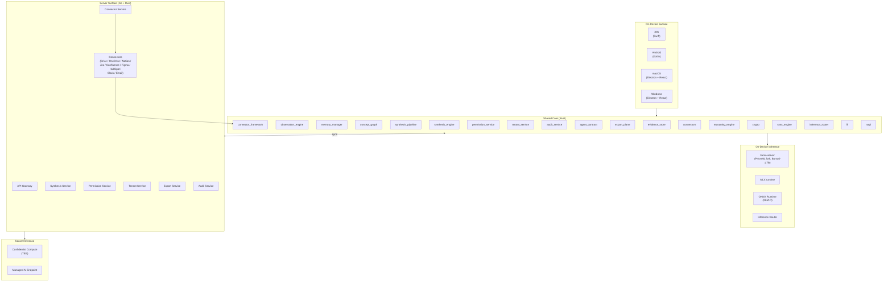
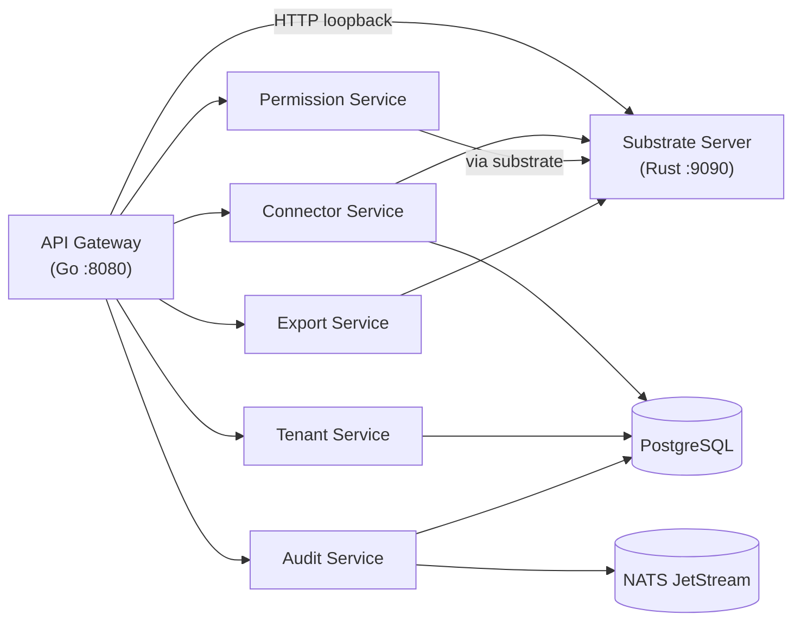
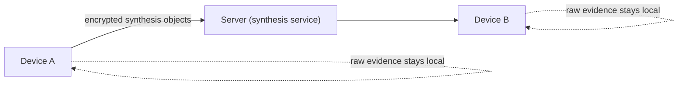
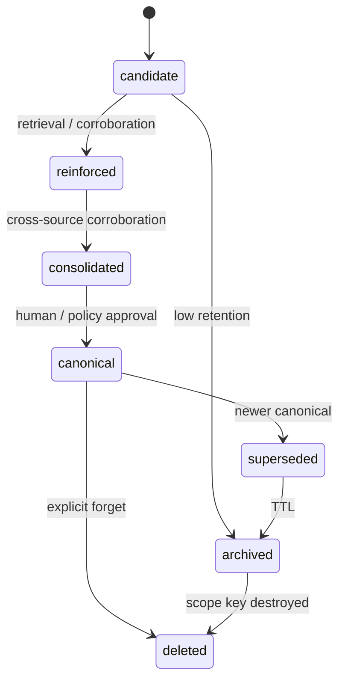

# Knowledge — Architecture

This is the implementation architecture for the Knowledge
substrate. It builds on the layered six-plane substrate from
[design.md](design.md) and turns it into a concrete
component map, a data flow, a permission model, a decay state
machine, a crypto layer, a device-optimisation strategy, and
platform-specific implementation notes.

For the product thesis, the strategic principles, and the
per-class decay policies behind these mechanics, see
[design.md](design.md). For per-platform tuning, see
[platforms.md](platforms.md).

---

## 1. System overview

Knowledge is split into three cooperating surfaces — an
on-device surface that runs on every form factor a user owns, a
server surface that runs the connector pipeline and cross-tenant
synthesis, and an inference layer that serves both. They all
consume the same Rust shared core.



The shared Rust core is the single source of truth for memory.
Every platform shell consumes it via FFI. The server surface is a
peer of the device surface for the on-server connector workflows;
they share the same observation / semantic / reasoning / export
schema.

---

## 2. Rust shared core

The Rust core is a workspace of focused crates, compiled to four
binary shapes:

- **`framework_ios`** — `.xcframework` (static library + headers,
  built via `cargo lipo` / `xcodebuild -create-xcframework`),
  consumed via Swift through UniFFI.
- **`jni_android`** — `.so` per ABI (`arm64-v8a`,
  `armeabi-v7a`, `x86_64`), consumed via JNI.
- **`napi_macos`** — N-API addon `.node` for Electron main
  process, with a thin Swift bridge for MLX.
- **`napi_windows`** — N-API addon `.node` for Electron main
  process, with C++ bindings to DirectML / Vulkan / CUDA where
  applicable.

### 2.1 Module map

| Module | Responsibility |
|---|---|
| `evidence_store` | Encrypted, append-only evidence plane with content-aware storage routing (inline / body-table / ring buffer) and the hybrid lexical + semantic + recency retriever. |
| `observation_engine` | Extracts entities, facts, tasks, and decisions from raw evidence and feeds them through the importance classifier into the observation plane. |
| `memory_manager` | Owns the decay state machine, retention scoring, working memory, and the user / channel / domain / tenant memory objects. |
| `concept_graph` | Sparse typed concept graph with supersession, contradiction edges, and incremental subgraph updates. |
| `synthesis_pipeline` | Manages scope-window synthesis (channel / domain / tenant), grammar-constrained outputs, elected-device election, and encrypted publication. |
| `synthesis_engine` | Server-side synthesis service wired to the Go gateway's `/api/v1/synthesis/{domain,tenant}` routes: a production HTTP managed-endpoint synthesizer, a deterministic test scaffold, and a confidential-compute TEE-attested worker. |
| `crypto` | All cryptographic primitives the substrate consumes — hybrid X25519 + ML-KEM-768 KEM, ML-DSA-65 and SPHINCS+ signatures, XChaCha20-Poly1305, BLAKE3, and the provenance bundle. |
| `sync_engine` | CRDT-based delta sync of synthesis objects, MLS group keying, and policy-gated evidence sync. |
| `permission_service` | Zanzibar-style relation graph with reachability checks. |
| `tenant_service` | Tenant lifecycle, per-tenant keys, and member provisioning. |
| `audit_service` | Append-only audit log of canonical promotions, exports, agent proposals, and policy changes. |
| `agent_contract` | Proposal-only write contract for agents — typed proposals, lifecycle, and promotion to canonical. |
| `export_plane` | Portable concept profiles, export policy, and the read-only policy simulator. |
| `connector_framework` | OAuth2 vault, incremental + webhook sync state, channel-scoped attachment, and ACL sync. |
| `connectors` | The 140 built-in vendor connector implementations across 10 markets (file stores, docs/wikis, CRM, support, chat/meetings, developer tools, finance, and region-focused platforms), each labelled by `ConnectorMaturity` (contract-stable by default; GitHub, Slack, Notion, MoMo, Stripe live-verified). |
| `inference_router` | On-device inference routing across the feature-gated CoreML/ANE and ONNX-Runtime NPU adapters, MLX, llama.cpp, a managed-cloud adapter, and a deterministic fallback, with capability detection and device-tier gating. |
| `reasoning_engine` | Contradiction and drift detection, multi-hop traversal, query planning, workflow memory, Graph-of-Thought, and community summaries. |
| `ffi` | UniFFI surface consumed by iOS and Android. |
| `napi` | N-API addon consumed by macOS and Windows Electron shells. |

This table is the canonical module index for the substrate.

### 2.2 Local store

- **SQLCipher** for the relational store (AES-256-CBC per-page +
  HMAC-SHA512; the per-database master key is unwrapped via the
  hybrid X25519 + ML-KEM-768 KEM from §8 below).
- **SQLite FTS5** with `unicode61 remove_diacritics 2` for
  lexical / hybrid retrieval.
- **Cold segments** — content older than the hot window is
  written to encrypted append-only segments with per-epoch
  XChaCha20-Poly1305 keys; epoch keys are rotated on a schedule
  and destroyed when the epoch is forgotten.
- **Content-aware storage routing.** Bodies are routed through a
  size-threshold strategy:
  - **Inline path (≤ 512 bytes):** short text messages are stored
    inline in the evidence row; a BLAKE3 hash is computed for
    integrity framing, but no dedup index lookup is performed.
    This eliminates JOIN overhead for the chat-message common case.
  - **Body-table path (> 512 bytes):** files, document chunks,
    transcripts, and large bodies are stored in a separate body
    table with BLAKE3 content-hash deduplication. Each body row
    is encrypted under a random Content Encryption Key (CEK);
    per-scope CEK wraps in `body_store_key_wraps` let multiple
    scopes share the same body while preserving cryptographic
    forgetting: deleting a scope's wraps makes the body
    unrecoverable once no wraps remain.
  - **Ring-buffer path (noise class):** messages classified as
    noise by the importance tagger are stored in a fixed-size
    circular buffer (configurable, default 5 MB) that overwrites
    on FIFO. They are available for the current synthesis window
    but never persist beyond it.
- **Semantic near-dedup at the observation plane** — XLM-R
  embeddings detect semantically equivalent observations
  extracted from different messages. Deduplication of *meaning*
  happens at the observation layer, not the evidence layer,
  catching cases where the same fact is stated in different words
  across channels.

### 2.3 Cross-platform FFI

- **UniFFI** for iOS bindings (Swift). The procedural-macro flow
  produces idiomatic Swift types for the `evidence_store`,
  `memory_manager`, and `synthesis_pipeline` public APIs.
- **JNI** for Android. A thin Kotlin wrapper around the JNI
  surface exposes coroutines-friendly entry points.
- **N-API** for macOS / Windows. Electron's main process loads
  the `.node` addon and exposes an IPC surface to the React
  renderer.

The FFI surface covers core evidence store, cryptography, and
memory management functions — all wired and tested. Per-user
memory is writable through `add_user_memory`, the write
counterpart to `get_user_memory` / `list_memories`: it appends a
`Candidate` observation to the scope's `UserMemoryObject` and
persists it to the encrypted evidence plane. Only the **user**
tier is writable here — channel / domain / tenant memory is owned
by the synthesis pipeline and has no caller-facing write path.
Host-driven backup is wired through `snapshot_store_to` (UniFFI) /
`snapshotStoreTo` (N-API): it folds the live SQLCipher store into a
standalone, self-contained backup copy via `VACUUM INTO` without
closing the store, keeping the same page key (a backup, not a rekey)
so the copy re-opens with the identical master key. The call
serialises behind the per-handle runtime mutex, so the copy is
internally consistent even while ingest / query traffic continues;
the destination must not already exist.
`trigger_synthesis` is fully wired: it gathers the synthesis
window, renders the `SynthSummary` prompt, and dispatches it
through the `InferenceRouter`
(MLX → llama.cpp → ManagedCloud → fallback). It
returns `Unavailable` only when no adapter that supports
`SynthSummary` is linked into the build *and* reachable at
runtime — e.g. a mobile build with no MLX runtime registered, or
a server build whose llama.cpp loopback sidecar is unset or
down. Server / desktop / hybrid builds compile the reqwest-backed
llama.cpp adapter in by default (see §2.3.1), so a
`docker compose up` deployment has synthesis working out of the
box once the `llama-server` sidecar is healthy. When no on-device
SLM is available, an operator can instead point synthesis at an
external OpenAI-compatible endpoint via the ManagedCloud adapter
(see §2.3.2).

`trigger_synthesis` drives the on-device **channel** tier. The
server-side **domain** and **tenant** tiers are reached through a
separate entry point, `trigger_server_synthesis(handle, scope_id,
tier)`, which dispatches `synthesis_engine`'s `synthesize_domain` /
`synthesize_tenant` against the scope's registered hierarchy. The
substrate exposes these as `POST /synthesis/{domain,tenant}` and the
Go gateway mirrors them at `/api/v1/synthesis/{domain,tenant}`,
completing the channel → domain → tenant roll-up path end-to-end.
Unlike the channel tier — which uses the `InferenceRouter` slot — the
server tiers dispatch a distinct managed-endpoint engine that the
substrate installs at boot via `configure_synthesis_engine` from the
`KNOWLEDGE_SYNTHESIS_*` environment (see
[operator/configuration.md](../operator/configuration.md)). A
deployment that sets no synthesis config simply leaves the engine
uninstalled and the routes return `503` (engine unavailable) at
runtime. A deployment that *opts in* but cannot install the engine —
e.g. a binary built without `http-client` — instead aborts boot
(fail-fast) rather than starting up and serving dead routes. Neither
entry point adds to the public FFI surface: both
`trigger_server_synthesis` and `configure_synthesis_engine` already
exist in `crates/ffi`; this wiring only routes HTTP traffic into them.

The **reasoning plane** surfaces `reasoning_engine`'s analysis to
callers through three read-only FFI entry points in
`crates/ffi/src/reasoning.rs`, answering *"what changed / what
contradicts / why this answer"*: `reasoning_contradictions(handle,
scope_id)` returns opposing canonical claims in a scope,
`reasoning_drift(handle, scope_id)` returns canonical claims whose
evidence base has shifted (superseded / removed / weakened), and
`reasoning_explain_query(scope_id, query)` returns the query
planner's cheapest-first retrieval rationale. The graph-derived
queries project the concept graph from **only** the requested
scope's live user memory (capped at `REASONING_MAX_NODES` highest-
retention observations to bound the pairwise contradiction scan), so
a forgotten or empty scope yields an empty result, never an error and
never another scope's data; `reasoning_explain_query` reads no scope
data at all (the plan is a pure function of the query text) but still
validates `scope_id` so the per-scope authorisation envelope is
uniform across the routes. Like `get_concept_graph`, these are
plain-Rust entry points consumed by the substrate server rather than
`#[uniffi::export]` surfaces — their DTOs serialise straight to JSON
for the gateway → UI read path. The substrate exposes them as `POST
/reasoning/{contradictions,drift,explain}` and the Go gateway mirrors
them at `/api/v1/reasoning/*` (all read-only routes).

#### 2.3.1 Server vs. mobile inference transport

The llama.cpp loopback adapter talks to a sidecar `llama-server`
over HTTP via the reqwest-backed `HttpLlamaServerClient`. To keep
the mobile UniFFI `staticlib` / `cdylib` artefacts free of the
heavy `reqwest` + `rustls` / `ring` / `hyper` HTTP/TLS client
stack, the FFI crate compiles this transport in **only for
non-mobile targets** — server, desktop (Electron via N-API), and
hybrid builds — or whenever the `http-client` Cargo feature is
explicitly enabled. This is enforced by the `http_client_wired`
build-script cfg and a target-gated `inference_router/http-client`
dependency that share the identical `not(ios/android)` predicate.
Mobile builds drive synthesis through the MLX adapter instead.
The substrate auto-discovers the sidecar from the
`KNOWLEDGE_LLAMA_SERVER_URL` environment variable (falling back to
`KNOWLEDGE_SLM_SERVER_URL` / the loopback default).

#### 2.3.2 Managed-cloud synthesis transport

For deployments that would rather not self-host a `llama-server`
sidecar, the `ManagedCloudAdapter` routes synthesis to an external
OpenAI-compatible `/v1/chat/completions` endpoint (OpenAI, Groq,
Together, a local Ollama, …). It sits between llama.cpp and the
fallback in the priority chain, so it is reached only when no
on-device SLM is available. Because the compute is remote, the
adapter is independent of the device tier — it serves synthesis
even on a `Low`-tier device — and it applies the same structured
output constraint via the API's `response_format`. The substrate
auto-discovers it from `KNOWLEDGE_MANAGED_INFERENCE_URL` /
`_KEY` / `_MODEL`; the reqwest-backed `HttpManagedInferenceClient`
is gated behind the same `http-client` feature as the llama.cpp
transport. Classification still falls through to the free
`FallbackAdapter`, so an SME is never billed per-message for work
the local classifier already handles. See
[operator/configuration.md](../operator/configuration.md) for the
full configuration reference.

#### 2.3.3 Lazy SLM download & platform-aware scheduler entry points

Two public FFI entry points were added alongside the on-device
resource-optimization work; both are exported via `#[uniffi::export]`
(UniFFI/JNI) and wired through the N-API surface in
`crates/napi/src/bindings.rs`:

- **`model_download_status(handle) -> String`**
  (`js_model_download_status` / `modelDownloadStatus` on N-API). A
  lightweight, non-blocking poll accessor that returns the serialised
  `ModelDownloadState` as a JSON object tagged by a `state` field —
  `{"state":"idle"}`, `{"state":"in_progress","pct":42}`,
  `{"state":"complete"}`, or `{"state":"failed","message":"…"}`. The
  weights (~248 MB MLX / ~237 MB GGUF) are **not** bundled; they are
  fetched on demand the first time synthesis is triggered, streamed into
  a `*.partial` sidecar, SHA-256-verified against a pinned hash, and only
  then renamed into place. While a download is in flight `trigger_synthesis`
  returns `ModelDownloading { progress_pct }`; hosts poll this accessor to
  paint a one-time progress bar instead of absorbing a hot per-chunk
  callback across the language boundary.
- **`start_sync_scheduler_for_platform(handle, …, platform_hint)`**
  (the optional trailing `platformHint` argument of `startSyncScheduler`
  on N-API). A platform-aware variant of the connector sync scheduler:
  `PlatformHint::Mobile` doubles the default interval (15 → 30 min) and
  tick (30 → 60 s) and coalesces every due connector into a single wake
  window to minimise CPU + radio wake-ups, while `Desktop` keeps the
  per-dispatch stagger. The legacy three-argument `start_sync_scheduler`
  is unchanged and defaults to `Desktop`, so existing call sites are
  unaffected.

#### 2.3.4 Concept-graph read entry point

- **`get_concept_graph(handle, scope_id) -> GraphView`**
  (`js_get_concept_graph` / `getConceptGraph` on N-API). The first
  read-path FFI function that is **intentionally not** a
  `#[uniffi::export]`. It projects the scope's live user-memory
  observations into a per-scope concept graph at read time (via
  `concept_graph::project_memory_graph`) and returns the wire-flat
  `GraphView` the UI renders directly — each live observation is a node
  carrying its lifecycle state, and each resolved supersession pointer is
  a typed `Supersedes` edge, so a freshly-written memory shows up as a
  `Candidate` node and a decayed one dims to `Superseded` in real time.
  The graph is *derived*, never separately persisted, so it can never
  disagree with memory and needs no extra store or CRDT sync.

  Unlike §2.3.3's accessors, `GraphView` is a rich nested
  `concept_graph::visualization` type; exporting it over UniFFI would
  force the entire visualization taxonomy into UniFFI records/enums —
  heavy coupling for mobile hosts that do not render concept graphs (they
  read memories directly via `list_memories`). The graph is therefore
  exposed as JSON only at the boundaries that consume it: the N-API
  surface for Electron/desktop, and the substrate server
  (`GET /concept_graph/{scope_id}` → gateway
  `GET /api/v1/memories/concept-graph`) for the Go gateway → web UI read
  path. A cryptographically-forgotten or empty scope projects to an empty
  graph (`200` with empty `nodes`/`edges`), never a `404`.

### 2.4 CRDT-based sync

- Per-scope **operation logs** are CRDT-merged across devices.
- Synthesis objects use **add-wins** semantics with explicit
  supersession markers; conflicts produce `contradicts` edges in
  the concept graph rather than silent overwrites.
- Raw evidence does **not** sync by default; only synthesis
  objects, observation rows, and (with explicit policy) selected
  evidence body refs.

### 2.5 Post-quantum primitives summary

The `crypto` crate wraps the post-quantum and classical
primitives the rest of the substrate consumes through a small
high-level API: content hashing, AEAD, key derivation, hybrid
KEM encap / decap, and provenance signing / verification. The
cryptographic design and the threat model live in
[design.md §9](design.md#9-post-quantum-cryptography);
the concrete primitive inventory and key layout are in §8
below.

---

## 3. On-device inference architecture

The on-device inference layer is where the substrate's heavy
synthesis runs. The architecture deliberately mirrors the KChat
slm-chat-demo runtime layout so the same `llama-server` sidecar
serves Knowledge synthesis and chat skills on the same device.

### 3.1 PrismML llama.cpp fork

Knowledge ships with the
[`kennguy3n/llama.cpp@prism`](https://github.com/kennguy3n/llama.cpp/tree/prism)
fork as its on-device SLM serving layer. The fork is the only
runtime that supports the `Q2_0` 2-bit ternary repack format used
in Bonsai derivatives across CUDA, Metal, Vulkan, AVX-512 VNNI,
AVX-VNNI, AVX2, and ARM NEON / dotprod. The dispatcher under
`ggml/` selects the best kernel for the host at runtime; the
substrate does not need to know which backend won.

### 3.2 Adapter bootstrap priority

The Inference Router bootstraps adapters in priority order; the
first one that probes successfully wins the bind:

```
MLXAdapter  →  LlamaCppAdapter  →  fallback (no SLM, encoder-only)
```

- **`MLXAdapter`** — Apple Silicon only (iOS, macOS). Loads the
  Bonsai-1.7B MLX 2-bit weight via the system MLX runtime. This
  is the preferred path on Apple Silicon for weight-size and
  memory-bandwidth wins.
- **`LlamaCppAdapter`** — POSIX + Windows. Talks to a
  `llama-server` instance from the PrismML fork over loopback
  HTTP / SSE. The Bonsai-1.7B GGUF is the canonical artifact.
- **Fallback** — XLM-R encoder + lexicon classifiers only; SLM
  synthesis is disabled for that session.

### 3.3 Inference tasks

Every inference call routes through one of a small number of
tagged tasks; the router uses the tag to pick the prompt
template, the grammar, and the budget:

| Task | Tag | Output |
|---|---|---|
| Importance tagging | `tag.importance` | `{class, confidence}` JSON |
| Entity extraction | `extract.entities` | `[{type, span, confidence}]` JSON |
| Observation promotion | `promote.observation` | Structured observation row |
| Summary generation | `synth.summary` | Episodic / channel / domain summary |
| Concept synthesis | `synth.concept` | Concept node + relation proposals |
| Contradiction adjudication | `adjudicate.contradiction` | `{verdict, rationale, evidence_refs}` |

### 3.4 Shared sidecar pattern

A single `llama-server` instance is shared across all KChat
subsystems on the device (Knowledge synthesis, KChat chat AI
surfaces, CV-Guard SLM consultation, slm-guardrail when
SLM-promoted). The server runs with `--parallel 2` so two
inference slots can overlap, mmap'd weights, 60 s idle-unload,
and warm-up at boot.

### 3.5 Grammar-constrained decoding

Every structured output (observation rows, importance tags,
entity lists, synthesis bundles) is generated with GBNF
grammar-constrained decoding. The substrate never has to repair
malformed JSON from the SLM at the consumer side; the grammar
guarantees the output schema.

### 3.6 Thinking disabled

A closed `<think>\n</think>\n` pair is prepended to every
synthesizer prompt to suppress in-model chain-of-thought.
Reasoning traces — when needed — are produced by the **reasoning
plane** with explicit Graph-of-Thought scaffolding so they remain
auditable and citable.

---

## 4. Server architecture

The server surface is implemented as a Go API gateway
(`server/cmd/gateway`) that proxies evidence/synthesis operations to
the Rust substrate server (`crates/substrate_server`) via HTTP
loopback, and directly serves tenant, connector, permission, export,
and audit operations against Postgres.

### 4.1 Go gateway (implemented — `server/`)

The gateway binary (`server/cmd/gateway/main.go`) wires:

| Service | Package | Responsibility |
|---|---|---|
| **API Gateway** | `internal/gateway` | Bearer / JWT auth, control-plane authorization (service-only lifecycle + per-tenant ReBAC), per-IP + per-tenant rate limiting (token bucket), CORS, Prometheus metrics, SSE streaming for synthesis status, request-id propagation |
| **Connector Service** | `internal/connector` | 140 providers across file stores, docs/wikis, CRM, support, project tracking, chat/meetings, developer tools, design, finance, and region-focused platforms across 10 markets (Vietnam, SEA, GCC, UK, Germany, France, Switzerland, Australia, Latin America, expanded SEA), each carrying an explicit `ConnectorMaturity` label — 5 live-verified (cassette-backed), the rest contract-stable (see the [connector maturity table](../product/roadmap.md#connector-maturity)); OAuth2 token refresh; webhook subscription; incremental delta sync; real document-content fetching; persistent connector registrations (Postgres) |
| **Permission Service** | `internal/permission` | Zanzibar-style relation graph: grant/revoke/check tuples via substrate loopback; SCIM v2 user/group provisioning (in-memory directory — not persisted across restarts) joined to tuple store, including group→tenant-role bindings via the `knowledge:tenant:<uuid>:<role>` DisplayName convention |
| **Tenant Service** | `internal/tenant` | Tenant CRUD, config update, key rotation, member lifecycle (invite/activate/suspend/remove) |
| **Export Service** | `internal/export` | Portable concept profile rendering with policy enforcement and audit integration |
| **Audit Service** | `internal/audit` | Append-only audit log; NATS JetStream consumer; configurable per-tenant retention |

Configuration is 12-factor (env vars); see
[api-reference.md](api-reference.md) for the full config
table and endpoint documentation.

### 4.2 Rust substrate server (`crates/substrate_server`)

The substrate server exposes the Rust shared core over HTTP
(default `:9090`) for the Go gateway to consume via loopback.
Operations: `ingest`, `query`, `get_evidence`, `list_memories`,
`concept_graph` (`GET /concept_graph/{scope_id}` — the per-scope concept
graph projected from live user-memory; surfaced on the gateway as
`GET /api/v1/memories/concept-graph`),
`user_memory` (write — create a user-memory observation),
`forget_scope`, `trigger_synthesis`, `synthesis_status`,
`recent_syntheses`, `health`. The `user_memory` write is guarded
so a replication standby returns `503` and the Go gateway retries
the write against the primary; the Go gateway surfaces it as
`POST /api/v1/memories`, the write counterpart to the
`GET /api/v1/memories` list.

### 4.3 Rust services (server-scope)

| Service | Responsibility |
|---|---|
| **Synthesis Engine** | Heavy synthesis (channel / domain / tenant windows) when more than the elected-device path is needed; runs in confidential compute or as a managed endpoint |
| **Crypto Service** | Provenance signing, hybrid KEM operations, MLS commit / welcome handling at server scope |
| **Vector Store Service** | Embedding upserts and ANN retrieval over `pgvector`; routes hybrid (BM25 + vector + recency) queries |

### 4.4 Storage

| Store | Use |
|---|---|
| **PostgreSQL** | Tenant/connector/audit persistence, SCIM membership, relation tuples (Go gateway); nodes, edges, provenance bundles, observations (Rust substrate) |
| **pgvector** | Embedding index (XLM-R + optional MobileCLIP for media) co-located with PostgreSQL for transactional consistency |
| **NATS JetStream** | Async event bus: audit events (consumer + retention), synthesis-window triggers, connector events |
| **MinIO / S3** | Object storage: encrypted bodies, weight files, manifest snapshots |

### 4.5 Service topology



---

## 5. Data flow

The data flow is the same shape on the device and on the server,
because they share the substrate planes from
[design.md](design.md) §3.

### 5.1 On-device

```
raw input
  → evidence plane (encrypted bodies, content-hash dedup)
  → observation engine (lexicon → XLM-R → SLM-assisted)
  → memory manager (decay / promotion)
  → concept graph (selective)
  → synthesis pipeline (channel / episodic windows)
  → export plane (portable concept profile, allowed evidence pack)
```

### 5.2 On-server

```
connector sync (OAuth2 + webhook)
  → evidence plane (encrypted bodies, ACL pointer from source)
  → observation engine (server-side, same pipeline)
  → memory manager
  → concept graph
  → synthesis pipeline (domain / tenant windows; managed AI / TEE)
  → export plane
```

### 5.3 Cross-device sync



- **Synthesis objects** sync via CRDT-merged operation logs;
  every object carries provenance + supersession markers.
- **Raw evidence** stays on the device that produced it unless
  policy explicitly permits server / cross-device sync.
- **MLS group keying** is the substrate for shared channel /
  domain memory; commits and welcomes use ML-DSA-65 signatures
  with hybrid X25519 + ML-KEM-768 KEM under the hood.

---

## 6. Permission model

| Object | Hierarchy / role |
|---|---|
| Tenant | Top of the B2B hierarchy; owns domains, channels, users |
| Domain | Cross-channel workstream within a tenant |
| Channel | Scope where messages and files land; primary synthesis scope |
| User | A person; has devices and roles |
| Group | A directory (SCIM-provisioned) set of users; carries role bindings via a `# member` userset rewrite |
| Device | A user's specific endpoint; holds DEK delegations |
| Concept | A node in the semantic plane |
| Summary | An episodic / channel / domain / tenant summary |
| Workflow | A reusable reasoning trace / playbook |
| Export-Profile | A portable concept profile recipe |
| Agent | A software agent allowed to propose memory writes |

| Relation | Meaning |
|---|---|
| `owner` | Has full control, including delete and key destruction |
| `admin` | Can configure policy, manage members, approve proposals |
| `editor` | Can write canonical observations / concepts |
| `member` | Can read and propose, cannot promote |
| `synthesizer` | Allowed to publish synthesis objects to the scope |
| `viewer` | Read-only |
| `proposer` | Agents only; can propose, never promote |

Relations are stored in a Zanzibar-style tuple store; permission
checks are reachability queries over the relation graph. The
`owner ⇒ admin ⇒ editor ⇒ member ⇒ viewer` chain is wired into the
substrate permission store at runtime, so a higher relation satisfies a
lower gate without a second tuple. The Go gateway enforces this in front
of the substrate: tenant lifecycle and the `permission`/`scim` mounts
are service-only, per-tenant reads require `viewer`, and mutations
require `admin`; SCIM groups carry tenant-role bindings through a
`# member` userset rewrite. See
[permission-model.md](permission-model.md) for the full model and the
substrate-level rationale in [design.md](design.md) §7.

### 6.1 Cryptographic capabilities

- Each scope has a **DEK** (Data Encryption Key).
- Granting a read-bearing relation produces a **delegation token**
  binding the user / device's public key to the scope DEK via
  hybrid KEM unwrap.
- Revoking the relation is enforced at two layers:
  - The relation tuple is removed (Zanzibar).
  - The scope DEK is rotated and previously delegated tokens are
    invalidated; for the most sensitive scopes, the DEK is
    destroyed and a new one is generated for remaining members
    via MLS commit.

### 6.2 Export boundary

By default, exports produce **portable concept profiles only** —
typed, scoped, time-bounded concepts with provenance. Raw
evidence and full-fidelity summaries are an opt-in escalation
gated by an explicit export policy and a fresh audit-trail entry.

---

## 7. Memory decay state machine



The transitions are driven by retrieval count, cross-source
corroboration, time since last access, contradiction detection
(supersession is preferred over silent deletion; contradictions
become explicit edges in the concept graph), and explicit human
action (pinning, promotion, deprecation, forgetting).

Per-class decay policies are enforced by the memory manager and
specified in [design.md](design.md) §4.3.
Cryptographic forgetting destroys
the scope DEK or the archive epoch key, depending on the scope of
the delete.

---

## 8. Post-quantum crypto layer

### 8.1 Key material

| Layer | Primitive | Notes |
|---|---|---|
| Key encapsulation | **ML-KEM-768 (Kyber)** | Hybrid X25519 + ML-KEM-768 during transition |
| Provenance signatures | **ML-DSA-65 (Dilithium)** | Every synthesis output and every export bundle is signed |
| Stateless backup signatures | **SPHINCS+-SHAKE-128f-simple** (PQClean via `pqcrypto-sphincsplus`) | Reserved for high-assurance / archival signing via the `CoSigner` AND-combiner. 17,088-byte signatures: too large for per-synthesis provenance — used **only** on the archival group-op path alongside ML-DSA-65, not as a per-record signer. |
| Symmetric AEAD | XChaCha20-Poly1305 | Per-scope and per-epoch keys |
| Hashing / framing | BLAKE3 | Content hash, MAC framing |

### 8.2 Hybrid KEM during transition

All new key exchanges run a hybrid X25519 + ML-KEM-768
construction. The combiner produces a session secret that is
classically secure as long as either primitive is unbroken. The
substrate stays forward-secure against the "harvest now, decrypt
later" threat model from day one.

### 8.3 MLS with post-quantum extensions

- Leaf key packages carry an ML-KEM-768 KEM in addition to
  X25519.
- TreeKEM uses the hybrid KEM construction for path-secret
  derivation.
- Commits and welcomes are signed with ML-DSA-65; archival
  group ops can additionally be SPHINCS+ co-signed.

### 8.4 Per-epoch keys for archive segments

Cold archive segments use **per-epoch** XChaCha20-Poly1305 keys
keyed by BLAKE3-derived nonces. Aging out an epoch is a single
DEK destroy; the segment ciphertext is left in place but is no
longer recoverable.

### 8.5 Cryptographic forgetting

- **Per-scope DEK destroy** forgets the entire scope at once.
  Body-table dedup rows are protected by per-scope CEK wraps
  (`body_store_key_wraps`): deleting a scope's wraps makes the
  shared body unrecoverable once no wraps remain. FTS5 tokens
  are purged via `purge_fts_for_scope`, which runs `DELETE +
  REBUILD` inside a single transaction so the shadow tables are
  truncated and re-tokenised from the surviving content — no
  residual plaintext fragments linger in the `%_data` segment
  B-tree. Tombstone replay on `open_store` closes the crash-gap.
- **Per-epoch DEK destroy** forgets a time slice of the cold
  archive.
- **Per-row DEK** (used for very-high-sensitivity rows) gives
  per-row forgetting at extra storage cost.

---

## 9. Device and platform notes

The substrate adapts to four signals (storage, memory, battery,
network) and ships platform-specific integration notes for iOS,
Android, macOS, and Windows. The full catalogue — SQLCipher
storage routing, working-set caps, decay-sweep throttling,
ANR-class watchdogs, idle-window observation processing,
background-fetch policies, and the per-platform FFI / N-API
shims — lives in [`platforms.md`](platforms.md).

---

## Cross-references

- [README.md](../../README.md) — overview and quick start
- [design.md](design.md) — product thesis and substrate
- [platforms.md](platforms.md) — device-tuning and per-platform integration notes
- [`kennguy3n/slm-chat-demo`](https://github.com/kennguy3n/slm-chat-demo) — model strategy reference
- [`kennguy3n/llama.cpp@prism`](https://github.com/kennguy3n/llama.cpp/tree/prism) — modified llama.cpp inference runtime
